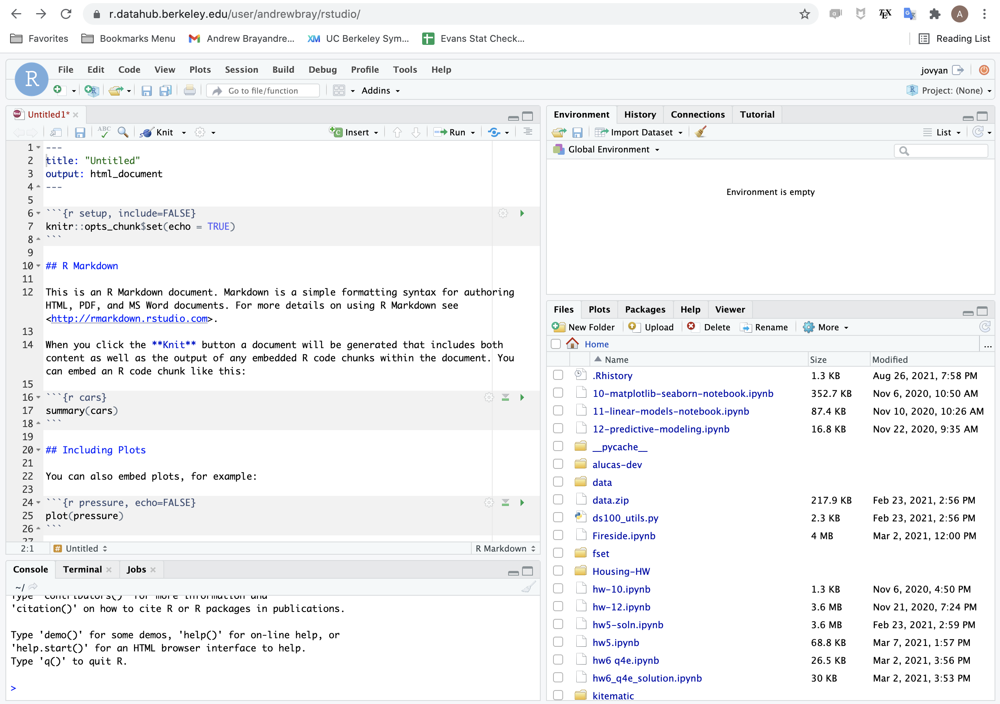

```{r setup, include=FALSE, warning=FALSE}
knitr::opts_chunk$set(message = FALSE, 
                      fig.align = "center",
                      fig.retina = 3,
                      warning = FALSE)

library(tidyverse)
library(xaringanthemer)
source("https://raw.githubusercontent.com/stat-20/stat-20-website/main/xaringan-theme.R")
```

class: center, middle

# Some data collection...

---

# Logistics

1. Office Hours

--

2. Schedule for next week
  - Problem set 2 and Lab 2 released Monday, due Friday 8 pm
  
--

3. Schedule for the remainder of this week
  - Lab 1 due tonight at 8 pm
  
---
class: center, middle

# Speaking of Lab 1...

---



--

`r emo::ji("scream")`

---
class: center, middle

# Why are we doing this?

<!-- https://www.cc.com/video/dcyvro/the-colbert-report-austerity-s-spreadsheet-error -->

---

# Reproducible Science

--

An analysis is *reproducible* if another person can take the same source materials and recreate the same conclusion.

--

To be reproducible, an analysis should

- contain the **data**
- contain the **code** that conducts the analysis
- make clear the link between the output of the code and the conclusions drawn

---

# Not a new idea

--

**Royal Society**: Founded 1660 by Robert Boyle and others

--

```{r, out.height = "60%", echo = FALSE}

# kladcat, CC BY 2.0 <https://creativecommons.org/licenses/by/2.0>, via Wikimedia Commons>
```

---
# But our tools are

--

- RMarkdown
- Jupyter Notebook

<!-- flip to first 2 prezi slides -->

---

## For this class

- Every data analysis must be a reproducible data analysis

--

- *Nullius in Verba*

---

## General tips:

--

1. Hold high standards for final products
  - Is it reproducible?
  - Is it clear?
  - Is it beautiful?

--

2. Try to break things... then put them back together

--

3. Share ideas, ask questions, answer questions

<!-- go to Ed to show example -->

---
class: center, middle

# Last time

---


---
class: center, middle

# Statistics is the practice of being able to *critique* and *construct* arguments using data.

---

## Descriptive Statistics

Numerical, verbal, or graphical summaries of a data set. E.g.

- "This picture is predominantly gray in color"
- Measures of center: mean, median, mode
- Measures of variability: standard deviation, variance
- Plots
  - histograms
  - scatterplots

---

## Inferential Statistics

Drawing conclusions about a broader population or phenomenon using data. E.g.:

- Point and interval estimates of parameters
- Hypothesis test, p-values
- Bayesian posterior probabilities
- Regression modeling

--

**Highly dependent on the**
- **source of data**
- **method of analysis**

---
class: center, middle

# Taxonomy of Data

---
class: middle, center

When we think about how much data we have, we can speak in terms of the number *observations* or the number of *variables*.

---
# The Data Frame

```{r message = FALSE, echo = FALSE}
library(knitr)
library(kableExtra)
library(palmerpenguins)
penguins %>%
  select(species, island, bill_depth_mm, bill_length_mm) %>%
  sample_n(6) %>%
  kable() %>%
  kable_styling(latex_options = "striped")
```

A **data frame** is an array the associates the **observations** (downs the rows) with the **variables** measured on each observation (across the columns).

---

# The Taxonomy of Data


