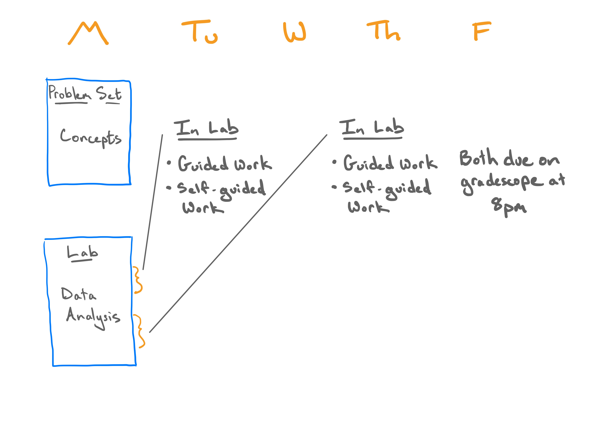
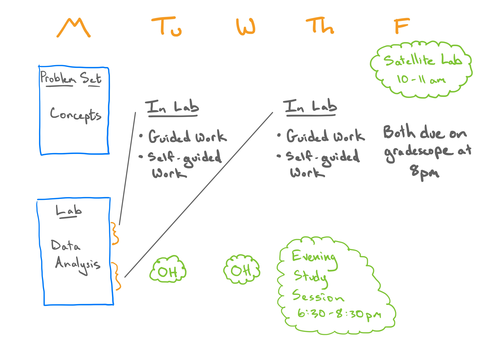
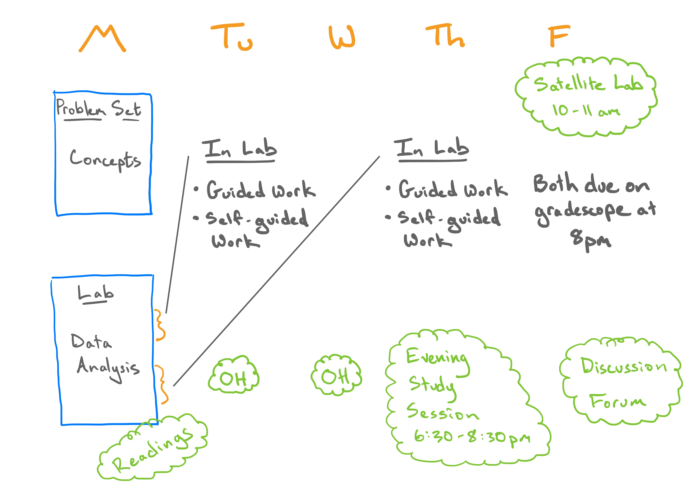
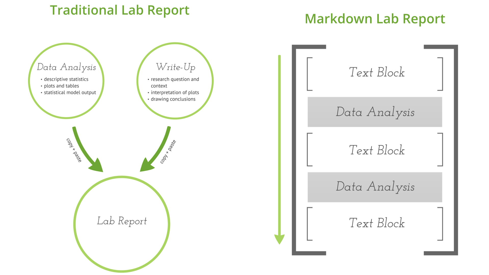

```{r setup, include=FALSE, warning=FALSE}
knitr::opts_chunk$set(message = FALSE,
                      warning = FALSE,
                      echo = FALSE,
                      fig.align = "center",
                      fig.retina = 3)

library(tidyverse)
library(xaringanthemer)
source("https://raw.githubusercontent.com/stat-20/stat-20-website/main/xaringan-theme.R")
#ggplot2::theme_set(theme_xaringan)
```
class: center, middle

# Welcome to Week 2

---

```{r echo=FALSE, out.width="100%"}

```

---

```{r echo=FALSE, out.width="100%"}

```

---

```{r echo=FALSE, out.width="100%"}

```

???

Show where the problem set instructions are.
---

class: center, middle

# Last Time

---

## Tenets of a Reproducible Analysis

An analysis is *reproducible* if another person can take the same source materials and recreate the same conclusion.

--

To be reproducible, an analysis should

- contain the **data**
- contain the **code** that conducts the analysis
- make clear the link between the output of the code and the conclusions drawn

---
class: middle

```{r, out.height = "100%", echo = FALSE}
knitr::include_graphics("figs/markdown-1.png")
# https://prezi.com/dvmgx17e_was/reproducible/
```

---
class: middle

```{r, out.height = "100%", echo = FALSE}

```

---

# Numerical Data

Values are numbers that signify their relative ordering and magnitudes. (tip: arithmetic ops. make sense.)

--

.pull-left[
### Continuous
Values can take any value on an interval. Ex:
- Max miles from Cal
- bill length
]

--

.pull-right[
### Discrete
Values can take any value in a countable set. Ex:
- \# sibs + dogs
- \# young
]

---

# Categorical Data

Values are categories. (arithmetic operations don't make sense.)

--

.pull-left[
### Nominal
Categories lack relative ordering. Ex:
- Hometown
- Species
]

--

.pull-right[
### Ordinal
Categories have natural ordering. Ex:
- Likert scale (agree, neutral, disagree)
]

---
class: center, middle

# Taxonomy of Data

The *type* of data informs the way it is described (numerically, graphically), and the way it is analyzed.

--

The distinctions aren't exclusive. Some variables permit classification into multiple types.


---

class: center, middle, inverse

# Describing Data

???

Ask for a student volunteer. Ask them to "Describe" to me what they had for breakfast. Use as example of how descriptions do a process of summarization and make choices about what to include and what to omit.

---
## Describing Data

Describing large and complex data most often involves a process of *summarization*.

--

.pull-left[
### What should I **include**?

- My interest
- Audience interest
- Most informative or distinctive aspect
]

--

.pull-right[
### What should I **omit**?

- My disinterest
- Audience disinterest
- Replicate or assumed information
]

---
class: center, middle, inverse

# Describing Categorical Data

Verbal, Numerical, Graphical

???

We look first to a setting where we can summarize the data without any information loss.

---

# Palmer Penguins

Observations were made on 344 penguins at Palmer Research Station, Antarctica including their species.

--

.pull-left[
```{r echo=FALSE, out.width="100%"}
knitr::include_graphics("figs/penguins.png")
# Artwork by @allison_horst
```
]

.pull-right[
```{r}
library(palmerpenguins)
library(knitr)
library(kableExtra)
set.seed(30)
penguins %>%
  sample_frac() %>%
  select(species) %>%
  kable() %>%
  kable_styling(latex_options = "striped")
```
]

---

# Counts

An elementary method of summarizing categorical data is to compute the **count** of observations in each category.

--

.pull-left[
### Raw data

```{r}
set.seed(30)
penguins %>%
  sample_frac() %>%
  select(species) %>%
  kable() %>%
  kable_styling(latex_options = "striped")
```
]

--

.pull-right[
### Table of counts

```{r}
set.seed(30)
penguins %>%
  select(species) %>%
  count(species) %>%
  kable() %>%
  kable_styling(latex_options = "striped")
```
]

---

# Proportions

Proportion = category count / total sample size.

--

.pull-left[
### Table of counts

```{r}
set.seed(30)
penguins %>%
  select(species) %>%
  count(species) %>%
  kable() %>%
  kable_styling(latex_options = "striped")
```
]

--

.pull-left[
### Table of proportions

```{r}
penguins %>%
  select(species) %>%
  count(species) %>%
  mutate(p = n / sum(n)) %>%
  kable(digits = 2) %>%
  kable_styling(latex_options = "striped")
```
]

???

The relative prominence of each category can help standardize for different sample sizes.

---

# Bar chart of counts

--

.pull-left[
```{r}
set.seed(30)
penguins %>%
  select(species) %>%
  count(species) %>%
  kable() %>%
  kable_styling(latex_options = "striped")
```
]

--

.pull-right[
```{r}
ggplot(penguins, aes(x = species)) +
  geom_bar() +
  theme_xaringan()
```
]

---

# Bar chart of proportions

--

.pull-left[
```{r}
penguins %>%
  select(species) %>%
  count(species) %>%
  mutate(p = n / sum(n)) %>%
  kable(digits = 2) %>%
  kable_styling(latex_options = "striped")
```
]

--

.pull-right[
```{r}
ggplot(penguins, aes(x = species)) +
  geom_bar(aes(y = ..prop.., group = 1)) +
  theme_xaringan()
```
]

--

**Question**: Can we reconstruct the raw data set?

---
class: inverse, middle, center

# Describing Numerical Data


---

# Palmer Penguins

Observations were made on 344 penguins at Palmer Research Station, Antarctica including their **bill_length**.

--

.pull-left[
```{r echo=FALSE, out.width="100%"}
knitr::include_graphics("figs/culmen_depth.png")
# Artwork by @allison_horst
```
]

.pull-right[
```{r}
library(palmerpenguins)
library(knitr)
library(kableExtra)
set.seed(30)
penguins %>%
  sample_frac() %>%
  select(bill_length_mm) %>%
  kable() %>%
  kable_styling(latex_options = "striped")
```
]


---

# Visualizing numerical data

```{r echo = FALSE, fig.width=11, fig.height=6.5}
library(patchwork)
p <- ggplot(penguins, aes(x = bill_length_mm))
p1 <- p + 
  geom_dotplot(binwidth = .1,
               dotsize = 5,
               alpha = .5) +
  scale_y_continuous(NULL, breaks = NULL) +
  theme_xaringan() +
  labs(title = "dot plot")
p2 <- p +
  geom_histogram(col = "white") +
  theme_xaringan() +
  labs(title = "histogram")
p3 <- p +
  geom_density(fill = "white") +
  theme_xaringan() +
  labs(title = "density plot")
p4 <- p +
  geom_boxplot() +
  scale_y_continuous(NULL, breaks = NULL) +
  theme_xaringan() +
  labs(title = "box plot")

(p1 + p3) / (p2 + p4)
```


---

# Describing Distributions

- **Shape**: modality, skewness

--

- **Center**: mean, median, mode

--

- **Spread**: variance, sd, range, IQR

--

- **Unusual observations**: outliers

--

**Question**: which of these apply to categorical data?

---

# Shape

--

**Modality**

```{r out.width=800, echo = FALSE, fig.align='center'}
knitr::include_graphics("figs/modality.png")
```
--

**Skewness**

```{r out.width=800, echo = FALSE, fig.align='center'}
knitr::include_graphics("figs/skewness.png")
```


---
# Shape Q

Which of these variables do you expect to be uniformly distributed?

1. bill length of Gentoo penguins
2. salaries of a random sample of people from California
3. house sale prices in San Francisco
4. birthdays of classmates (day of the month)


---
# Shape Q

Which of these variables do you expect to be uniformly distributed?

1. bill length of Gentoo penguins
2. salaries of a random sample of people from California
3. house sale prices in San Francisco
4. **birthdays of classmates (day of the month)**


---
# Center: mean

```{r echo = TRUE}
X <- c(8, 11, 7, 7, 8, 11, 9, 6, 10, 7, 9)
```

--

$$
\frac{8 + 11 + 7 + 7 + 8 + 11 + 9 + 6 + 10 + 7 + 9}{11} = \frac{93}{11} = 8.45
$$

--

**Sample mean**: the arithmetic mean of the data

$$
\bar{x} = \frac{x_1 + x_2 + \ldots + x_n}{n}
$$

--

```{r echo = TRUE}
mean(X)
```


---
# Center: median

**Median**: the middle value of a sorted data set.

--

```{r echo = TRUE}
sort(X)
median(X)
```

Break ties by averaging middle two if necessary.

Also known as Q2, the second quartile (50\% of the data below it).

---
# Center: mode

**Mode**: the most frequently observed value in the data set.

--

```{r}
X %>%
  data.frame(x = X) %>%
  count(x) %>%
  arrange(desc(n))
```


---
# Spread (on board)

---
# Spread: variance

**Sample variance**: roughly, the mean squared deviation from the mean.

$$
s^2 = \frac{\sum_{i=1}^{n} (x_i - \bar{x})^2}{n - 1}
$$


---
# Spread: variance

```{r echo = TRUE}
X - mean(X)
(X - mean(X))^2
sum((X - mean(X))^2) / (length(X) - 1)
var(X)
```


---
# Spread: standard deviation

**Sample standard deviation**: the square root of the variance. Used because
units are the same as the data.

$$
s = \sqrt(s^2)
$$

```{r echo = TRUE}
sqrt(var(X))
sd(X)
```


---
# Spread: IQR

**Inner Quartile Range**: the range of the middle 50% of the data.

$$
IQR = Q3 - Q1
$$

```{r echo = TRUE}
sort(X)
IQR(X)
```


---
# Spread: range

**Range**: the range of the full data set.

$$
range = max - min
$$

```{r echo = TRUE}
max(X) - min(X)
range(X)
```


---
# Spread Q

Which measure(s) of spread would be sensitive to the presence of outliers?

1. variance
2. standard deviation
3. IQR
4. Range


---
# Spread Q

```{r, echo=FALSE}
Y <- X
Y[1] <- 37
```


```{r echo = TRUE}
X
Y
var(X)
var(Y)
```


---
# Spread Q

```{r echo = TRUE}
IQR(X)
IQR(Y)
range(X)
range(Y)
```


---
# Spread Q

Which measure(s) of spread would be sensitive to the presence of outliers?

1. **variance**
2. **standard deviation**
3. IQR
4. **Range**


---
# Center Q

Which measure(s) of center would be sensitive to the presence of outliers?

1. mean
2. median
3. mode


---
# Center Q

Which measure(s) of center would be sensitive to the presence of outliers?

1. **mean**
2. median
3. mode


---
# Mean vs median

```{r out.width=800, echo = FALSE, fig.align='center'}
knitr::include_graphics("figs/skew-sym.png")
```

For symmetric dists, use *mean* and *sd*.

For skewed dists, use *median* and *iqr*.

```{r echo = FALSE, eval = FALSE}
x <- c(rgamma(50, 2, 3),
       5 - rgamma(50, 2, 3),
       rnorm(50))
y <- factor(rep(c("ls", "rs", "sym"), each = 50))
df <- data.frame(x, y)
ggplot(df, aes(x = x, groups = y)) + geom_density()
```

