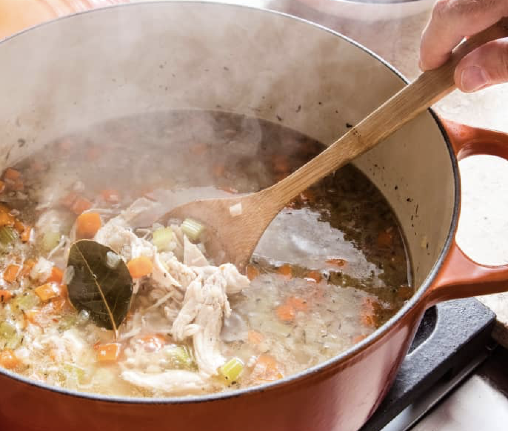

```{r setup, include=FALSE, warning=FALSE}
knitr::opts_chunk$set(message = FALSE,
                      warning = FALSE,
                      echo = TRUE,
                      fig.align = "center",
                      fig.retina = 3)

library(tidyverse)
library(xaringanthemer)
library(kableExtra)
library(emo)
library(palmerpenguins)
library(nomnoml)
library(DiagrammeR)
library(DiagrammeRsvg)
library(rsvg)
source("https://raw.githubusercontent.com/stat-20/stat-20-website/main/xaringan-theme.R")
xaringanExtra::use_panelset()
```

---
## Announcements

--

1. Problem Set 3 due Friday at 8 pm

  - Evening Study Session 6:30 - 8:30 pm

--

1. Lab 3 due *Thursday* at 8 pm


---
## Lab 3 on Gradescope

.pull-left[
```{r echo = FALSE, fig.align='left', out.width="80%"}

```
]

.pull-right[
1. Upload photos of front and back of handout (with data)
2. Write your reflection directly into gradescope
]

---
## Lab 3: Boba F&ecirc;te

.pull-left-narrow[
```{r echo = FALSE, out.width="100%"}

```

.cite[
image: https://www.humanforscale.com/
]

]

.pull-right-wide[
- Lab tomorrow meets *outside* on the West and South terraces of Evans Hall.
- Mind the time.
- Don't forget your handout!
]

---
## Announcements

1. Problem Set 3 due Friday at 8 pm
  - Evening Study Session 6:30 - 8:30 pm

1. Lab 3 due *Thursday* at 8 pm

--

1. Quiz 1
  - ~ 20 minutes in a 24 hr period on Gradescope


---
## Quiz 1 Topics

.pull-left[
**Intro to Data**
- Data frames
- Taxonomy of Data
- Key terms

**Reproducibility**

- 3 tenets
- Our tools: R + Markdown
]

--

.pull-right[
**Describing Data**
- Describing distributions verbally
- Numerical summaries
- Graphical summaries
    - Grammar of Graphics
    - `ggplot2`

**Study Design**
- Key terms
- Sampling
- Experimental Design
]

---
class: middle, center

## Our goal: teach you to critique and construct claims made using data.


---
## Announcements

1. Problem Set 3 due Friday at 8 pm
  - Evening Study Session 6:30 - 8:30 pm

1. Lab 3 due *Thursday* at 8 pm

1. Quiz 1
  - ~ 20 min in 24 hr on Gradescope from 11 am 9/12 to 11 am 9/13
  - Review quiz answers in class
  - If unsatisfied with performance, you can take second quiz at end of the week. Same list of topics, different questions. Final grade on Quiz 1 will be max of the two scores.
  - Quiz 1 redo: same format from 11 am 9/16 to 11 am 9/17
  
---
class: middle, center, inverse

# Welcome to Week 3

---

# The Lifecycle of an Empirical Claim

```{r echo = FALSE, fig.align = "center"}
DiagrammeR::grViz("
digraph graph2 {

graph [layout = dot, rankdir = LR, bgcolor = '#f3f3ee']

node [shape = oval]
a [label = '@@1']
b [label = '@@2']
c [label = '@@3']
d [label = '@@4']

a -> b -> c -> d

}

[1]: paste0('Formulate a\\nQuestion')
[2]: paste0('Collect\\nData')
[3]: paste0('Analyze\\nData')
[4]: paste0('Construct\\nClaim')
", width = 1100)
```

???
Empirical Meaning experimentation, observation, data

It's indeed a lifecycle, it can go in many directions and iterate.

---
# Arbuthnot

.pull-left-narrow[

```{r echo = FALSE, eval = TRUE, fig.align = "left"}
g <- DiagrammeR::grViz("
digraph dot {

graph [bgcolor = '#f3f3ee']

node [shape = oval]
b [label = '@@2']
c [label = '@@3']
d [label = '@@4']

node [style = filled, fillcolor = '#F1DE67']
a [label = '@@1']
a -> b -> c -> d

}

[1]: paste0('Formulate a\\nQuestion')
[2]: paste0('Collect\\nData')
[3]: paste0('Analyze\\nData')
[4]: paste0('Construct\\nClaim')
", height = 500)
#g %>% export_svg() %>% charToRaw() %>% rsvg_png("graph.png")
widgetframe::frameWidget(g, width = 179)
```

]

.pull-right-wide[
### Formulate a Question

What is the chance that a newborn baby is genetically male?
]

---
# Arbuthnot

.pull-left-narrow[

```{r echo = FALSE, eval = TRUE, fig.align = "left", dev = "png"}
g <- DiagrammeR::grViz("
digraph dot {

graph [bgcolor = '#f3f3ee']

node [shape = oval]
a [label = '@@1']
c [label = '@@3']
d [label = '@@4']

node [style = filled, fillcolor = '#F1DE67']
b [label = '@@2']

a -> b -> c -> d
}

[1]: paste0('Formulate a\\nQuestion')
[2]: paste0('Collect\\nData')
[3]: paste0('Analyze\\nData')
[4]: paste0('Construct\\nClaim')
", height = 500)
widgetframe::frameWidget(g, width = 179)
```
]

.pull-right-wide[
### Collect Data

```{r echo = FALSE}
knitr::include_graphics("figs/christening-records.png")
```

]

---
# Arbuthnot

.pull-left-narrow[
```{r echo = FALSE, eval = TRUE, fig.align = "left", dev = "png"}
g <- DiagrammeR::grViz("
digraph dot {

graph [bgcolor = '#f3f3ee']

node [shape = oval]
a [label = '@@1']
b [label = '@@2']
d [label = '@@4']

node [style = filled, fillcolor = '#F1DE67']
c [label = '@@3']

a -> b -> c -> d
}

[1]: paste0('Formulate a\\nQuestion')
[2]: paste0('Collect\\nData')
[3]: paste0('Analyze\\nData')
[4]: paste0('Construct\\nClaim')
", height = 500)
widgetframe::frameWidget(g, width = 179)
```
]

.pull-right-wide[
### Analyze Data

```{r echo = FALSE, fig.height = 5}
library(stat20data)
data("arbuthnot")
arbuthnot <- arbuthnot %>%
  mutate(p_boys = boys / (boys + girls))
ggplot(arbuthnot, aes(x = year,
                      y = p_boys)) +
  geom_line() +
  ylim(0, 1)
```

]

---
# Arbuthnot

.pull-left-narrow[

```{r echo = FALSE, eval = TRUE, fig.align = "left", dev = "png"}
g <- DiagrammeR::grViz("
digraph dot {

graph [bgcolor = '#f3f3ee']

node [shape = oval]
a [label = '@@1']
b [label = '@@2']
c [label = '@@3']

node [style = filled, fillcolor = '#F1DE67']
d [label = '@@4']

a -> b -> c -> d
}

[1]: paste0('Formulate a\\nQuestion')
[2]: paste0('Collect\\nData')
[3]: paste0('Analyze\\nData')
[4]: paste0('Construct\\nClaim')
", height = 500)
widgetframe::frameWidget(g, width = 179)
```
]

.pull-right-wide[
### Construct Claim

*Descriptive Claim*: In every year from 1629 - 1710, in the London parishes under study, the proportion of christenings that were male exceeded 50%.

*Inferential Claim*: The proportion of births that are genetically male exceeds 50%.

]

---
## Scope of Inference

**population** - the set of observational units on which you wish to make an inference (size: $N$)

--

#### Scales of Data

**sample** - a subset of the population on which you have data (size of the sample: $n$)

--

**anecdote** - very small sample of data collected haphazardly (usually $n = 1$)

--

**census** - sample = population (complex, expensive, and sometimes impossible to achieve)

---

```{r echo = FALSE, fig.height = 4}
library(stat20data)
data("arbuthnot")
arbuthnot <- arbuthnot %>%
  mutate(p_boys = boys / (boys + girls))
ggplot(arbuthnot, aes(x = year,
                      y = p_boys)) +
  geom_line() +
  ylim(0, 1)
```

> *Descriptive Claim*: In every year from 1629 - 1710, in the London parishes under study, the proportion of christenings that were male exceeded 50%.

--

- Scope of inference is limited to the **sample** of data
- Focuses purely on the **statistics** of the sample: numerical summaries of the data (yearly observed proportions)

---

```{r echo = FALSE, fig.height = 4}
library(stat20data)
data("arbuthnot")
arbuthnot <- arbuthnot %>%
  mutate(p_boys = boys / (boys + girls))
ggplot(arbuthnot, aes(x = year,
                      y = p_boys)) +
  geom_line() +
  ylim(0, 1)
```

> *Inferential Claim*: The proportion of births that are genetically male exceeds 50%.

--

- Scope of inference is the **population** of all births, with no geographic, cultural, or temporal caveats
- Uses the **statistics** of the sample to infer the nature of the **parameters** of the population: numerical characteristics of the population (the proportion of births than are genetically male)


---
## Scope of Inference

When studying the relationships between multiple variables, some inferences are of **associations**, others assert a **causal link**. These often map to the nature of the data.
--

### Collection methods

- **Observational Data**: passive recording of variables on a sample
- **Experimental Data**: researchers actively assign treatments to observational units then record variables

Both often involve the process of drawing a sample.

---
## Analogy: Sampling as Cooking

--

```{r out.width=220, echo = FALSE, fig.align='left'}

```

--

- To evaluate if the soup is good, you taste a spoonful - *sample.*

--

- If the spoonful is bland, you've made a *descriptive claim*.

--

- If you conclude the soup needs salt, you've made an *inference to a population*.

--

- For it to be valid, the spoonful must be *representative* of the soup.


.cite[
image: https://www.cooksillustrated.com/recipes/10242-turkey-barley-soup
]

---

# Sampling considerations

You're a senior Psychology major conducting a study that examines procrastination among Cal students.  How should you select a sample?

--

**A.** Post a link to your survey on social media.

--

**B.** Get a list of Cal student emails from the Registrar, take a simple random sample (SRS), and email that sample.

--
.task[
With a neighbor, write one pro and one con to each approach, then vote for your preference at `pollev.com/andrewbray088`
]

---
class: middle, center, inverse

A Lesson from History

---

```{r out.width=800, echo = FALSE, fig.align='center'}
knitr::include_graphics("figs/landon-fdr.png")
```

---

## Landon v. FDR, 1936

Literary Digest polled 10 million Americans, 2.4 million responded.

--

N = 128 million, n = 2.4 million

--

**Prediction**: 43% for FDR

**Result**: 62% for FDR

---

## What went wrong?

--

Literary Digest surveyed

- magazine subscribers
- registered car owners
- registered telephone owners

--

These groups have a much higher income on average than the typical
american. In 1936 the Great Depression is still in full swing, so the 
typical (poorer) american was more supportive of FDR.

Their sampling method was **biased** (not representative).


---
class: middle, center, inverse

Sampling Strategies

---
## Sampling Strategies
--

### Simple Random Sampling (SRS)
Select from the population of size $N$ a sample of size $n$ where each observational unit is equally likely of being selected.

--

### Stratified Sampling
Divide the population up into *strata*, then take a SRS within each stratum.

---
## Example: MLB Salaries

Imagine we have access to the full population 160 baseball players (focus on Yankees, Padres, Mariners, and Dodgers), and record their team name and salary.

--

```{r strat-samp, echo = FALSE}
team <- c(rep("New York Yankees", 40), 
           rep("San Diego Padres", 40), 
           rep("Seattle Mariners", 40), 
           rep("Los Angeles Dodgers", 40))
salary <- c(rnorm(40, mean = 25), 
            rnorm(40, 16), 
            rnorm(40, 23), 
            rnorm(40, 15))
df <- data.frame(team, salary)
head(df)
```

---
## Population view
--

```{r plot-strat, echo = FALSE, eval = TRUE, message=FALSE, warning=FALSE, fig.width=10, fig.height = 4, fig.align='center'}
library(tidyverse)
df %>%
  mutate(name = team) %>%
  ggplot(aes(x = salary, fill = name)) + 
  geom_density(alpha = .8) +
  geom_rug(aes(color = name))
```

--

How can we estimate the **population mean salary** (with $N = 160$) using only a sample of size $n = 40$?

--

- Take a sample, compute the *sample mean*
- But how should we take the sample?

---
## Simple Random Sample (SRS)

**Population Mean**

```{r}
df %>% 
  summarize(mean(salary))
```

--

**Sample Mean from an SRS**

```{r}
# SRS
df %>%
  sample_n(40) %>% 
  summarize(mean(salary))
```

---
## Stratified Sample

--

**Sample Mean from an Stratified Sample**

```{r}
df %>% 
  group_by(team) %>% 
  sample_n(10) %>% 
  ungroup() %>%
  summarize(mean(salary))
```

---
## Long-run performance

To understand how these strategies perform in the long run, we have to imagine how good the parameter estimates will be over *many* possible samples.

--

```{r}
df %>%
  sample_n(40) %>% 
  summarize(mean(salary))
```

--

```{r}
df %>%
  sample_n(40) %>% 
  summarize(mean(salary))
```


---
## Long-run performance


```{r comp, echo=FALSE, fig.align='center', fig.width=12, fig.height = 8, message=FALSE, eval = TRUE}
library(mosaic)
SRS <- do(1000) * mean(~salary, data = sample(df, 40))
STR <- do(1000) * mean(~salary, data = rbind(sample(subset(df, team == "New York Yankees"), 10),
                                             sample(subset(df, team == "San Diego Padres"), 10),
                                             sample(subset(df, team == "Seattle Mariners"), 10),
                                             sample(subset(df, team == "Los Angeles Dodgers"), 10)))
sim <- data.frame(salary = rbind(SRS, STR), method = rep(c("SRS", "STR"), each = 1000))
ggplot(sim, aes(x = mean, fill = method)) +
  geom_density(alpha = .7) +
  annotate("segment", x = mean(df$salary), xend = mean(df$salary),
           y = 0, yend = 3, color = "black", linetype = 2) +
  theme_bw()
```

---
## Sampling Strategies

--

**SRS**: Unbiased, easy, but can be highly variable.

--

**Stratified Sampling**: If you divide population into strata that are *similar* within and *different* between, your estimates will still be unbiased but have lower variability.


