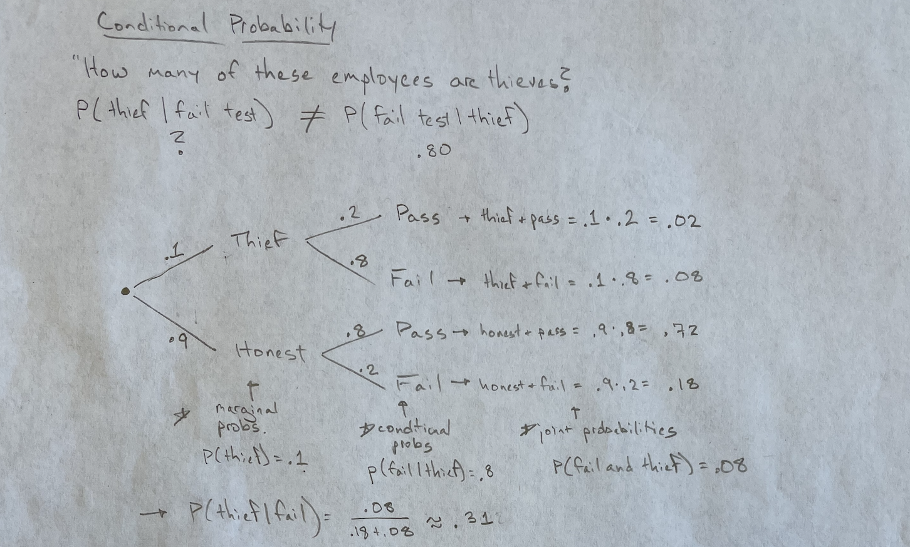
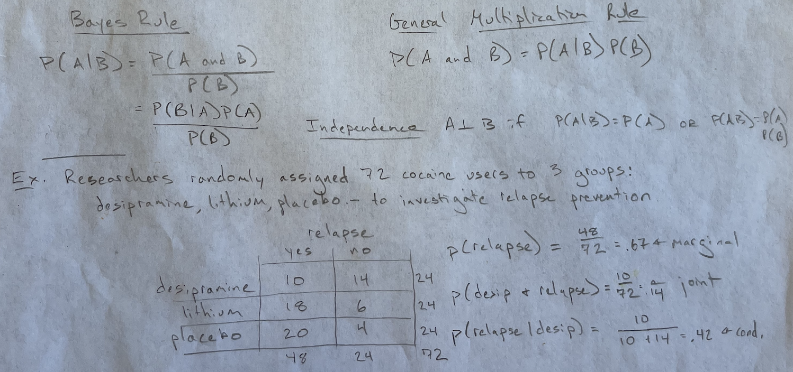

```{r setup, include=FALSE, warning=FALSE}
knitr::opts_chunk$set(message = FALSE,
                      warning = FALSE,
                      echo = TRUE,
                      fig.align = "center",
                      fig.retina = 3)

library(tidyverse)
library(xaringanthemer)
library(kableExtra)
library(emo)
library(palmerpenguins)
library(nomnoml)
library(DiagrammeR)
library(DiagrammeRsvg)
library(rsvg)
source("https://raw.githubusercontent.com/stat-20/stat-20-website/main/xaringan-theme.R")
xaringanExtra::use_panelset()
```


# Honest Liars

```{r out.width=500, echo = FALSE, fig.align='center'}

```

## Problem Set-up

- Through accounting procedures, it is known that 10% of the employees of a store are stealing.
- This classroom will act as employees and two managers.

---
# The managers

First, we need two managers.

```{r managers, eval = FALSE}
seat_row <- 1:15
sample(seat_row, size = 2)
seat_column <- 1:17
sample(seat_row, size = 2)
```

--

```{r managers-output, eval = TRUE, echo = FALSE}
seat_row <- 1:15
sample(seat_row, size = 2)
seat_column <- 1:15
sample(seat_row, size = 2)
```


The rest of you are the employees.

---
# The employees

You will need two random digits.

- Digit 1: Last digit of your Cal 1 Card #
- Digit 2: 5th digit of your phone num (excluding area code)

Please write these on a sheet of paper.

---
# Honest or thief?

To simulate 10% of retail employees being thieves, we will use your first random digit:

- If your first digit = 0, write "thief" above your first number.
- Otherwise, write "honest" above your first number.


---
# Pass or fail?

Your manager now administers a lie detector test that is 80% accurate;
there is an 80% chance that thieves will fail the test and an 80% chance that 
honest folk will pass the test. 

--

Using your second random digit,

.pull-left[
**Thieves**

- If your digit = 0 or 1, write "pass" above that digit.
- Otherwise, write "fail" above that digit.
]

--

.pull-right[
**Honest folk**

- If your digit = 0 or 1, write "fail" above that digit.
- Otherwise, write "pass" above that digit.
]
    
---
# Moment of truth

### Who wrote "fail" on their piece of paper?

>Raise your hands.

--

### Managers:

> What percentage of these employees do you think are thieves?

--

Those that raised their hands/failed the test, state whether you are honest or a thief.

--

What happened here?

--

*The common mistake of reversing the conditional probability!*

---

```{r echo = FALSE, fig.align='center', out.width="100%"}

```

---

```{r echo = FALSE, fig.align='center', out.width="100%"}

```
