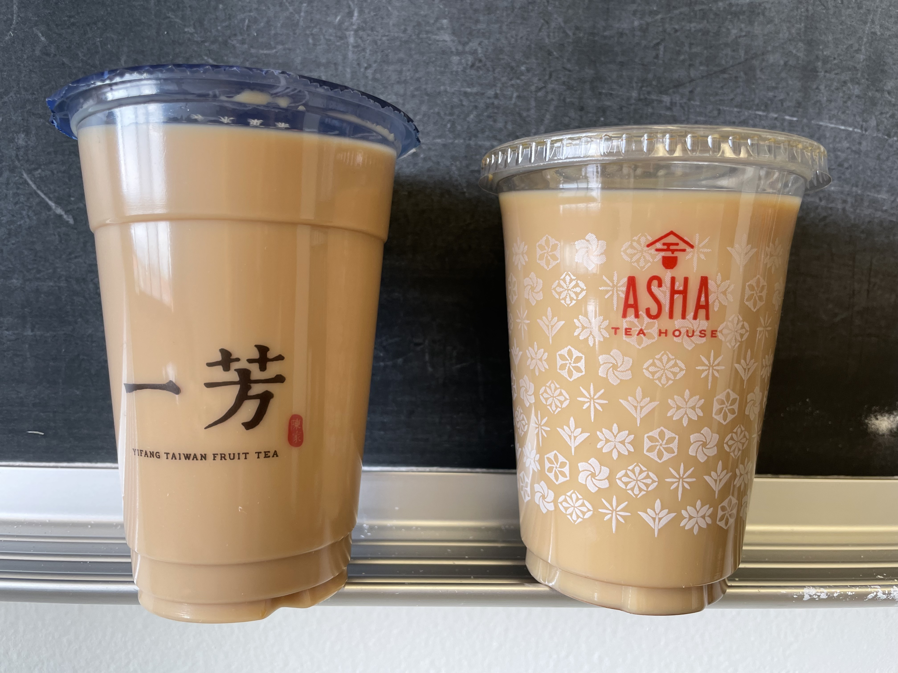
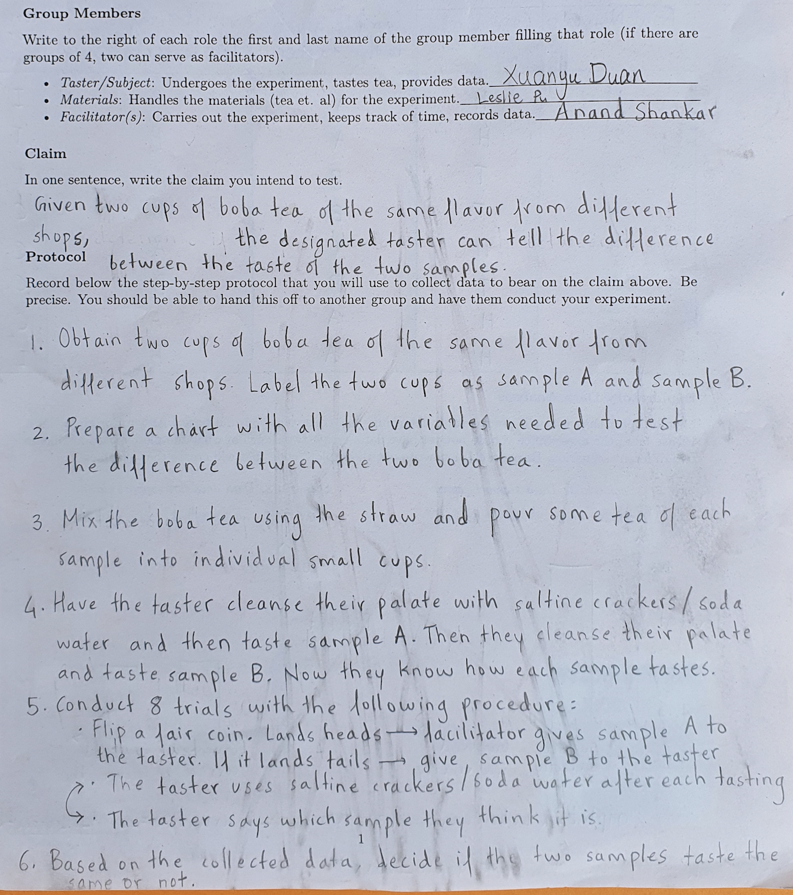
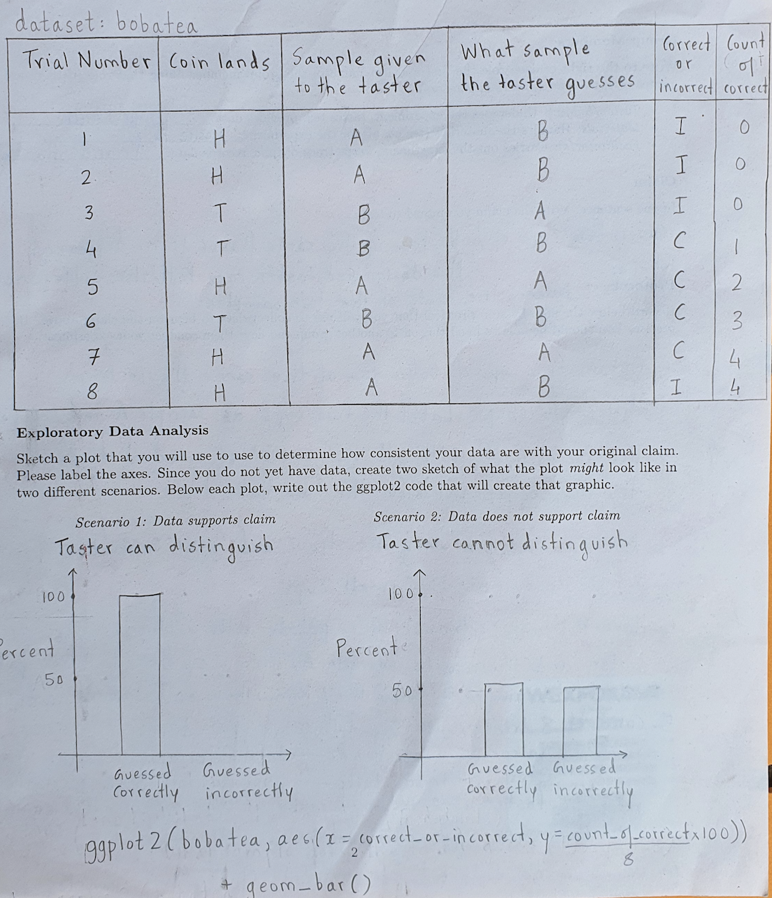
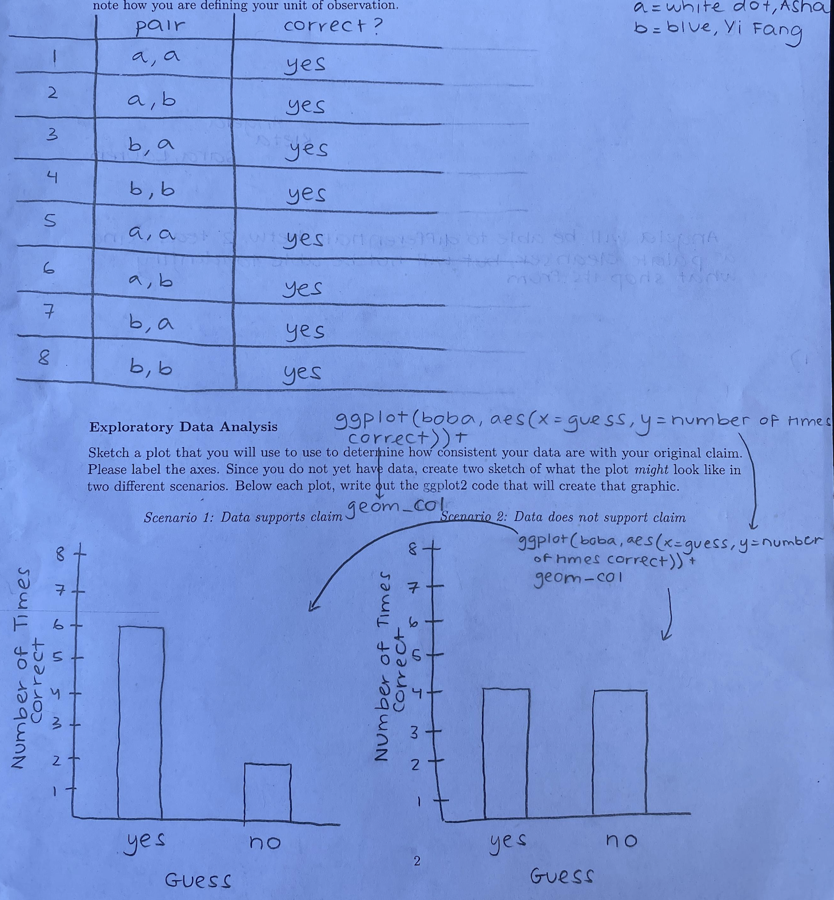
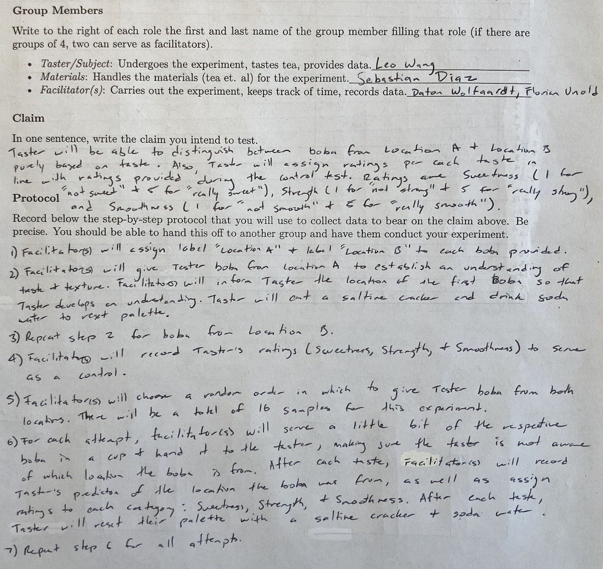
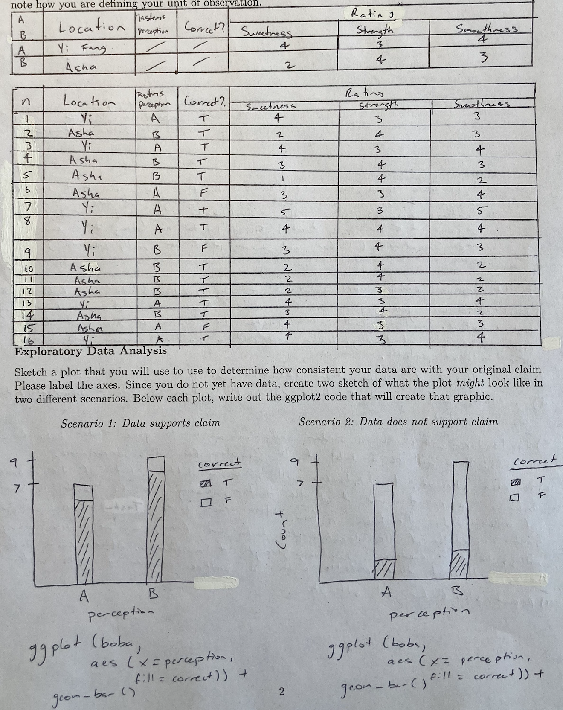
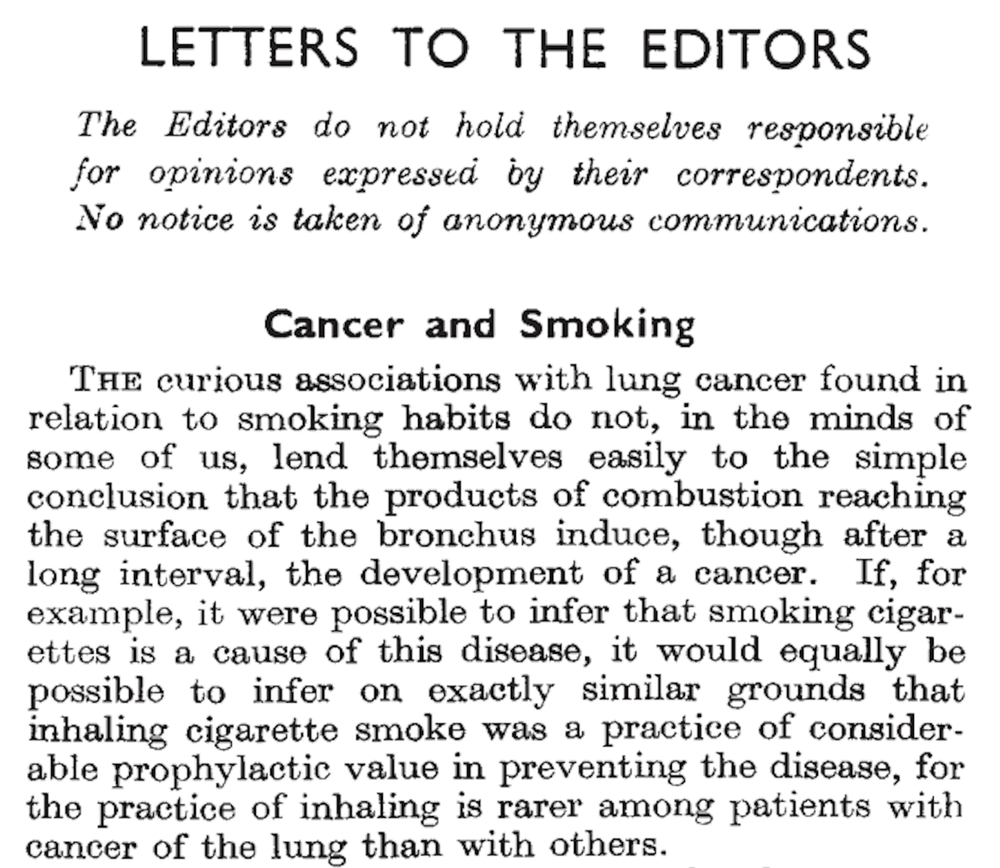
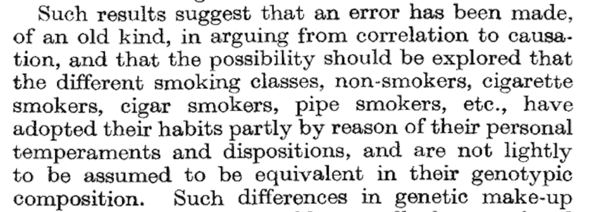
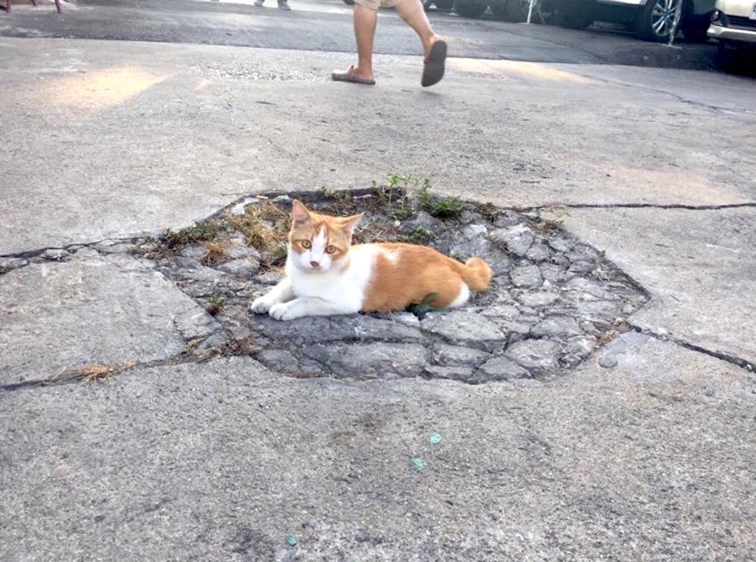

```{r setup, include=FALSE, warning=FALSE}
knitr::opts_chunk$set(message = FALSE,
                      warning = FALSE,
                      echo = TRUE,
                      fig.align = "center",
                      fig.retina = 3)

library(tidyverse)
library(xaringanthemer)
library(kableExtra)
library(emo)
library(palmerpenguins)
library(nomnoml)
library(DiagrammeR)
library(DiagrammeRsvg)
library(rsvg)
source("https://raw.githubusercontent.com/stat-20/stat-20-website/main/xaringan-theme.R")
xaringanExtra::use_panelset()
```

---
## Announcements

1. Quiz 1 redo: same format from 11 am 9/16 to 11 am 9/17

--

1. Looking forward:
    - This week: Intro to Probability, in lab: data wrangling with `dplyr`.
    - Next week: Distributions of Random Variables
    - Week after next: Midterm I on Monday 9/27 (more details to follow)

--

1. Problem Set 4 and Lab 4 released tonight, due Friday at 8 pm

--

1. Evening Study Session: Thursday 6:30 - 8:30 pm

---
## Last Week: Boba F&ecirc;te

```{r echo = FALSE, fig.align='center', out.width="90%"}
knitr::include_graphics("figs/boba-fete-topdown.png")
```

---
class: center, middle, inverse
# Goals for today:

--

## Collect the best ideas into 4 principles

--

## Get to _why_ these principles are important


---
## The essential question of our time

.pull-left[
```{r echo = FALSE, fig.align='left', out.width="100%"}

```
]

.pull-right[
_Which tea was better_?

- Asha?
- Yifang?

Vote at `pollev.com/andrewbray088`.
]

---

# The Lifecycle of an Empirical Claim

```{r echo = FALSE, fig.align = "center"}
DiagrammeR::grViz("
digraph graph2 {

graph [layout = dot, rankdir = LR, bgcolor = '#f3f3ee']

node [shape = oval]
a [label = '@@1']
b [label = '@@2']
c [label = '@@3']
d [label = '@@4']

a -> b -> c -> d

}

[1]: paste0('Formulate a\\nQuestion')
[2]: paste0('Collect\\nData')
[3]: paste0('Analyze\\nData')
[4]: paste0('Construct\\nClaim')
", width = 1100)
```

---
class: center, middle, inverse

# Lessons from our class

---

.pull-left[
```{r echo = FALSE, fig.align='center', out.height="125%"}

```
]


.pull-right[
```{r echo = FALSE, fig.align='center', out.height="115%"}

```
]

---

.pull-left[
```{r echo = FALSE, fig.align='center', out.height="125%"}
knitr::include_graphics("figs/boba-angela-front.png")
```
]


.pull-right[
```{r echo = FALSE, fig.align='center', out.height="115%"}

```
]

---

```{r echo = FALSE, fig.align='center', out.height="125%"}

```

---

```{r echo = FALSE, fig.align='center', out.height="115%"}

```

---
# Principles of Experimental Design

**Randomization**: Randomly assign subjects to treatments.

**Control**: Compare treatment of interest to a control group that isolates the effect of interest.

**Blinding**: When experimental units do not know whether they are in the control or treatment group

**Replication**: Within a study, replicate by collecting a sufficiently large sample. Or replicate the entire study.


---
# Other key ideas

**Placebo**: fake treatment, often used as the control group for medical studies

**Placebo effect**: experimental units showing improvement simply because they believe they are receiving a special treatment

**Blocking**: If there are variables that are known or suspected to affect the response variable, first group subjects into blocks based on these variables, and then randomize cases within each block to treatment groups.

---
class: center, middle

# Does smoking cigarettes cause cancer?


---
## Possible confounder: genetics

.pull-left[
```{r echo = FALSE, fig.align='center'}

```
]

.pull-right[
```{r echo = FALSE, fig.align='center'}

```

R.A. Fisher
_Nature_, 1958
]

---
## The mounting evidence

--

- Randomized trials with mice and tobacco tar

--

- Regression models to "control for" possible confounders

--

- Identification of physical mechanism

--

- Twins studies


---
## Alternate paths from association to causation

```{r out.width=1050, echo = FALSE, fig.align='center'}
knitr::include_graphics("figs/alternate-paths.png")
```

---
# Example 2: Acupuncture and pain

```{r out.width=500, echo = FALSE, fig.align='center'}
knitr::include_graphics("figs/acupuncture.png")
```

How do you test if acupuncture reduces pain?

--

"Sham acupuncture" is a good control.

---

```{r out.width=800, echo = FALSE, fig.align='center'}
knitr::include_graphics("figs/corrs1.png")
```


---

```{r out.width=800, echo = FALSE, fig.align='center'}
knitr::include_graphics("figs/corrs2.png")
```


---
# If you learn one thing in this class...

```{r out.width=800, echo = FALSE, fig.align='center'}
knitr::include_graphics("figs/xkcd-correlation.png")
```


---
class: center, middle

```{r echo = FALSE, fig.align='center', out.width="55%"}

```

Correlation $\ne$ Causation.