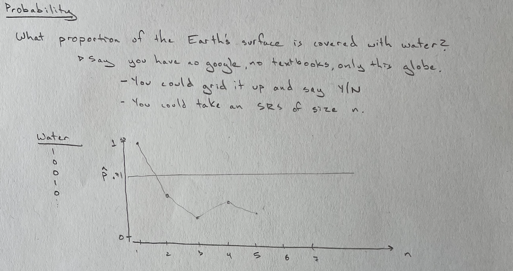
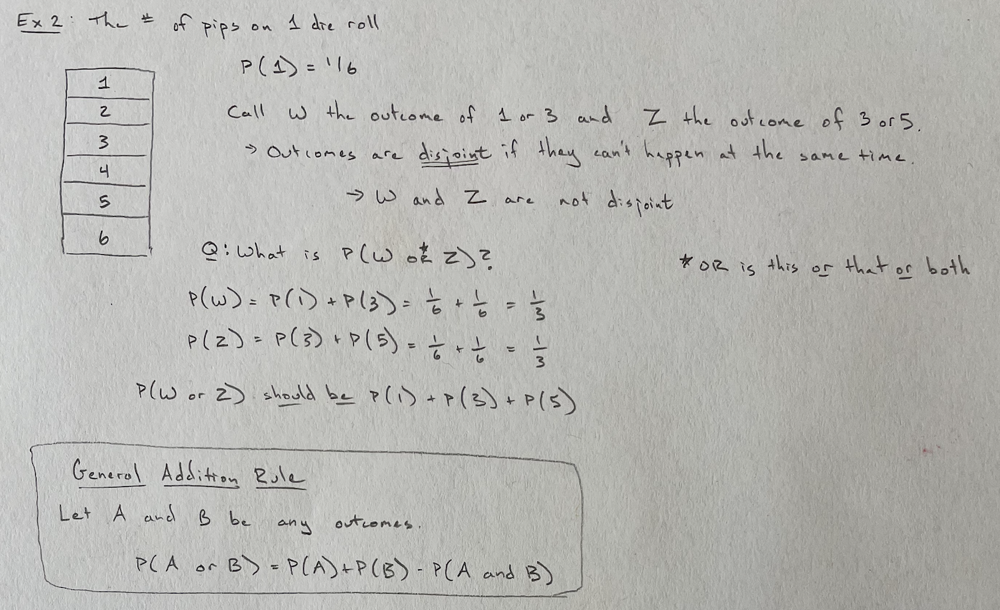
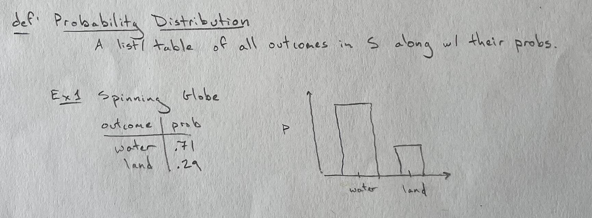
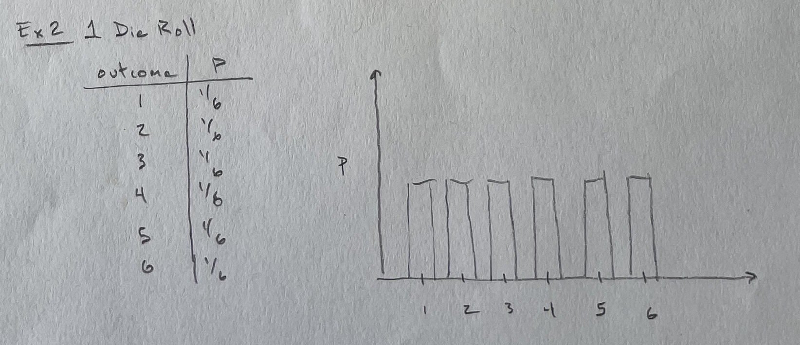
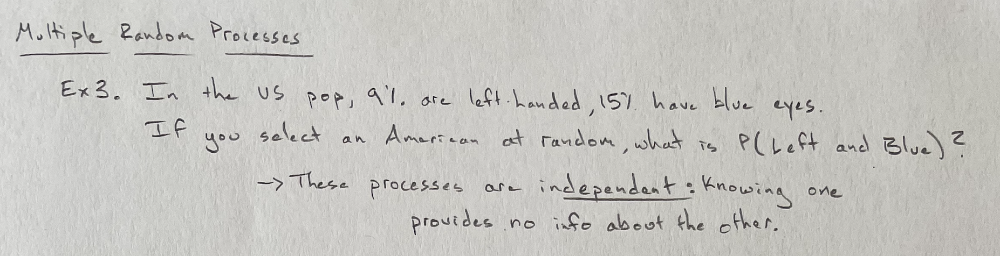
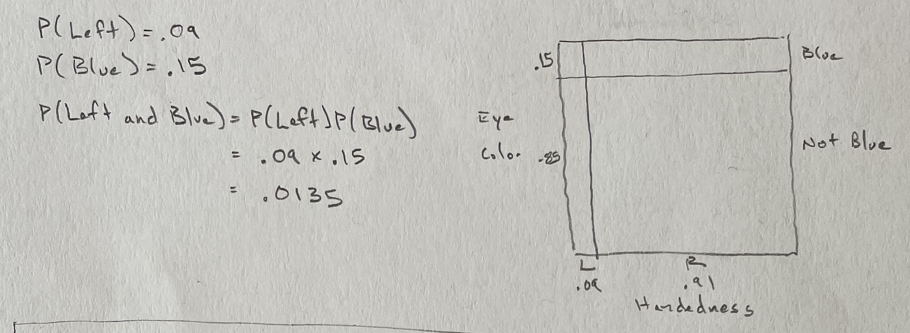

```{r setup, include=FALSE, warning=FALSE}
knitr::opts_chunk$set(message = FALSE,
                      warning = FALSE,
                      echo = TRUE,
                      fig.align = "center",
                      fig.retina = 3)

library(tidyverse)
library(xaringanthemer)
library(kableExtra)
library(emo)
library(palmerpenguins)
library(nomnoml)
library(DiagrammeR)
library(DiagrammeRsvg)
library(rsvg)
source("https://raw.githubusercontent.com/stat-20/stat-20-website/main/xaringan-theme.R")
xaringanExtra::use_panelset()
```


```{r echo = FALSE, fig.align='center', out.width="100%"}

```

---

```{r echo = FALSE, fig.align='center', out.width="100%"}
knitr::include_graphics("figs/p2.png")
```

---

```{r echo = FALSE, fig.align='center', out.width="100%"}

```

---
```{r echo = FALSE, fig.align='center', out.width="100%"}

```

---

```{r echo = FALSE, fig.align='center', out.width="100%"}

```

---

```{r echo = FALSE, fig.align='center', out.width="100%"}

```

---

```{r echo = FALSE, fig.align='center', out.width="100%"}

```

---

```{r echo = FALSE, fig.align='center', out.width="100%"}

```
