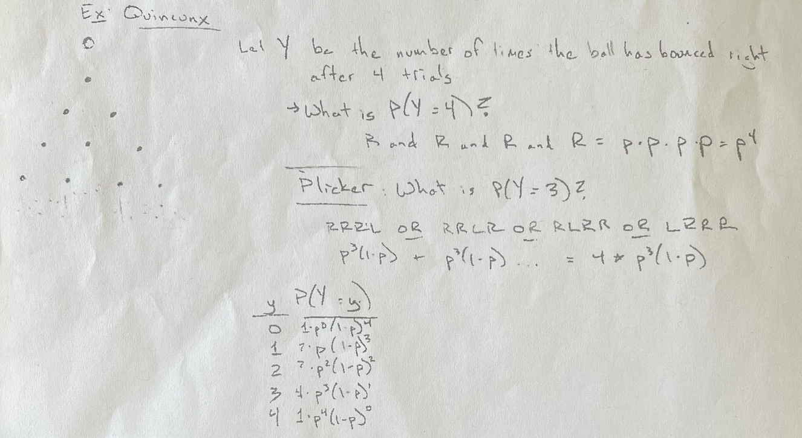
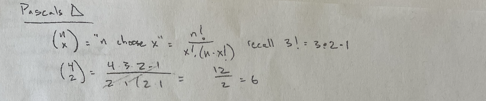

```{r setup, include=FALSE, warning=FALSE}
knitr::opts_chunk$set(message = FALSE,
                      warning = FALSE,
                      echo = TRUE,
                      fig.align = "center",
                      fig.retina = 3)

library(tidyverse)
library(knitr)
library(xaringanthemer)
library(kableExtra)
library(emo)
library(palmerpenguins)
library(stat20data)
data(flights)
source("https://raw.githubusercontent.com/stat-20/stat-20-website/main/stat20-theme.R")
xaringanExtra::use_panelset()
```

```{r eval = FALSE, echo = FALSE}
# name of css file
css_filename <- "stat20-theme.css"

# color palette
warm_white <- "#F3F3EE"
forest_green <- "#2F4C3E"
kelly_green <- "#4A7862"
dark_yellow <- "#EFBE43"
yellow <- "#F1DE67"
palette <- c(warm_white,
             forest_green,
             kelly_green,
             dark_yellow,
             yellow)

# fonts
header_font <- xaringanthemer::google_font("Bitter", "300")
text_font   <- xaringanthemer::google_font("Commissioner")
code_font   <- xaringanthemer::google_font("Fira Mono")
adage_font  <- xaringanthemer::google_font("Amatic SC", "Bold", "700")

# set ggplot2 theme
theme_stat20 <- theme_gray() +
    theme(plot.background = element_rect(fill = warm_white,
                                         colour = NA))
ggplot2::theme_set(theme_stat20)

# set xaringan theme
xaringanthemer::style_duo_accent(
    outfile = css_filename,
    background_color = warm_white,
    primary_color = forest_green,
    secondary_color = dark_yellow,
    text_bold_color = kelly_green,
    colors = palette,
    text_font_size = "1.5rem",
    header_font_google = header_font,
    text_font_google   = text_font,
    code_font_google   = code_font,
    extra_fonts = list(adage_font),
    code_font_size = "20px",
    extra_css = list(".pull-left-wide" = list("width" = "70%",
                                              "float" = "left"),
                     ".pull-right-narrow" = list("width" = "27%",
                                                 "float" = "right"),
                     ".pull-left-narrow" = list("width" = "27%",
                                                "float" = "left"),
                     ".pull-right-wide" = list("width" = "70%",
                                               "float" = "right"),
                     ".mini" = list("font-size" = "65%"),
                     ".cite" = list("vertical-align" = "bottom",
                                    "font-size" = "50%",
                                    "text-align" = "right"),
                     ".task" = list("padding-right"    = "10px",
                                    "padding-left"     = "10px",
                                    "padding-top"      = "3px",
                                    "padding-bottom"   = "3px",
                                    "margin-bottom"    = "6px",
                                    "margin-top"       = "6px",
                                    "border-left"      = paste("solid", "5px", yellow),
                                    "background-color" = paste0(yellow, 50)),
                     ".adage" = list("font-size" = "250%",
                                     "font-family" = "Amatic SC"))
)
```

---
class: middle, center, inverse

# Announcements

---

.mini[22. The plot below displays the relationship between the mean arrival 
delay and the mean distance traveled by every plane in the data set. 
It also shows the total number of flights made by each plane by the 
size of the plotted circle. Please form a single chain that will 
create this plot, starting with the raw data set. You will also want 
to exclude the edge cases from your analysis, so focus on the
planes that have logged more than 20 flights and flown an average
distance of less than 2000 miles.]

--

.pull-left[
```{r p1, eval = FALSE, echo = TRUE}
flights %>%
  group_by(tailnum) %>%
  summarize(avg_delay = mean(arr_delay, na.rm = TRUE),
            avg_dist = mean(distance, na.rm = TRUE),
            n = n()) %>%
  filter(n > 20,
         avg_dist < 2000) %>%
  ggplot(aes(x = avg_dist, y = avg_delay)) + 
  geom_point(alpha = .1, aes(size = n)) +
  labs(x = "average distance", 
       y = "average delay",
       size = "number of flights")
```
]

--

.pull-right[
```{r ref.label = "p1", echo = FALSE}
```
]

---


.mini[22. The plot below displays the relationship between the mean arrival 
delay and the mean distance traveled by every plane in the data set. 
It also shows the total number of flights made by each plane by the 
size of the plotted circle. Please form a single chain that will 
create this plot, starting with the raw data set. You will also want 
to exclude the edge cases from your analysis, so focus on the
planes that have logged more than 20 flights and flown an average
distance of less than 2000 miles.]

--

.pull-left[
```{r p2, eval = FALSE, echo = TRUE}
flights %>%
  drop_na(arr_delay, distance) %>% #<<
  group_by(tailnum) %>%
  summarize(avg_delay = mean(arr_delay),
            avg_dist = mean(distance),
            n = n()) %>%
  filter(n > 20,
         avg_dist < 2000) %>%
  ggplot(aes(x = avg_dist, y = avg_delay)) + 
  geom_point(alpha = .1, aes(size = n)) +
  labs(x = "average distance", 
       y = "average delay",
       size = "number of flights")
```
]

--

.pull-right[
```{r ref.label = "p2", echo = FALSE}
```
]

---
### Break the pipe

.pull-left[
```{r}
flights %>%
  group_by(tailnum) %>%
  summarize(avg_delay = mean(arr_delay, na.rm = TRUE), #<<
            avg_dist = mean(distance, na.rm = TRUE), #<<
            n = n()) %>%
  filter(n > 20,
         avg_dist < 2000)
```
]

--

.pull-right[
```{r}
flights %>%
  drop_na(arr_delay, distance) %>% #<<
  group_by(tailnum) %>%
  summarize(avg_delay = mean(arr_delay),
            avg_dist = mean(distance),
            n = n()) %>%
  filter(n > 20,
         avg_dist < 2000)
```
]

---
### Any large ns?

.pull-left[
```{r}
flights %>%
  group_by(tailnum) %>%
  summarize(avg_delay = mean(arr_delay, na.rm = TRUE), #<<
            avg_dist = mean(distance, na.rm = TRUE), #<<
            n = n()) %>%
  filter(n > 20,
         avg_dist < 2000) %>%
  arrange(desc(n))
```
]

.pull-right[
```{r}
flights %>%
  drop_na(arr_delay, distance) %>% #<<
  group_by(tailnum) %>%
  summarize(avg_delay = mean(arr_delay),
            avg_dist = mean(distance),
            n = n()) %>%
  filter(n > 20,
         avg_dist < 2000) %>%
  arrange(desc(n))
```
]

---
## Missing values

### `drop_na(___, ___)`

Drops the full _row_ for any observation with an `NA` in any of the specified variables.

### `function(___, na.rm = TRUE)`

When working on a single variable, drops any observations that are `NA` before calculating the function.

---
### Remove rows with a missing tailnum

.pull-left[
```{r}
flights %>%
  drop_na(tailnum) %>%
  group_by(tailnum) %>%
  summarize(avg_delay = mean(arr_delay, na.rm = TRUE), #<<
            avg_dist = mean(distance, na.rm = TRUE), #<<
            n = n()) %>%
  filter(n > 20,
         avg_dist < 2000) %>%
  arrange(desc(n))
```
]

.pull-right[
```{r}
flights %>%
  drop_na(arr_delay, distance) %>% #<<
  group_by(tailnum) %>%
  summarize(avg_delay = mean(arr_delay),
            avg_dist = mean(distance),
            n = n()) %>%
  filter(n > 20,
         avg_dist < 2000) %>%
  arrange(desc(n))
```
]

---
class: middle, center

# Moral of the story

--

.adage[Real data is complex.]

--

.adage[Move slowly, maintain skepticism.]

--

.adage[Break the pipe.]


---
class: middle, center, inverse

# Fundamental Probability Distributions

---
## What is the simplest random variable?

--

```{r echo = FALSE}
df <- data.frame(x = "c", p = 1)
names(df) <- c("x", "P(X = x)")
df %>%
  kable()
```

```{r echo = FALSE, fig.height=4}
df %>%
  ggplot(aes(x = x, 
             y = `P(X = x)`)) +
  geom_col() +
  theme(axis.text=element_text(size=20),
        axis.title=element_text(size=20))
```

--

> This random variable is neither random nor variable `r emo::ji("thumbs_down")`

---
## Example random process

--

Drop a ball onto a peg. If it bounces left, Let $X = 1$, otherwise let $X = 0$.

--

.pull-left-narrow[

```{r echo = FALSE}
df <- data.frame(x = 0:1, p = c("1 - p", "p"))
names(df) <- c("x", "P(X = x)")
df %>%
  kable()
```

```{r echo = FALSE}

```

.cite[source: steamexperiments.com]

]

--

.pull-right-wide[

\begin{align}
\textrm{E}(X) &= \sum_{i=1}^{k}x_iP(X = x_i) \\
&= 0 \cdot (1 - p) + 1 \cdot p \\
&= p = \mu
\end{align}

]


---
## Example random process

Drop a ball onto a peg. If it bounces left, Let $X = 1$, otherwise let $X = 0$.

.pull-left-narrow[
```{r echo = FALSE}
df <- data.frame(x = 0:1, p = c("1 - p", "p"))
names(df) <- c("x", "P(X = x)")
df %>%
  kable()
```

```{r echo = FALSE}

```

.cite[source: steamexperiments.com]
]

.pull-right-wide[

\begin{align}
\textrm{Var}(X) &= \sum_{i=1}^{k}(x_i - \mu)^2 P(X = x_i) \\
&= (0-p)^2 \cdot (1 - p) + (1-p)^2 \cdot p \\
&= p^2(1-p) + (1 - 2p + p^2)p \\
&= p - p^2 = p(1 - p) = \sigma^2
\end{align}

]


---
## The Bernoulli Distribution

Describes a random variable with two outcomes, 0 and 1, where 1 is mapped to the outcome considered a "success", and the probability of a success is $p$.

--

.pull-left[
$$
X \sim \textrm{Bern}(p)
$$

_"X is distributed as a Bernoulli r.v. with probability of success p"_

\begin{align}
\textrm{E}(X) &= p \\
\textrm{Var}(X) &= p(1 - p) \\
\textrm{SD}(X) &= \sqrt{p(1 - p)} \\
\end{align}
]

--

.pull-right[

```{r echo = FALSE, fig.height=4.5}
df <- data.frame(x = factor(c(1, 0)), p = c(.71, .29))
names(df) <- c("x", "P(X = x)")
df %>%
  ggplot(aes(x = x, 
             y = `P(X = x)`)) +
  geom_col() +
  theme(axis.text=element_text(size=20),
        axis.title=element_text(size=20))
```

]

---

## Examples of the Bernoulli

--

### A spin of the globe

Let $X$ be 1 if your index finger lands on water and 0 otherwise.

--

.pull-left[
$$
X \sim \textrm{Bern}(p = .71)
$$

_"X is distributed as a Bernoulli r.v. with probability of success .71"_

\begin{align}
\textrm{E}(X) &= .71 \\
\textrm{Var}(X) &= .71(1 - .71) = .206 \\
\textrm{SD}(X) &= \sqrt{.71(1 - .71)} = .454 \\
\end{align}
]

--

.pull-right[

```{r echo = FALSE, fig.height=4.5}
df <- data.frame(x = factor(c(1, 0)), p = c(.71, .29))
names(df) <- c("x", "P(X = x)")
df %>%
  ggplot(aes(x = x, 
             y = `P(X = x)`)) +
  geom_col() +
  theme(axis.text=element_text(size=20),
        axis.title=element_text(size=20))
```

]

---

## Examples of the Bernoulli

--

### A fair coin flip

Let $X$ be 1 if a coin lands "heads" and 0 otherwise.

--

.pull-left[
$$
X \sim \textrm{Bern}(p = .5)
$$

_"X is distributed as a Bernoulli r.v. with probability of success .5"_

\begin{align}
\textrm{E}(X) &= .5 \\
\textrm{Var}(X) &= .5(1 - .5) = .25 \\
\textrm{SD}(X) &= \sqrt{.5(1 - .5)} = .5 \\
\end{align}
]

--

.pull-right[

```{r echo = FALSE, fig.height=4.5}
df <- data.frame(x = factor(c(1, 0)), p = c(.5, .5))
names(df) <- c("x", "P(X = x)")
df %>%
  ggplot(aes(x = x, 
             y = `P(X = x)`)) +
  geom_col() +
  theme(axis.text=element_text(size=20),
        axis.title=element_text(size=20))
```

]

---

## Examples of the Bernoulli

--

### An unfair coin flip

Let $X$ be 1 if a coin lands "heads" and 0 otherwise.

--

.pull-left[
$$
X \sim \textrm{Bern}(p = .33)
$$

_"X is distributed as a Bernoulli r.v. with probability of success .33"_

\begin{align}
\textrm{E}(X) &= .33 \\
\textrm{Var}(X) &= .33(1 - .33) = .221 \\
\textrm{SD}(X) &= \sqrt{.33(1 - .33)} = .470 \\
\end{align}
]

--

.pull-right[

```{r echo = FALSE, fig.height=4.5}
df <- data.frame(x = factor(c(1, 0)), p = c(.33, .67))
names(df) <- c("x", "P(X = x)")
df %>%
  ggplot(aes(x = x, 
             y = `P(X = x)`)) +
  geom_col() +
  theme(axis.text=element_text(size=20),
        axis.title=element_text(size=20))
```

]

---
## Reminder about RV Notation

--

- The random variable itself is given a capital letter: $X, Y, Z, W, \ldots$

--

- A particular value taken by that random variable is given a small lowercase letter: $x, y, z, w, \ldots$
--

.pull-left[

\begin{align}
P(X = 1) &= .33 \\
P(X = 0) &= .67
\end{align}
]

.pull-right[

```{r echo = FALSE, fig.height=3}
df <- data.frame(x = factor(c(1, 0)), p = c(.33, .67))
names(df) <- c("x", "P(X = x)")
df %>%
  ggplot(aes(x = x, 
             y = `P(X = x)`)) +
  geom_col() +
  theme(axis.text=element_text(size=20),
        axis.title=element_text(size=20))
```

]
--

- To be a valid distribution, the sum of the probabilities of all of the outcomes in the sample space / bar chart should equal 1.


---
class: middle, center, inverse

# What is the _next_ most simple form of randomness that we could express as a random variable?

---

<iframe width="1120" height="730" src="https://www.youtube.com/embed/3m4bxse2JEQ?start=5" title="YouTube video player" frameborder="0" allow="accelerometer; autoplay; clipboard-write; encrypted-media; gyroscope; picture-in-picture" allowfullscreen></iframe>

---

```{r echo = FALSE, out.width="150%"}

```

---

```{r echo = FALSE, out.width="150%"}

```

---
## The Binomial Distribution

Describes a random variable that is the sum of $n$ independent Bernoulli RVs, each with a success probability $p$.

--

.pull-left[
$$
Y \sim \textrm{Binom}(n, p)
$$

_"Y is distributed as a Binomial r.v. with n trails and probability of success p"_

\begin{align}
P(Y = y) &= {n \choose y} p^y (1 - p)^{n - y}
\end{align}
]

--

.pull-right[

```{r echo = FALSE, fig.height=4}
y <- c(0, 1, 2, 3, 4)
py <- dbinom(y, size = 4, prob = .5)
df <- data.frame(y = factor(y),
                 py = py)
names(df) <- c("y", "P(Y = y)")
df %>%
  ggplot(aes(x = y, 
             y = `P(Y = y)`)) +
  geom_col() +
  theme(axis.text=element_text(size=20),
        axis.title=element_text(size=20))
```

]

--

> What is $E(Y)$? What is $SD(Y)$?

---
## E and Var of the Binomial

.task[
Let $X \sim \textrm{Bern}(p)$ and $Y = X_1 + X_2 + \ldots + X_n$.

Find $E(Y)$ and $SD(Y)$.

Work with your neighbor(s) and enter your answers at `pollev.com/andrewbray088`.
]

--

```{r echo = FALSE}
countdown::countdown(minutes = 4, bottom = 0)
```

---
## E and Var of the Binomial

#### Expected Value
\begin{align}
E(Y) &= E(X_1 + X_2 + \ldots + X_n) \\
&= E(X_1) + E(X_2) + \ldots + E(X_n) \\
&= nE(X) = np
\end{align}

--

#### Variance
\begin{align}
Var(Y) &= Var(X_1 + X_2 + \ldots + X_n) \\
&= Var(X_1) + Var(X_2) + \ldots + Var(X_n) \\
&= nVar(X) = np(1-p); \quad \quad SD(Y) = \sqrt{np(1-p)}
\end{align}

---
## Examples of the Binomial

--

### The sum of fair coin flips

Let $Y$ be the total number of heads in 4 flips of a fair coin.

--

.pull-left[
$$
Y \sim \textrm{Binom}(n = 4, p = .5)
$$

_"Y is distributed as a Binomial r.v. with 4 trials and probability of success .5"_

\begin{align}
\textrm{E}(Y) &= np = 4\cdot.5 = 2 \\
\textrm{SD}(Y) &= \sqrt{np(1-p)} \\
& = \sqrt{4 \cdot.5(1 - .5)} = 1 \\
\end{align}
]

--

.pull-right[

```{r echo = FALSE, fig.height=4}
y <- c(0, 1, 2, 3, 4)
py <- dbinom(y, size = 4, prob = .5)
df <- data.frame(y = factor(y),
                 py = py)
names(df) <- c("y", "P(Y = y)")
df %>%
  ggplot(aes(x = y, 
             y = `P(Y = y)`)) +
  geom_col() +
  theme(axis.text=element_text(size=20),
        axis.title=element_text(size=20))
```

]

---
## Examples of the Binomial

--

### The sum of unfair coin flips

Let $Y$ be the total number of heads in 4 flips of a coin that lands heads with probability .33.

--

.pull-left[
$$
Y \sim \textrm{Binom}(n = 4, p = .33)
$$

\begin{align}
\textrm{E}(Y) &= np = 4\cdot.33 = 1.33 \\
\textrm{SD}(Y) &= \sqrt{np(1-p)} \\
& = \sqrt{4 \cdot.33(1 - .33)} = .94 \\
\end{align}
]

--

.pull-right[

```{r echo = FALSE, fig.height=4}
y <- c(0, 1, 2, 3, 4)
py <- dbinom(y, size = 4, prob = .33)
df <- data.frame(y = factor(y),
                 py = py)
names(df) <- c("y", "P(Y = y)")
df %>%
  ggplot(aes(x = y, 
             y = `P(Y = y)`)) +
  geom_col() +
  theme(axis.text=element_text(size=20),
        axis.title=element_text(size=20))
```

]

---
## Are these binomial?

1. The total number of exams that get jammed in the scanner when we scan them Monday afternoon.

--

2. The total number of students that miss the exam due to illness.

--

3. The total number of questions you get correct on your midterm.

--

> In order for a process to be perfectly described by the binomial distribution, the $n$ fixed trials must be independent of one another and each with the same probability of success $p$.