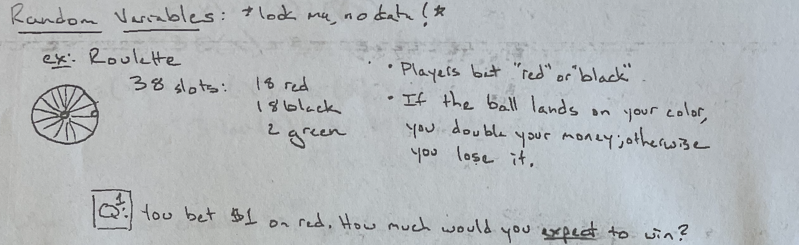
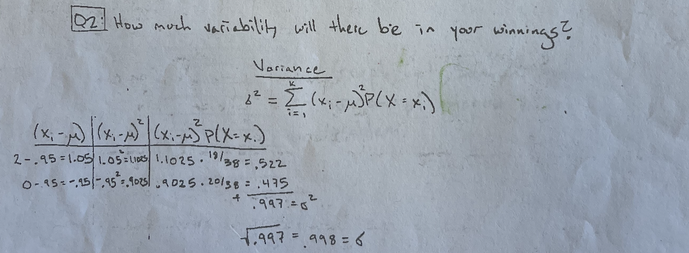
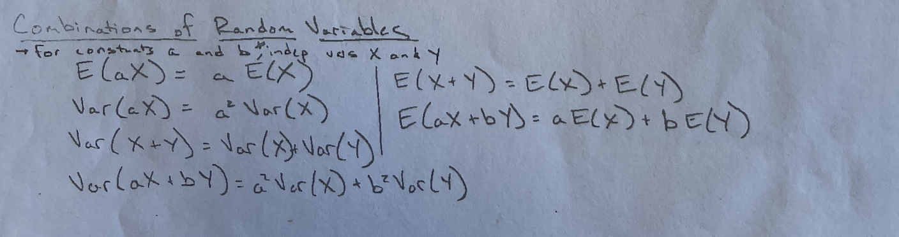
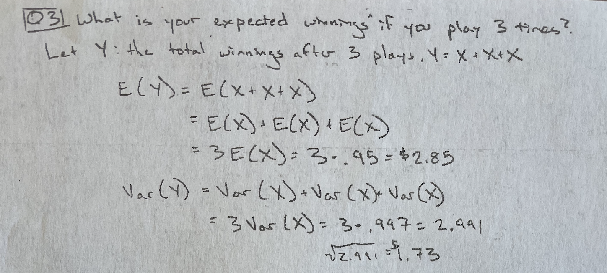
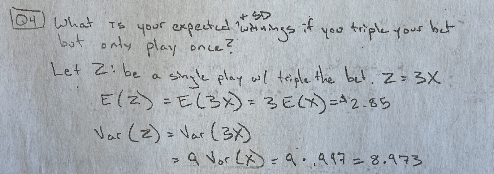

```{r setup, include=FALSE, warning=FALSE}
knitr::opts_chunk$set(message = FALSE,
                      warning = FALSE,
                      echo = TRUE,
                      fig.align = "center",
                      fig.retina = 3)

library(tidyverse)
library(xaringanthemer)
library(kableExtra)
library(emo)
library(palmerpenguins)
library(nomnoml)
library(DiagrammeR)
library(DiagrammeRsvg)
library(rsvg)
source("https://raw.githubusercontent.com/stat-20/stat-20-website/main/xaringan-theme.R")
xaringanExtra::use_panelset()
```

---
## Announcements

1. Lab 4 due Tues 8 pm (no Lab 5)

--

2. PS 5 due Fri 8 pm

--

3. Midterm I next Monday

---

.pull-left[
**Intro to Data**
- Data frames
- Taxonomy of Data
- Key terms

**Reproducibility**

- 3 tenets
- Our tools: R + Markdown

**Probability**
- Definitions
- Conditional Prob.
- Random Variables
- Foundational Distributions
]

.pull-right[
**Describing Data**
- Describing distributions verbally
- Numerical summaries
- Graphical summaries
    - Grammar of Graphics
    - `ggplot2`

**Study Design**
- Key terms
- Sampling
- Experimental Design

**Data Wrangling**
- Filtering, subsetting, aggregating
]

---

## Midterm I Logistics

- Locations: Evans Hall and Physics 3. Stay tuned.

--

- 50 minutes

--

- References will be provided

--

- Mix of multiple choice and short answer

---

```{r echo = FALSE, fig.align='center', out.width="40%"}
knitr::include_graphics("figs/roulette.gif")
```


```{r echo = FALSE, fig.align='center', out.width="100%"}

```

.cite[source: https://boardgamegeek.com/thread/1927319/wheel-fate]

---

```{r echo = FALSE, fig.align='center', out.width="100%"}
knitr::include_graphics("figs/p4.png")
```

---

```{r echo = FALSE, fig.align='center', out.width="100%"}

```

---

```{r echo = FALSE, fig.align='center', out.width="100%"}

```

---

.pull-left[
### Q3

What is your expected winnings and their SD if you play 3 times?
]

.pull-right[
### Q4
What is your expected winnings and their SD if you triple your bet but play only once?
]

--

.task[
Work with your neighbor(s) to come up with your 4 answers and enter them at `pollev.com/andrewbray088`.
]

```{r echo = FALSE}
countdown::countdown(minutes = 4, bottom = 0)
```

---

```{r echo = FALSE, fig.align='center', out.width="100%"}

```

---

```{r echo = FALSE, fig.align='center', out.width="100%"}

```
