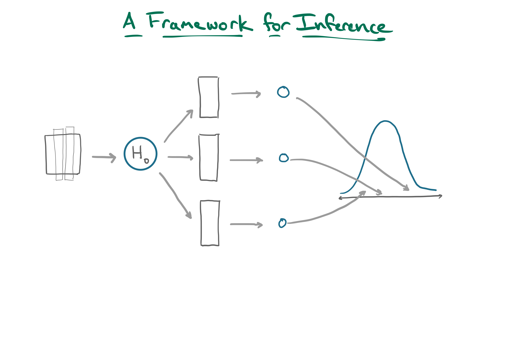
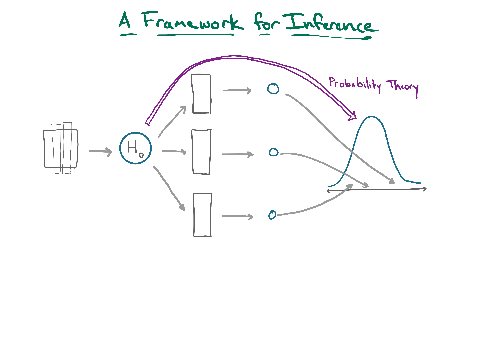

```{r setup, include=FALSE, warning=FALSE}
knitr::opts_chunk$set(message = FALSE,
                      warning = FALSE,
                      echo = FALSE,
                      fig.align = "center",
                      fig.retina = 3)

library(tidyverse)
library(knitr)
library(xaringanthemer)
library(kableExtra)
source("https://raw.githubusercontent.com/stat-20/stat-20-website/main/stat20-theme.R")
xaringanExtra::use_panelset()
```

## Millenials and same-sex marriage

In the national debate on same-sex marriage, it is commonly stated that half of all Americans favor same-sex marriage.  In 2014, Pew research conducted a poll of millennials (Americans born after 1980) and found that 67% answered yes when asked: "Do you favor same-sex marriage?"  The poll was a random sample of 75 millennials.  Does this poll provide convincing evidence that the opinion of millennials is different from those of Americans at large?

--

### The Hypotheses

Let $p$ be the true proportion of Americans who favor same-sex marriage.

$$H_0: p = 0.5$$

$$H_A: p \ne 0.5$$

---
## Finding the Null Distribution: Taking Draws

If a null hypothesis concerns a particular value that a proportion should take (a _point_ null), then you can generate data under that null hypothesis by taking **draws** from that distribution.

--

### Our Simulation

1. Flip 75 fair coins.
2. Calculate the proportion the 75 that came up heads.
3. Repeat 1-2 500 times, keeping track of those proportions.

---

## Null Distribution with 100 reps

```{r fig.width = 10, echo = FALSE, fig.height=4}
set.seed(51)
library(stat20data)
data(millenials)
library(infer)
null <- millenials %>%
  specify(response = response, success = "favor") %>%
  hypothesize(null = "point", p = .5) %>%
  generate(reps = 100, type = "draw") %>%
  calculate(stat = "prop")

obs_stat <- millenials %>%
  specify(response = response, success = "favor") %>%
  calculate(stat = "prop")

null %>%
  visualize() +
  shade_pvalue(obs_stat = obs_stat,
               direction = "both")
```

```{r echo = FALSE}
p_two <- null %>%
  get_p_value(obs_stat = obs_stat, direction = "both")
```

**p-value**: `r p_two`.

--

.task[
What will happen if we repeat the simulation and look at the p-value from a _different_ 100 reps?
]

---

## Null Distribution with (a new) 100 reps 

```{r fig.width = 10, echo = FALSE, fig.height=4}
null <- millenials %>%
  specify(response = response, success = "favor") %>%
  hypothesize(null = "point", p = .5) %>%
  generate(reps = 100, type = "draw") %>%
  calculate(stat = "prop")

obs_stat <- millenials %>%
  specify(response = response, success = "favor") %>%
  calculate(stat = "prop")

null %>%
  visualize() +
  shade_pvalue(obs_stat = obs_stat,
               direction = "both")
```

```{r echo = FALSE}
p_two <- null %>%
  get_p_value(obs_stat = obs_stat, direction = "both")
```

**p-value**: `r p_two`.

--

.task[
What will happen if we increase the number of simulations to 5000 reps?
]

---

## Null Distribution with 5,000 reps 

```{r fig.width = 10, echo = FALSE, fig.height=4}
null <- millenials %>%
  specify(response = response, success = "favor") %>%
  hypothesize(null = "point", p = .5) %>%
  generate(reps = 5000, type = "draw") %>%
  calculate(stat = "prop")

obs_stat <- millenials %>%
  specify(response = response, success = "favor") %>%
  calculate(stat = "prop")

null %>%
  visualize() +
  shade_pvalue(obs_stat = obs_stat,
               direction = "both")
```

```{r echo = FALSE}
p_two <- null %>%
  get_p_value(obs_stat = obs_stat, direction = "both")
```

**p-value**: `r p_two`.

--

> Increasing replicates stabilizes the distribution and increases precision of p-value.

---

```{r}

```

---

```{r}

```

---
class: center, middle, inverse

# Probability Theory: Exact Method

---

$$
X \sim \textrm{Bin}(n = 75, p = .5)
$$

```{r fig.width = 10, fig.height=4}
library(tidyverse)
n <- 75
p <- .5

data.frame(heads = 0:n, 
           prob = dbinom(x = 0:n, size = n, prob = p)) %>%
ggplot(aes(x = factor(heads), y = prob)) +
  geom_col() +
  labs(x = "x",
       y = "P(X = x)")  +
  scale_x_discrete(breaks = seq(0, 75, 5))
```

--

> What is $P(X > 37)$?

---

$$
X \sim \textrm{Bin}(n = 75, p = .5)
$$

```{r fig.width = 10, fig.height=4}
library(tidyverse)

data.frame(heads = 0:n, 
           prob = dbinom(x = 0:n, size = n, prob = p)) %>%
  mutate(ge_38 = heads < 38) %>%
  ggplot(aes(x = factor(heads), 
             y = prob,
             fill = ge_38)) +
  geom_col() +
  labs(x = "x",
       y = "P(X = x)")  +
  scale_x_discrete(breaks = seq(0, 75, 5)) +
  scale_fill_discrete() +
  theme(legend.position = "none")
```

> What is $P(X > 37)$? $1 - P(X \le 37)$

--

```{r bin1, echo = TRUE, eval = FALSE}
1 - pbinom(37, size = 75, prob = .5)
```

--

```{r ref.label = "bin1", echo = FALSE, eval = TRUE}
```

---

$$
X \sim \textrm{Bin}(n = 75, p = .5)
$$

```{r fig.width = 10, fig.height=4}
library(tidyverse)

data.frame(heads = 0:n, 
           prob = dbinom(x = 0:n, size = n, prob = p)) %>%
  mutate(ge_38 = heads < 50 & heads > 25) %>%
  ggplot(aes(x = factor(heads), 
             y = prob,
             fill = ge_38)) +
  geom_col() +
  labs(x = "x",
       y = "P(X = x)")  +
  scale_x_discrete(breaks = seq(0, 75, 5)) +
  scale_fill_discrete() +
  theme(legend.position = "none")
```

> What is $P(X \ge 50) + P(X \le 25)$?

--

```{r bin2, echo = TRUE, eval = FALSE}
1 - pbinom(q = 49, size = 75, prob = .5) +
  pbinom(q = 25, size = 75, prob = .5)
```

--

```{r ref.label = "bin2", eval = TRUE}
```

---

## Null Distribution with 50,000 reps 

```{r fig.width = 10, echo = FALSE, fig.height=4}
null <- millenials %>%
  specify(response = response, success = "favor") %>%
  hypothesize(null = "point", p = .5) %>%
  generate(reps = 50000, type = "draw") %>%
  calculate(stat = "prop")

obs_stat <- millenials %>%
  specify(response = response, success = "favor") %>%
  calculate(stat = "prop")

null %>%
  visualize() +
  shade_pvalue(obs_stat = obs_stat,
               direction = "both")
```

```{r echo = FALSE}
p_two <- null %>%
  get_p_value(obs_stat = obs_stat, direction = "both")
```

**p-value**: `r p_two`.

---
## Simulation vs Exact Method

--

- With certain null hypotheses, it's possible to compute the p-value _exactly_.
- We can get arbitrarily close to this exact probability through _simulation_, which is much more general.

--

> How were p-values computed before computers?

---
class: center, middle, inverse

# Probability Theory: Approximation Method

---
## The Normal Distribution

Describes a _continuous_ random variable that is bell-shaped, centered at $\mu$ and with a spread of $\sigma$.

--

.pull-left[
$$
X \sim \textrm{N}(\mu, \sigma)
$$

_"X is distributed as a Normal r.v. center at mu with a standard deviation of sigma._

\begin{align}
f(x) &= \frac{1}{\sigma \sqrt{2\pi}}e^{-\frac{1}{2}\left(\frac{x-\mu}{\sigma} \right)^2}
\end{align}
]

--

.pull-right[

```{r fig.height=4}

data.frame(heads = -3:3, 
           prob = rep(0, 7)) %>%
  ggplot(aes(x = heads, 
             y = prob)) +
  geom_blank() +
  stat_function(fun = dnorm,
                args = list(mean = 0,
                            sd = 1),
                col = "goldenrod",
                size = 2) +
  labs(x = "x",
       y = "f(x)") +
  scale_x_continuous(breaks = -3:3)
```

]

---

$$
X \sim \textrm{N}(\mu = 75 \cdot .5, \sigma = \sqrt(75 \cdot .5 \cdot .5)
$$

```{r fig.width = 10, fig.height=4}
library(tidyverse)

data.frame(heads = 0:n, 
           prob = dbinom(x = 0:n, size = n, prob = p)) %>%
  mutate(ge_38 = heads < 50 & heads > 25) %>%
  ggplot(aes(x = factor(heads), 
             y = prob,
             fill = ge_38)) +
  geom_blank() +
  stat_function(fun = dnorm,
                args = list(mean = n*p,
                            sd = sqrt(n*p*(1-p))),
                col = "goldenrod",
                size = 2) +
  labs(x = "x",
       y = "f(x)")  +
  scale_x_discrete(breaks = seq(0, 75, 5)) +
  scale_fill_discrete() +
  theme(legend.position = "none")
```

> What is $P(X \ge 50) + P(X \le 25)$?

--

```{r norm1, echo = TRUE, eval = FALSE}
1 - pnorm(q = 49, mean = 75 *.5, sd = sqrt(75*.5*.5)) +
  pnorm(q = 25, mean = 75 *.5, sd = sqrt(75*.5*.5))
```

--

```{r ref.label = "norm1", eval = TRUE}
```

---

```{r}

```
