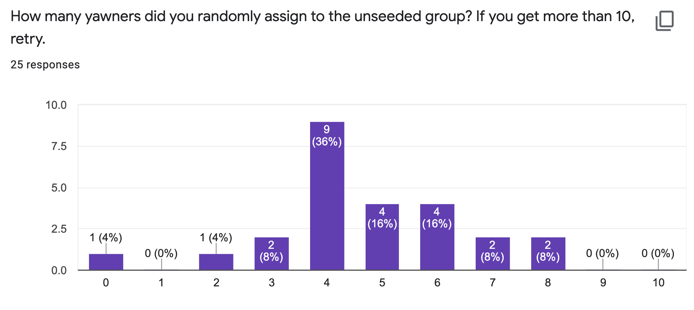
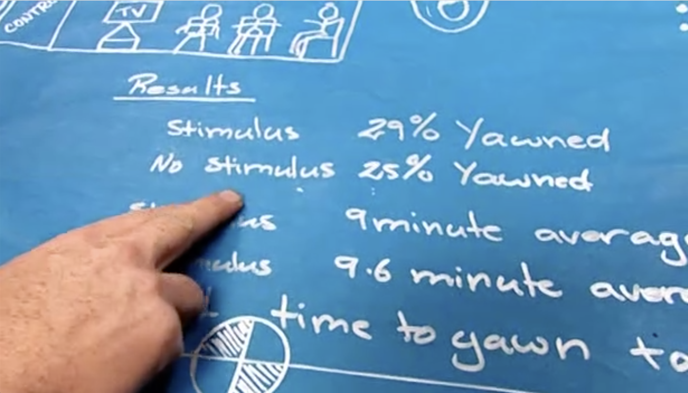

```{r setup, include=FALSE, warning=FALSE}
knitr::opts_chunk$set(message = FALSE,
                      warning = FALSE,
                      echo = TRUE,
                      fig.align = "center",
                      fig.retina = 3)

library(tidyverse)
library(knitr)
library(xaringanthemer)
library(kableExtra)
source("https://raw.githubusercontent.com/stat-20/stat-20-website/main/stat20-theme.R")
xaringanExtra::use_panelset()
```

name: waiting

## While you're waiting...

.task[
Which statement regarding the MythBusters experiment last week is true?
]

A. The number of yawners in the unseeded group that was observed (4) is precisely the sort of data we'd expect to observe if yawning _was not_ contagious.

B. The number of yawners in the unseeded group that was observed (4) is precisely the sort of data we'd expect to observe if yawning _was_ contagious.

Respond at `pollev.com/andrewbray088`.

---
class: center, middle, inverse

# Goal:

.adage[Learn to construct and critique claims made using data.]

---

## Case study: Gender Discrimination

.pull-left[
```{r out.width=600, echo = FALSE, fig.align='center'}
knitr::include_graphics("figs/equal-pay.jpg")
```
]

.pull-right[  
  - 48 male supervisors given the same personnel file.
  - Asked: promote or not.
  - Files were identical except gender.
  - Files were randomly assigned to the supervisors.
  - Goal: are females unfairly discriminated against?
]

---
## The Data

Gender | promote | nopromote 
-------|---------|-----------
Male   |    21   |    3      
Female |    14   |    10    

--

$$P(promote\,|\,M) = 21/24 = 0.875 \\
P(promote\,|\,F) = 14/24 = 0.583$$

--

At a first glance, does there appear to be a relatonship between promotion and 
gender?


---
.panelset[
.panel[.panel-name[Question]
.task[
We saw a difference of almost 30% (29.2% to be exact) between the proportion of male and female files that are promoted. Based on this information, which of the below is true?
]

<ol type="a">
  <li>If we were to repeat the experiment we will definitely see that more female files get promoted. This was a fluke.</li>
  <li>Promotion is dependent on gender, males are more likely to be promoted, and hence there is gender discrimination against women in promotion decisions.</li>
  <li>The difference in the proportions of promoted male and female files is due to chance, this is not evidence of gender discrimination against women in promotion decisions.</li>
</ol>

.cite[pollev.com/andrewbray088]
]

.panel[.panel-name[Answers]
<center>
<iframe src="https://embed.polleverywhere.com/multiple_choice_polls/55Mceu3tMbTsC8TYiYP6P?controls=none&short_poll=true" width="800px" height="600px"></iframe>
</center>
]
]

---
## Structure of Hypothesis Test

There are two competing claims.

.pull-left[
**Null Hypothesis**, $H_0$: "There is nothing going on".

- Promotion and gender are independent.
- No gender discrimination.
- Observed difference in proportions is simply due to chance.

]

--

.pull-right[
**Alternative Hypothesis**, $H_A$: "There is something going on.”

- Promotion and gender are dependent.
- There is gender discrimination.
- Observed difference in proportions is not due to chance.

]

---

## Trial as a Hypothesis test

```{r out.width = 350, echo = FALSE, fig.align='center'}
knitr::include_graphics("figs/trial.png")
```
  
**H0**  : Defendant is innocent  vs.  **HA**  : Defendant is guilty

- Present evidence / collect data.

--
- Judge the evidence - “Could these data plausibly have happened by chance if the null hypothesis were true?"

--
- If they were very unlikely to have occurred, then the evidence raises more than a reasonable doubt in our minds about the null hypothesis.


---
## If the evidence is weak

- If the evidence is not strong enough to reject the assumption of innocence, the jury returns with a verdict of *not guilty*.
    - The jury does not say that the defendant is innocent, just that there is not enough evidence to convict.
--
- Said statistically: *we fail to reject the null hypothesis*, or *the data is consistent with our model*.

--

We never *accept the null hypothesis*.

> Why not?


---

## Why don't we accept $H_0$?

--

The hypothesis test gives us:

$$ P(\textrm{data}\,|\,\textrm{H}_0) $$

--

It doesn't give us:

$$ P(\textrm{H}_0\,|\,\textrm{data}) $$

---
## Structure of a Hypothesis Test

1. Start with a **null hypothesis** ( $H_0$ ) that represents the status quo and an **alternative hypothesis** ( $H_A$ ) that represents our research question, i.e. what we're testing for.

--

2. Calculate the observed **test statistic**: an encapsulation of the evidence.

--

3. Find the **null distribution** of the test statistic under the assumption that $H_0$ is true, either via simulation (this week) or theoretical methods (later in the course).

--

4. If the test results suggest that the data is consistent with $H_0$, we stick with the $H_0$. If they are inconsistent, then we reject the $H_0$ in favor of $H_A$.


---
## Gender discrimination: $H_0$ test

What is the *null hypothesis*?

--
- $H_0$: There is no gender discrimination
- $H_0$: Gender and promotion are independent

--

What is the *alternative hypothesis*?

--
- $H_A$: There is gender discrimination
- $H_A$: Gender and promotion are not independent

--

What is our *test statistic*?

--
- $d = \hat{p}_{M} - \hat{p}_{F}$


---
## Recall: the data

Gender | promote | nopromote 
-------|---------|-----------
Male   |    21   |    3      
Female |    14   |    10    


We can compute our observed test statistic:

$$d_{obs} = \hat{p}_{M} - \hat{p}_{F} \\
d_{obs} = 21/24 - 14/24 = .29$$


---
## Creating a simulation

```{r out.width=750, echo = FALSE, fig.align='center'}
knitr::include_graphics("figs/gender-cards1.png")
```

**Face cards**: note promoted  
**Number cards**: promoted


---
## Constructing the Null Distribution

1. Shuffle the deck and deal into two piles of twenty four.
2. This mimics the process of each supervision being randomly assigned a male or female file.
3. Compute the proportion that is promoted in each:

$$d = \hat{p}_{M} - \hat{p}_{F}$$

Repeat steps 1-3 and store each one.

---

```{r out.width=750, echo = FALSE, fig.align='center'}
knitr::include_graphics("figs/gender-cards2.png")
```

--

> Instead of shuffling cards, we'll shuffle data frames using R...

---

.panelset[

.panel[.panel-name[Simulation using R]
.pull-left[
```{r simgender, fig.width = 8, echo = FALSE, message = FALSE}
gender <- rep(c("M", "F"), each = 24)
promote <- rep(c("Yes", "No"), c(35, 13))
paygap <- tibble(gender, promote)
n_reps <- 5000

library(infer)
null <- paygap %>%
  specify(response = promote,
          explanatory = gender,
          success = "Yes") %>%
  hypothesize(null = "independence") %>%
  generate(reps = n_reps, type = "permute") %>%
  calculate(stat = "diff in props",
            order = c("M", "F"))

p1 <- null %>%
  visualize() +
  shade_pvalue(obs_stat = .29, direction = NULL)
p1
```
]

.pull-right[
.task[
**Question**: Do the results of the simulation you just ran provide convincing evidence of gender discrimination against women, i.e. dependence between gender and promotion decisions?
]

Respond at `pollev.com/andrewbray088`.
]]

.panel[.panel-name[Answers]
<center>
<iframe src="https://embed.polleverywhere.com/multiple_choice_polls/0SwELhsNZQJk0OaUwzRrG?controls=none&short_poll=true" width="800px" height="600px"></iframe>
</center>
]
]

<!---

Do the results of the simulation you just ran provide convincing evidence of gender discrimination against women, i.e. dependence between gender and promotion decisions?

**A)** No, the data do not provide convincing evidence for the alternative hypothesis, therefore we can't reject the null hypothesis of independence between gender and promotion decisions. The observed difference between the two proportions was due to chance.

**B)** Yes, the data provide convincing evidence for the alternative hypothesis of gender discrimination against women in promotion decisions. The observed difference between the two proportions was due to a real effect of gender.

--->

---
## Computing a p-value

A **p-value** is the probability of observing the observed statistic or more extreme if $H_0$ is true.

**In a simulation setting**...a p-value is the _proportion_ of test statistics simulated assuming $H_0$ is true that are more extreme than the observed test statistic.

--

.pull-left[
```{r fig.height=3, echo = FALSE}
p1
```
]

--

.pull-right[
Of the `r n_reps` simulated test statistics, `r sum(abs(null$stat) > .29)` of them were more extreme than the observed value of `r .29`.

> P-value: `r sum(abs(null$stat) > .29)/n_reps`.

]

---
class: center, middle, inverse

# Mythbusters
## Is Yawning Contagious?

---
template: waiting

---

<center>
<iframe src="https://embed.polleverywhere.com/multiple_choice_polls/NAD3aFeB8g5HD8lWDrzjs?controls=none&short_poll=true" width="800px" height="600px"></iframe>
</center>

---

```{r echo = FALSE}

```
--
.task[
In pairs/trio, discuss the 5 question survey and respond at `pollev.com/andrewbray088`.
]

```{r echo = FALSE}
countdown::countdown(3)
```

---
# No, Mythbusters data shows no evidence that yawning is contagious

```{r echo = FALSE, out.width = "70%"}

```

---
# But yes, yawning is contagious

--

>Contagious yawning, however, seems to be isolated to just a few animals, including people, non-human primates and domesticated dogs. What's more is that contagious yawning doesn't really appear in human behavior until early childhood. Taken together, experts believe that contagious yawning may be a social communication tool specific to higher-order animals.

```{r echo = FALSE, out.width="30%"}
knitr::include_graphics("figs/dog-yawn.png")
```

.cite[https://www.houstonmethodist.org/blog/articles/2021/feb/why-do-we-yawn-and-are-yawns-really-contagious/]

