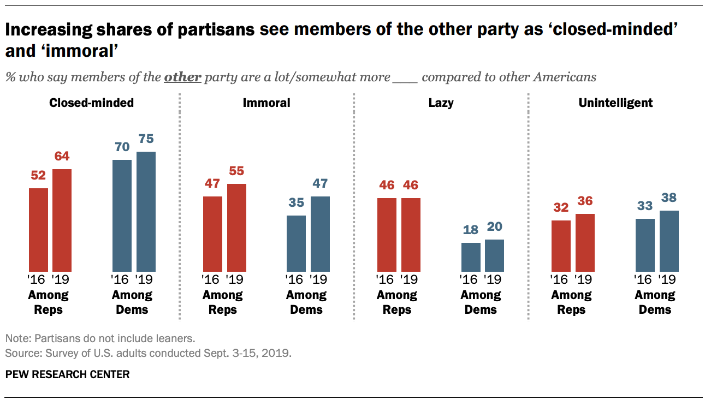

```{r setup, include=FALSE, warning=FALSE}
knitr::opts_chunk$set(message = FALSE,
                      warning = FALSE,
                      echo = TRUE,
                      fig.align = "center",
                      fig.retina = 3)

library(tidyverse)
library(infer)
library(knitr)
library(xaringanthemer)
library(kableExtra)
source("https://raw.githubusercontent.com/stat-20/stat-20-website/main/stat20-theme.R")
xaringanExtra::use_panelset()
set.seed(401)
```


## Announcements

- PS 8 due this coming Tuesday 8 am
- Lab 8 due the following Tuesday 8 am
- Quiz Sunday - Monday
- My OH outside Yali's 3 - 4 pm today

---
## Quiz: Inference

### Hypothesis tests
- Parameters vs statistics
- Setting up hypotheses
- Selecting a test statistic
- Formulating the null distribution
- Assessing evidence for-against the null visually and via p-values
- Interpretation of a p-value

### Methods of finding the null
- Computation (permuting and taking draws)
- Probability Theory (exact and normal approximation)

---

```{r out.width=800, echo = FALSE, fig.align='center'}
knitr::include_graphics("figs/pew1.png")
```

???
Start class by drawing Plato's Cave on the board

---

```{r out.width=800, echo = FALSE, fig.align='center'}

```

---

```{r out.width=800, echo = FALSE, fig.align='center'}
knitr::include_graphics("figs/pew3.png")
```

---

Boardwork

---
class: center, middle, inverse

# Finding the Sampling Distribution with the Bsootstrap

---
## Pew Data

How much uncertainty do we have in our estimate (64%) of the proportion of Republicans that think Democrats are more close-minded?

```{r pew1, eval = FALSE, echo = FALSE}
pew <- tibble(party = "Republican",
              closed = rep(c("yes", "no"),
                           c(3166, 1781)))
```

--

.pull-left[

```{r ref.label = "pew1", echo = FALSE}
```

```{r}
pew
```
]

--

.pull-right[
```{r}
pew %>%
  count(closed)
```
]

---
## Visualizing the data

.task[
What geometry is appropriate for visualizing a single categorical variable with two levels/values?
]

---
## Visualizing the data

What geometry is appropriate for visualizing a single categorical variable with two levels/values? _bar chart_

--

.pull-left[
```{r pewbar, eval = FALSE}
pew %>%
  ggplot(aes(x = closed)) +
  geom_bar()
```
]

--

.pull-right[
```{r ref.label = "pewbar", echo = FALSE, fig.height = 4.5}
```
]

---
## Calculating $\hat{p}$

$\hat{p}$ represents the observed statistic / estimate of the parameter $p$.

--

.pull-left[

**with `dplyr`**
```{r }
obs_stat <- pew %>%
  summarize(p_yes = mean(closed == "yes"))
obs_stat
```
]

--

.pull-right[
**with `infer`**
```{r}
obs_stat <- pew %>%
  specify(response = closed, 
          success = "yes") %>%
  calculate(stat = "prop")
obs_stat
```
]


---
## Generating a bootstrap sample

--

```{r boot1, eval = FALSE}
pew %>%
  specify(response = closed, 
          success = "yes") %>%
  generate(reps = 1, type = "bootstrap")
```

--

```{r ref.label = "boot1", echo = FALSE}
```


---
## Generating another bootstrap sample

--

.pull-left[
```{r}
pew %>%
  specify(response = closed, 
          success = "yes") %>%
  generate(reps = 1, type = "bootstrap")
```
]

--

.pull-right[
```{r}
pew %>%
  specify(response = closed, 
          success = "yes") %>%
  generate(reps = 1, type = "bootstrap")
```
]

---
## Generating nine bootstrap samples

--

.pull-left[
```{r}
boot_9 <- pew %>%
  specify(response = closed, 
          success = "yes") %>%
  generate(reps = 9, type = "bootstrap")
boot_9 %>%
  head()
```
]

--

.pull-right[
```{r}
boot_9 %>%
  tail()
```
]

---
## Visualizing nine bootstrap samples

--

.pull-left[
```{r boot9, eval = FALSE}
boot_9 %>%
  ggplot(aes(x = closed)) +
  geom_bar() + 
  facet_wrap(vars(replicate))
```
]

--

.pull-right[
```{r ref.label = "boot9", echo = FALSE}
```
]

---
## Calculating nine bootstrap $\hat{p}$

Note the reduction in size of the data frame as we summarize each bootstrap data set with a single statistic.

--

.pull-left[
```{r}
boot_9
```
]

--

.pull-right[
```{r}
boot_9 %>%
  calculate(stat = "prop")
```
]

---
## Visualizing bootstrap dist. of $\hat{p}$ (500 reps)

.task[
What geometry is appropriate for visualizing a single numerical variable (proportions)?
]

---
## Visualizing bootstrap dist. of $\hat{p}$ (500 reps)

What geometry is appropriate for visualizing the distribution of a single numerical variable (proportions)? _Density plot, histogram, dot plot, box plot_.

--

.pull-left[
```{r boot, eval = FALSE}
boot <- pew %>%
  specify(response = closed, 
          success = "yes") %>%
  generate(reps = 500, type = "bootstrap") %>%
  calculate(stat = "prop")

boot %>%
  ggplot(aes(x = stat)) +
  geom_density()
```
]

--

.pull-right[
```{r ref.label = "boot", echo = FALSE, fig.height = 4.5}
```
]

---
## Compute $1 - \alpha$ confidence interval

`get_ci()` takes the _bootstrap distribution_ and a $1 - \alpha$ _confidence level_ and returns a _percentile confidence interval_.

--
### 95% Percentile confidence interval

```{r bootci, eval = FALSE}
ci_boot <- boot %>%
  get_ci(level = .95) #<<
ci_boot
```

--

```{r ref.label = "bootci", echo = FALSE, fig.height = 4.5}
```


---
## Visualizing bootstrap dist. of $\hat{p}$ (500 reps)

`visualize()` is a short cut to make a ggplot for null and sampling (bootstrap) distributions. Allows shading of p-values and confidence intervals.

--

.pull-left[
```{r bootv, eval = FALSE}
boot %>%
  visualize() +
  shade_ci(ci_boot) #<<
```
]

--

.pull-right[
```{r ref.label = "bootv", echo = FALSE, fig.height = 4.5}
```
]

---
## Interpreting a Confidence Interval

--

```{r}
ci_boot
```

We are 95% confident that the true proportion of Republicans that think Democrats are closed minded is between 62.7% and 65.4%.


---

```{r echo = FALSE, out.width="85%"}
knitr::include_graphics("figs/infer-w-approx.jpg")
```


---
class: middle, inverse, center

# Finding the Sampling Distribution with Probability Theory

---
## Normal Approximation Method

The sampling distribution of the point estimate $\hat{p}$ can be well-approximated with:
  
$$\hat{p} \sim N(\mu = p, \sigma = \sqrt{\frac{p(1-p)}{n}}) \quad \quad$$ if

--

1. Observations are independent
2. The sample is large enough (rule of thumb: the number of observed successes and failures is more than 10).

$$n\hat{p} \ge 10 \\
n(1 - \hat{p}) \ge 10$$


---
## Constructing a CI using the Normal

```{r echo = FALSE, fig.height = 4}
sampling_dist <- pew %>%
   specify(response = closed,
           success = "yes") %>%
   assume(distribution = "z")
visualize(sampling_dist)
```

--

.task[
How many _standard errors_ should we extend the confidence interval to include the middle 95% of the sampling distribution?
]

--

**About two.**

---
## Constructing a CI using the Normal

The sampling distribution of the point estimate $\hat{p}$ can be well-approximated with:
  
$$\hat{p} \sim N(\mu = p, \sigma = \sqrt{\frac{p(1-p)}{n}}) \quad \quad$$

--

**Form of theoretical CI**

<center>
point estimate $\pm$ margin of error
</center>

$$\hat{p} \pm 1.96 \sqrt{(\hat{p} \times (0.36)1 - \hat{p})/n}$$

_margin of error_: amount above and below the point estimate where you are confident that parameter lies

---
## Question

We are given that $n = 4947, \hat{p} = 0.64$. Which of the
below is the correct calculation of the 95% confidence interval?

1. $0.64 \pm 1.96 \sqrt{(.64 \times 0.36)/4947}$
2. $0.64 \pm 1.65 \sqrt{(.64 \times 0.36)/4947}$
3. $0.64 \pm 1.96 ((.64 \times 0.36)/\sqrt{4947})$
4. $64 \pm 1.96 \sqrt{(64 \times 36)/4947}$

---
## Constructing a CI using the Normal

```{r echo = FALSE, fig.height = 4}
sampling_dist <- pew %>%
   specify(response = closed,
           success = "yes") %>%
   assume(distribution = "z")
ci_theory <- get_ci(sampling_dist, .95, point_estimate = obs_stat)
visualize(sampling_dist) +
  shade_ci(ci_theory)
```

--

.pull-left[
```{r}
ci_theory
```
]

--

.pull-right[
```{r}
ci_boot
```
]


---
## Choosing between methods

--

### Bootstrap SE

- Must have sufficiently large sample (n > 30)
- Can be calculated for any statistic

--

### Normal approximation

- Must satisfy assumptions (independence, sample size)
- Most commonly used (still)


---

```{r out.width=600, out.height = 300, echo = FALSE, fig.align='center'}

```

Our estimate for the proportion of Republicans that view Democrats as more close-minded is 64% with a margin of error of 1.3%.

--

We're 95% confident that the true proportion of Republicans that view Democrats as more close-minded is between 62.6% and 65.3%.

