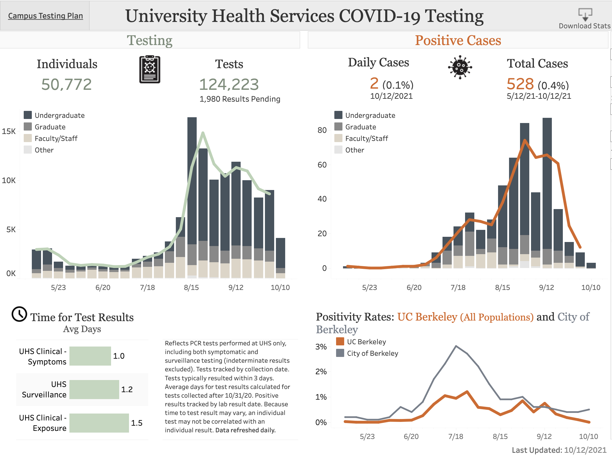
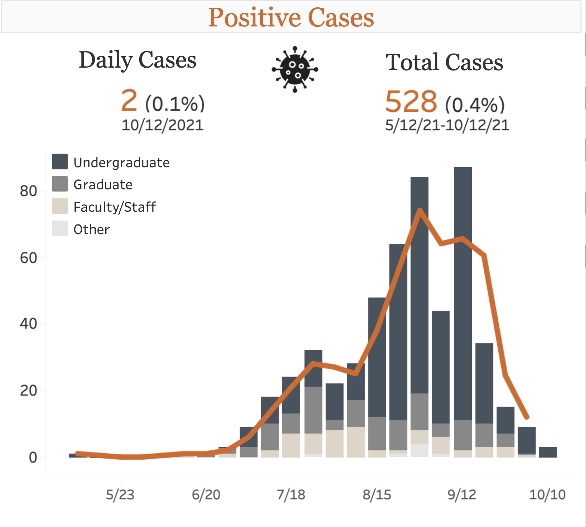
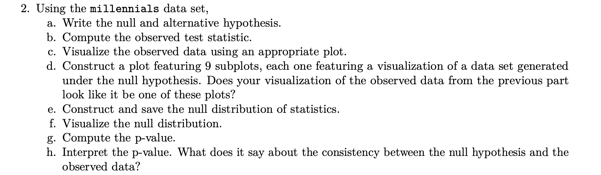

```{r setup, include=FALSE, warning=FALSE}
knitr::opts_chunk$set(message = FALSE,
                      warning = FALSE,
                      echo = FALSE,
                      fig.align = "center",
                      fig.retina = 3)

library(tidyverse)
library(knitr)
library(xaringanthemer)
library(kableExtra)
source("https://raw.githubusercontent.com/stat-20/stat-20-website/main/stat20-theme.R")
xaringanExtra::use_panelset()
```


class: middle, center, inverse

# Announcements

---
## Announcements

1. Schedule

---
.pull-left[
### Week 8
- Lecture: Statistical Errors, Confidence Intervals
- Lab 8 assigned, due Tues Week 10
- PS 8 assigned, due Tues Week 9
- Quiz: Sunday 11 am - Monday 11 am
]

.pull-right[
### Week 9
- Lecture: H-tests and CIs for numerical data
- PS 9 assigned, due Tues Week 10
- Quiz retake Thurs/Fri

### Week 10
- Lecture: Challenges and Solutions for Inference
- Midterm Monday of Week 11
]

---
## Announcements

1. Schedule

2. Quiz this coming Sunday/Monday

3. Midterm II 11/1

---
class: center, middle, inverse

# Hypothesis Testing Review

---

## What is it good for?

--

Hypothesis test have been shown to be valuable contributors to science (p < .05)
but are sometimes abused (p < .05).

--

- Used to assess the degree to which data is consistent with a particular model.
- The most widely used tool in statistical inference.


---
## Step 1

--

Lay out your model(s).

$H_0$: null model, business as usual  
$H_A$: alternative model, business not as usual

--

- Hypotheses are statments about the TRUE STATE of the world and should involve
*parameters*, not *statistics*.
- Hypotheses should suggest a *test statistic* that has some bearing on the claim.
- Always use two-tailed tests.


---
## Step 2

--

Contruct the appropriate null distribution.

```{r, echo=FALSE, eval=TRUE, fig.height = 3.5, fig.width = 10, fig.align='center'}
x1  <- 0:75
df <- data.frame(x = x1, y = dbinom(x1, 75, 0.5))
qplot(x, y, data = df) + 
  geom_bar(stat = "identity", col = "darkgreen", fill = "white") +
  stat_function(fun = dnorm, args = list(mean = 75/2, sd = sqrt(74/4)), 
                col = "goldenrod", lwd = 1.2)
```

--

1. Permutation (when `null = "independence"`)
--

2. Simulation (when `null = "point"`)
--

3. Exact Probability Theory (when you're lucky)
--

4. Normal Approximation (when the CLT applies)


---
## Step 3

--

Calculate a measure of consistency between the observed test statistic (the data)
and the null distribution (i.e., a p-value).

--

- If your observed test stat is in the tails > low p-val > data is inconsistent
with null hypothesis > "reject null hypothesis".
- If your observed test stat is in the body > high p-val > data is consistent with
the null hypothesis > "fail to reject the null hypothesis".

--

#### What can go wrong?

---
class:  middle, center, inverse

# Decision Errors

---
## Ex. Is there an outbreak?

```{r, out.width="65%"}

```

---

.pull-left[
```{r, out.width="100%"}

```
]

.pull-right[
**A simplified model**
UHS tests a sample of the Cal community every week and monitors the positivity rate (proportion of tests that are positive). Assume this is a random sample of constant size and that the test is perfectly accurate. Let $p$ be the positivity rate.

$H_0$: $p = 5%$ The incidence of COVID at Cal is at a manageable level.

$H_A$: $p > 5%$ The incidence of COVID at Cal is at an elevated level.
]

--

**Decision protocol**: if there is a big enough spike in a given week, shift classes to remote.

---
## Decision Errors

```{r, out.width="80%"}
knitr::include_graphics("figs/decision-errors-table.jpg")
```

---

.panelset[
.panel[.panel-name[Question]

Consider a setting where the Cal UHS testing system observes 87 positive cases of COVID in a one week interval, double the previous week.  Administration needs to decide whether or not to move  to remote learning. Which error would be worse?

A. Moving to remote instruction when in fact the true number of cases on campus is still low.

B. Failing to move to remote instruction when in fact the true number of cases on campus is elevated.

.task[
Discuss with a partner then enter your answer at `pollev.com/andrewbray088`.
]

```{r}
countdown::countdown(1)
```
]

.panel[.panel-name[Responses]
<center>
<iframe src="https://embed.polleverywhere.com/multiple_choice_polls/whmhtgaeLPalaVqOZcMCS?controls=none&short_poll=true" width="800px" height="600px"></iframe>
</center>
]
]

---
## Decision Errors Rates

```{r, out.width="80%"}
knitr::include_graphics("figs/decision-error-rates.jpg")
```

---
## What affects the error rates?

- **Sample size, $n$**: with increasing $n$, the variability of the null distribution will decrease.

- **Changing $\alpha$**: decreasing $\alpha$ will decrease type I error but increase type II error.

- **Increasing _effect size_**: change data collection process to separate the distribution under $H_A$ and decrease type II error.
    - Ex: If you're testing whether a pain medicine provides pain relief, only conduct the test if using a medicine that you expect to have cause a dramatic decrease in pain.

---
## Errors in other settings

```{r, out.width="90%"}

```

--

> What is a type I error in this setting?

> What is a type II error in this setting?

---
## Errors with millennials

> What is a type I error in this setting?

Concluding that millennials _are distinct_ from Americans at large with respect to same sex-marriage when in fact _they're not_.

> What is a type II error in this setting?

Concluding that millennials _are indistinguishable_ from Americans at large with respect to same sex-marriage when in fact _they are_.

