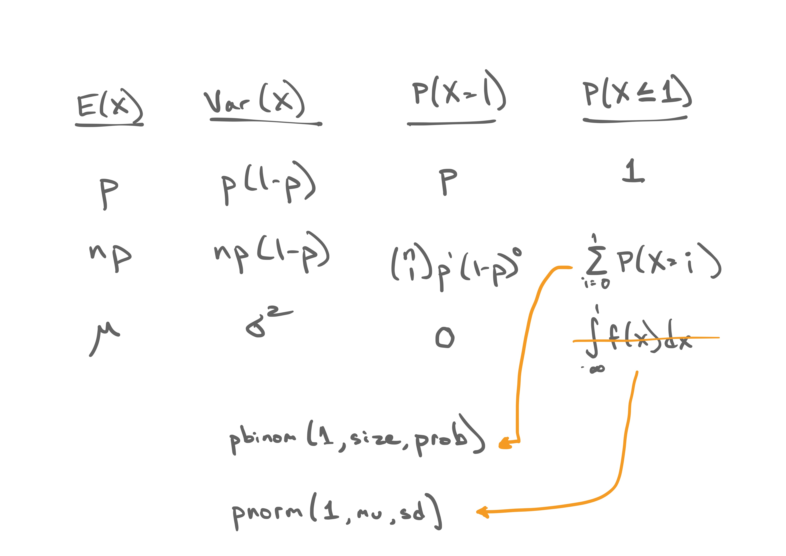
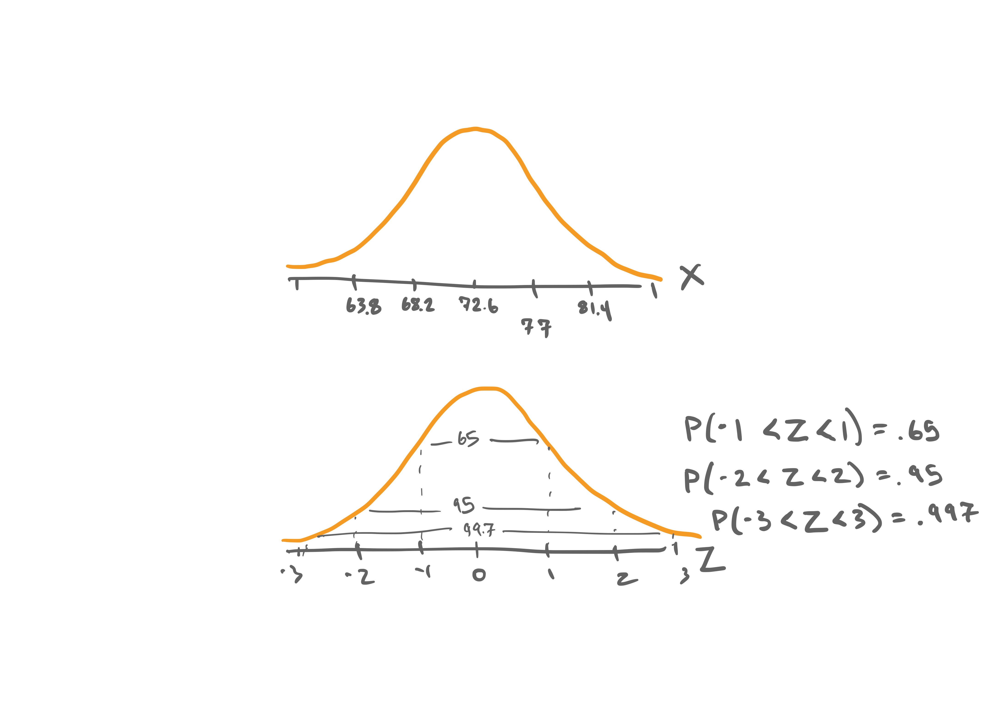
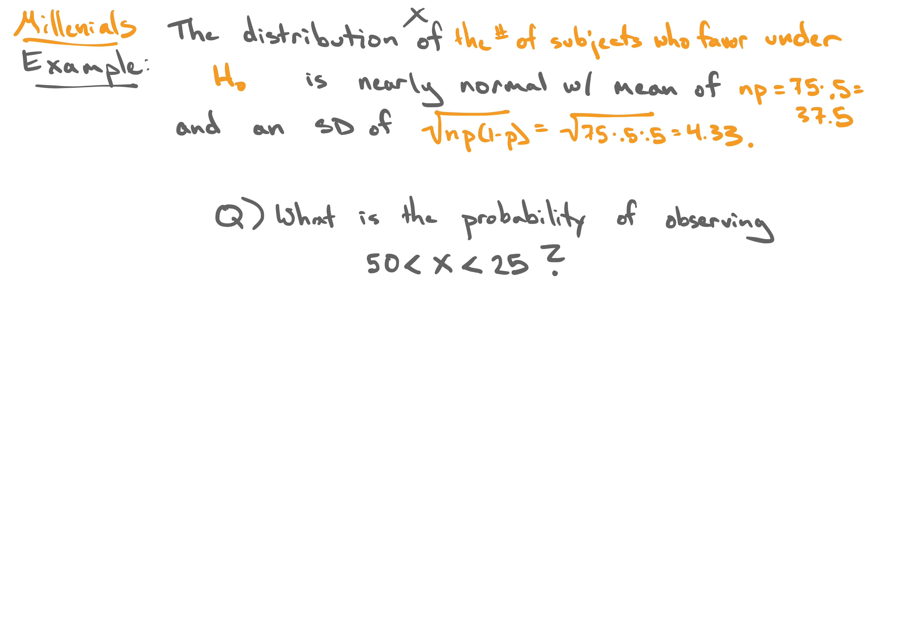

```{r setup, include=FALSE, warning=FALSE}
knitr::opts_chunk$set(message = FALSE,
                      warning = FALSE,
                      echo = FALSE,
                      fig.align = "center",
                      fig.retina = 3)

library(tidyverse)
library(knitr)
library(xaringanthemer)
library(kableExtra)
source("https://raw.githubusercontent.com/stat-20/stat-20-website/main/stat20-theme.R")
xaringanExtra::use_panelset()
```


```{r}
knitr::include_graphics("figs/infer-w-approx.jpg")
```

---

```{r, out.width="85%"}
knitr::include_graphics("figs/normal-1.jpg")
```

---

```{r, out.width="85%"}

```

---

```{r, out.width="85%"}
knitr::include_graphics("figs/normal-3.jpg")
```

---

```{r, out.width="85%"}

```

---

.panelset[
.panel[.panel-name[Question 2]
The distribution of car speeds on the I-5 in California is nearly normal with a mean of 72.6 mph and a standard deviation of 4.4 mph.

.task[
What % of the cars travel between 60 and 80 mph?
]
]

.panel[.panel-name[Responses]
<center>
<iframe src="https://embed.polleverywhere.com/multiple_choice_polls/QlHzhgLaQj82LTT41PufL?controls=none&short_poll=true" width="800px" height="600px"></iframe>
</center>
]
]

---

**Question 1**: What % of the cars travel slower than 75 mph? 
--
```{r echo = TRUE}
pnorm(75, mean = 72.6, sd = 4.4)
```

--
**Question 2**: What % of the cars travel between 60 and 80 mph?
--
```{r echo = TRUE}
pnorm(80, mean = 72.6, sd = 4.4) -
  pnorm(60, mean = 72.6, sd = 4.4)
```

---
## Why is the normal distribution helpful for inference?

---

```{r, out.width="85%"}

```

---
## Why is the normal distribution helpful for inference?

**Central Limit Theorem**
Sums of independent random variables become normally distributed as the $n \rightarrow \infty$.

> Our test statistics, $\hat{p}$ and $\hat{p}_1 - \hat{p}_2$, are both sums of (Bernoulli) randon variables.