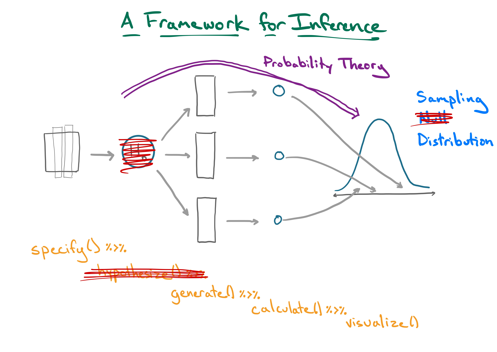
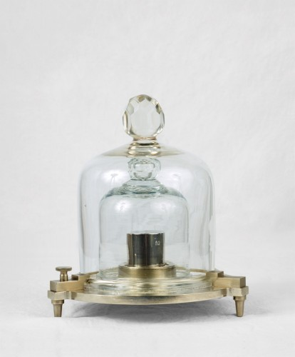
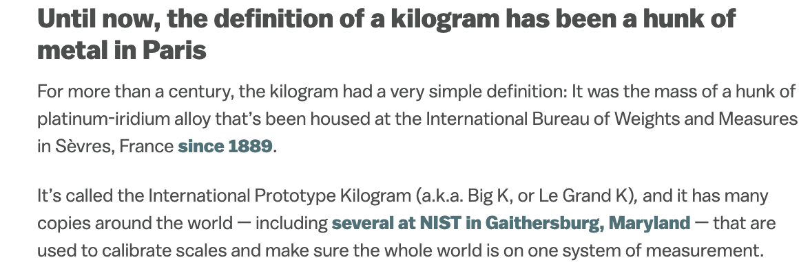

```{r setup, include=FALSE, warning=FALSE}
knitr::opts_chunk$set(message = FALSE,
                      warning = FALSE,
                      echo = TRUE,
                      fig.align = "center",
                      fig.retina = 3)

library(tidyverse)
library(infer)
library(knitr)
library(xaringanthemer)
library(kableExtra)
source("https://raw.githubusercontent.com/stat-20/stat-20-website/main/stat20-theme.R")
xaringanExtra::use_panelset()
set.seed(401)
```

## Agenda

1. Bootstrap CIs for numerical data
2. Small sample inference on a mean


---
class: center, middle, inverse

# Bootstrap CIs for numerical data

---

```{r echo = FALSE, out.width="80%"}

```


---
## Recall the penguins...

```{r echo = FALSE, out.width="80%", fig.align='center'}
knitr::include_graphics("figs/penguins.png")
```

---

```{r}
library(tidyverse)
library(palmerpenguins)
data(penguins)
penguins
```

--

**Question 1**: What proportion of the penguin population near Palmer Station are female?

---
**Question 1**: What proportion of the penguin population near Palmer Station are female?

--

.panelset[
.panel[.panel-name[Graphical Summary]
```{r fig.height=4}
penguins %>%
  ggplot(aes(x = sex)) +
  geom_bar()
```
]
.panel[.panel-name[Point Estimate]
```{r}
library(infer)
penguins %>%
  specify(response = sex,
          success = "female") %>%
  calculate(stat = "prop")
```
]
.panel[.panel-name[Interval Estimate]
```{r fig.height=4}
penguins %>%
  specify(response = sex,
          success = "female") %>%
  generate(reps = 500, type = "bootstrap") %>%
  calculate(stat = "prop") %>%
  get_ci(level = .95)
```
]
]


---
.task[What will happen to the confidence interval if we increase the _confidence level_?]

.panelset[
.panel[.panel-name[Question]
```{r fig.height=4}
penguins %>%
  specify(response = sex,
          success = "female") %>%
  generate(reps = 500, type = "bootstrap") %>%
  calculate(stat = "prop") %>%
  get_ci(level = .95)
```

]

.panel[.panel-name[Responses]
<center>
<iframe src="https://embed.polleverywhere.com/multiple_choice_polls/3y8nDdV7yJThvFRZzjGAf?controls=none&short_poll=true" width="600px" height="450px"></iframe>
</center>
]

.panel[.panel-name[Answer]
```{r}
penguins %>%
  specify(response = sex,
          success = "female") %>%
  generate(reps = 500, type = "bootstrap") %>%
  calculate(stat = "prop") %>%
  get_ci(level = .99)
```

> It will widen.
]

]

---
.task[What will happen to the confidence interval if we increase the _sample size_?]

.panelset[
.panel[.panel-name[Question]
```{r fig.height=4}
penguins %>%
  specify(response = sex,
          success = "female") %>%
  generate(reps = 500, type = "bootstrap") %>%
  calculate(stat = "prop") %>%
  get_ci(level = .95)
```

]

.panel[.panel-name[Responses]
<center>
<iframe src="https://embed.polleverywhere.com/multiple_choice_polls/GZiYDYnN7kaCwbeK25eLx?controls=none&short_poll=true" width="600" height="450"></iframe>
</center>
]

.panel[.panel-name[Answer]
```{r}
penguins %>%
  rbind(penguins) %>% # double the sample
  specify(response = sex,
          success = "female") %>%
  generate(reps = 500, type = "bootstrap") %>%
  calculate(stat = "prop") %>%
  get_ci(level = .95)
```

> It will narrow.
]

]

---

```{r echo = FALSE, out.width="80%"}
knitr::include_graphics("figs/sampling-dist.jpg")
```

---
## Inference for numerical data

```{r}
penguins
```

**Question 2**: What is the average bill length of the penguin population around Palmer Station?


---
**Question 2**: What is the average bill length of the penguin population around Palmer Station?

--

.panelset[
.panel[.panel-name[Graphical Summary]
```{r fig.height=4}
penguins %>%
  ggplot(aes(x = bill_length_mm)) +
  geom_histogram()
```
]
.panel[.panel-name[Point Estimate]
```{r}
penguins %>%
  specify(response = bill_length_mm) %>%
  calculate(stat = "mean")
```
]
.panel[.panel-name[Interval Estimate]
```{r fig.height=4}
penguins %>%
  specify(response = bill_length_mm) %>%
  generate(reps = 500, type = "bootstrap") %>%
  calculate(stat = "mean") %>%
  get_ci(level = .95)
```
]
]

---

.task[What needs to change to answer Question 3?]

**Question 3**: What is the _median_ bill length of the penguin population around Palmer Station?

--

Question 2: What is the average bill length of the penguin population around Palmer Station?

```{r fig.height=4}
penguins %>%
  specify(response = bill_length_mm) %>%
  generate(reps = 500, type = "bootstrap") %>%
  calculate(stat = "mean") %>%
  get_ci(level = .95)
```

---
**Question 3**: What is the _median_ bill length of the penguin population around Palmer Station?

.panelset[
.panel[.panel-name[Graphical Summary]
```{r fig.height=4}
penguins %>%
  ggplot(aes(x = bill_length_mm)) +
  geom_histogram()
```
]
.panel[.panel-name[Point Estimate]
```{r}
penguins %>%
  specify(response = bill_length_mm) %>%
  calculate(stat = "median") #<<
```
]
.panel[.panel-name[Interval Estimate]
```{r fig.height=4}
penguins %>%
  specify(response = bill_length_mm) %>%
  generate(reps = 500, type = "bootstrap") %>%
  calculate(stat = "median") %>% #<<
  get_ci(level = .95)
```
]
]

---
**Question 4**: What is the _difference in median_ bill length between male and female penguins in the population around Palmer Station?

.panelset[
.panel[.panel-name[Graphical Summary]
```{r fig.height=3.5}
penguins %>%
  drop_na(sex) %>%
  ggplot(aes(x = bill_length_mm,
             fill = sex)) +
  geom_density(alpha = .3)
```
]
.panel[.panel-name[Point Estimate]
```{r}
penguins %>%
  specify(response = bill_length_mm,
          explanatory = sex) %>% #<<
  calculate(stat = "diff in medians") #<<
```

*Note that without an `order` argument, `calculate()` takes the difference alphabetically.
]
.panel[.panel-name[Interval Estimate]
```{r fig.height=4}
penguins %>%
  specify(response = bill_length_mm,
          explanatory = sex) %>%
  generate(reps = 500, type = "bootstrap") %>%
  calculate(stat = "diff in medians") %>%
  get_ci(level = .95)
```
]
]

---
## Guidance with the bootstrap percentile method

Used to construct confidence intervals that contain with parameter with probability $1 - \alpha$ . For it to a reliable interval:

--

1. The distribution of the sample must resemble the population distribution > reasonably large sample size.

--

2. Population distribution should not be heavily skewed.

--

3. Certain statistics are poorly suited: $max$, $min$.
 
--

> How do you conduct inference if you have only a very small sample of data?

---
class: center, middle, inverse

# Small Sample Inference on a Mean


---

```{r out.width=350, echo = FALSE, fig.align='center'}
knitr::include_graphics("figs/guinness.jpg")
```

---

.pull-left[
```{r out.width=350, echo = FALSE, fig.align='center'}
knitr::include_graphics("figs/gosset.jpg")
```

Meet William Sealy Gosset.
]

--
.pull-right[
**Problem**: A batch of beer should have a fixed [chemical level related to barley]
in order to be of good quality. Can you test a small number of barrels and infer
if the entire batch is of good enough quality?
]


---

```{r out.width=650, echo = FALSE, fig.align='center'}
knitr::include_graphics("figs/student-t.png")
```

---

```{r out.width=800, echo = FALSE, fig.align='center'}
knitr::include_graphics("figs/gosset-plaque.jpg")
```

<!--
 One version of the origin of the pseudonym is that Gosset’s employer preferred staff to use pen names when publishing scientific papers instead of their real name, so he used the name “Student” to hide his identity. Another version is that Guinness did not want their competitors to know that they were using the t-test to determine the quality of raw material.
-->

---
# Gosset's insight

--
If you have a small number of observations (random variables)
--
 that are drawn from a nearly normal population,
--
 and if those observations are independent,
--
 and if you calculate the sample mean, $\bar{x} = 1/n \sum_{i = 1}^n x_i$, and the sample standard deviation $s = \sqrt{\frac{\sum_{i = 1}^n (x_i - \bar{x})^2}{n - 1}}$,
--
 then
--

$$
t = \frac{\bar{x} - \mu}{s/\sqrt(n)}
$$

will follow a $t$ distribution with $n - 1$ degrees of freedom, or

--

$$
t \sim t(df = n - 1)
$$

---
## $t$ versus normal
--

```{r tdist, echo = FALSE, fig.height=5.5, fig.align="center", warning = FALSE}
ggplot(NULL, aes(x=x, colour = distribution)) +
  stat_function(data = data.frame(x = -4:4, distribution= factor(1)), 
                fun = dt, args = c(df = 1)) +
  stat_function(data = data.frame(x = -4:4, distribution = factor(2)), 
                fun = dt, args = c(df = 2)) +
  stat_function(data = data.frame(x = -4:4, distribution = factor(3)), 
                fun = dt, args = c(df = 5)) +
  stat_function(data = data.frame(x = -4:4, distribution = factor(4)), 
                fun = dt, args = c(df = 30)) +
  stat_function(data = data.frame(x = -4:4, distribution = factor(5)), 
                fun = dnorm) +
  scale_colour_manual(values = c("orangered4", "orangered3", 
                                 "orangered2", "orangered", "goldenrod"),
                      labels = c("df = 1", "df = 2", "df = 5", "df = 30", "normal")) +
  theme_bw()
```

The $t$ has heavier tails than the normal distribution.

---
## Degrees of Freedom
--

*The number of parameters that are free to vary, without violating any constraint imposed on it*.

--

Since $\bar{x} = \frac{1}{n}\sum_{i = 1}^n x_i$, one of our *observations* is constrained, leaving $n-1$ that are free to vary.

$$ df = n - 1$$

<!-- --- -->
<!-- # Hypothesis testing -->
<!-- -- -->

<!-- 1. State hypotheses: e.g. $H_0: \mu = \mu_0$ versus $H_A: \mu \ne \mu_0$ -->
<!-- -- -->

<!-- 2. Check conditions -->
<!--     - Independent observations   -->
<!--     - Nearly normal population -->
<!-- -- -->

<!-- 3. Compute observed $t$-statistic $$ t_{obs} = \frac{\bar{x} - \mu_0}{s/\sqrt{n}} $$ -->
<!-- -- -->

<!-- 4. Draw picture to assess where $t_{obs}$ falls in $t_{df = n - 1}$ -->
<!-- -- -->

<!-- 5. Compute a (two-tailed) $p$-value -->
<!-- -- -->

<!-- 6. State conclusion -->


---
## Confidence interval for $\mu$
--

point estimate $\pm$ margin of error

$$ \bar{x} \pm (t^*_{df} \times SE) $$

- $\bar{x}$: point estimate of $\mu$.
- $t^*_{df}$: critical value that leaves $\alpha$ in the tails of a $t$ with 
$df = n - 1$.
- $SE$: standard error of $\bar{x}$, $s/\sqrt{n}$.

---
## Finding $t^*_{df}$

--
`q_()`: family of quantile functions that take the probability in the left tail that you're interested in, and the parameters of the distribution, and returns the cutoff value.

--

**Ex: quantile function for the standard normal**
--

```{r n1, eval = FALSE}
qnorm(.025, mean = 0, sd = 1)
```

--

```{r ref.label = "n1", echo = FALSE}
```

--

```{r n2, eval = FALSE}
qnorm(.16, mean = 0, sd = 1)
```

--

```{r ref.label = "n2", echo = FALSE}
```


---
## Finding $t^*_{df}$, cont.

--
`q_()`: family of quantile functions that take the probability in the left tail that you're interested in, and the parameters of the distribution, and returns the cutoff value.

--

```{r qt1, eval = FALSE}
qt(.025, df = 5)
```

--

```{r ref.label = "qt1", echo = FALSE}
```

--

```{r qt2, eval = FALSE}
qt(.025, df = 30)
```

--

```{r ref.label = "qt2", echo = FALSE}
```


---
# Example: The Kilogram
--

How do we know how much a kilogram weighs?


---
# Example: The Kilogram, cont.
--

Meet the IPK: International Prototype Kilogram, Paris, France.

```{r out.width=400, echo = FALSE, fig.align='center'}

```


---
# Example: The Kilogram
--

**Question**

The US has two copies of the IPK. Say they make a third copy for Cal We take 6 measures of our new CPK and get the following:

```{r echo = FALSE}
x <- c(0.997, 0.976, 1.032, 1.101, 1.004)
x
```

Is it a safe assumption that the CPK weighs the same as the IPK?


---

$$ \bar{x} \pm (t^*_{df} \times SE) $$

--

```{r}
x_bar <- mean(x)
x_bar
```

--

```{r}
t_stat <- qt(.025, df = 4)
t_stat
```

--

```{r}
SE <- sd(x)/sqrt(length(n))
SE
```

--

```{r}
c(x_bar - t_stat * SE, x_bar + t_stat * SE)
```

---
## Using the $t$-distribution

#### Recall
The Central Limit Theorem says that sums of independent **random variables** become normally distribution as **n grows large**.

--

If you have a **small number** of observations (random variables) that are drawn from a **nearly normal population**, and if those observations are independent, and if you calculate the sample mean, $\bar{x} = 1/n \sum_{i = 1}^n x_i$, and the sample standard deviation $s = \sqrt{\frac{\sum_{i = 1}^n (x_i - \bar{x})^2}{n - 1}}$,

then...
 
use the $t$-distribution.


---
## RIP IPK

```{r out.width=400, echo = FALSE, fig.align='center'}

```

--

```{r out.width=400, echo = FALSE, fig.align='center'}

```
