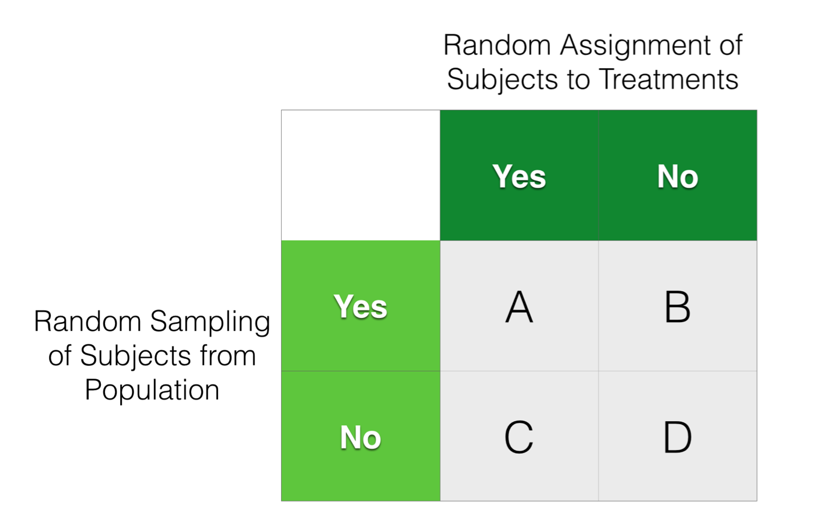

```{r setup, include=FALSE, warning=FALSE}
knitr::opts_chunk$set(message = FALSE,
                      warning = FALSE,
                      echo = TRUE,
                      fig.align = "center",
                      fig.retina = 3)

library(tidyverse)
library(infer)
library(knitr)
library(xaringanthemer)
library(kableExtra)
library(palmerpenguins)
source("https://raw.githubusercontent.com/stat-20/stat-20-website/main/stat20-theme.R")
xaringanExtra::use_panelset()
set.seed(401)
```

```{r echo = FALSE, fig.align="center", out.width="300%"}
knitr::include_graphics("figs/plato-cave.jpg")
```

---
## Classical Tools of Inference
--

.pull-left[
**Hypothesis Test**

Asserts properties of the population and it's parameters. Evaluates if the observed data is consistent with that assertion.
]

--

.pull-left[
**Confidence Intervals**

Establishes an interval (LB, UB) that conveys the uncertainty in a point estimate of a parameter.
]

---

**Question**: Based on their survey of ~1600 students, the Chancellor's Office estimates that 68% of _all_ Berkeley students support the People's Park Project. With a confidence level of 99%, they have a margin of error of 3%. Which is a correct statement regarding the corresponding confidence interval?

1. There is a 99% probability that the true proportion of all Berkeley students who support the project is between 65% and 71%.

2. If we were to collect many other samples of size ~1600 and construct many such intervals, we'd expect 95\% of them to contain the population parameter.

3. If the sample size had been ~3200, the 99% confidence interval would be narrower than 65% to 71%.

```{r echo = FALSE}
countdown::countdown(minutes = 0, seconds = 30, warn_when = 10)
```


---

**Discuss**: Based on their survey of ~1600 students, the Chancellor's Office estimates that 68% of _all_ Berkeley students support the People's Park Project. With a confidence level of 99%, they have a margin of error of 3%. Which is a correct statement regarding the corresponding confidence interval?

1. There is a 99% probability that the true proportion of all Berkeley students who support the project is between 65% and 71%.

2. If we were to collect many other samples of size ~1600 and construct many such intervals, we'd expect 95\% of them to contain the population parameter.

3. If the sample size had been ~3200, the 99% confidence interval would be narrower than 65% to 71%.

```{r echo = FALSE}
countdown::countdown(minutes = 2, seconds = 0, warn_when = 10)
```

---

<iframe src="https://embed.polleverywhere.com/multiple_choice_polls/u6lg0iT5qLMrtLIyfBC49?controls=none&short_poll=true" width="800px" height="600px"></iframe>

---
class: center, middle

# Guidance for Inference

--

.adage[I. Let the data taxonomy be your guide.]

--

.adage[II. Keep your distributions straight.]

--

.adage[III. Mind the scope.]

---
class: center, middle

# Taxononomy of Data, Taxonomy of Visualization, Taxonomy of Inference

---

class: center, middle

# Guidance for Inference

.adage[I. Let the data taxonomy be your guide.]

--

.adage[II. Keep your distributions straight.]


---

```{r echo = FALSE, out.width="80%"}
knitr::include_graphics("figs/sampling-dist.jpg")
```

---
class: center, middle

# Guidance for Inference

.adage[I. Let the data taxonomy be your guide.]

.adage[II. Keep your distributions straight.]

--

.adage[III. Mind the scope.]

---

**Question**: For which study(ies) might it be reasonable to generalize the result to the broader population?

```{r echo = FALSE, fig.align="center", out.width="40%"}

```

.pull-left-narrow[
- A
- B
- C
- D
]

.pull-right-wide[
- A and B
- C and D
- A and C
- B and D

```{r eacho = FALSE}
countdown::countdown(minutes = 0, seconds = 30, warn_when = 10)
```
]

---

**Discuss**: For which study(ies) might it be reasonable to generalize the result to the broader population?

```{r echo = FALSE, fig.align="center", out.width="40%"}

```

.pull-left-narrow[
- A
- B
- C
- D
]

.pull-right-wide[
- A and B
- C and D
- A and C
- B and D

```{r eacho = FALSE}
countdown::countdown(minutes = 2, seconds = 0, warn_when = 10)
```
]

---

For which study(ies) might it be reasonable to generalize the result to the broader population?

.pull-left[
```{r echo = FALSE, fig.align="center", out.width="90%"}

```
]

.pull-right[
<iframe src="https://embed.polleverywhere.com/multiple_choice_polls/dREevsKjgr25yCaYwQ18D?controls=none&short_poll=true" width="600px" height="450px"></iframe>
]

---
**Discuss**: Which study(ies) would lead to results that could be interpreted causally?

```{r echo = FALSE, fig.align="center", out.width="40%"}

```

.pull-left-narrow[
- A
- B
- C
- D
]

.pull-right-wide[
- A and B
- C and D
- A and C
- B and D

```{r eacho = FALSE}
countdown::countdown(minutes = 0, seconds = 45, warn_when = 10)
```
]

---
Which study(ies) would lead to results that could be interpreted causally?

.pull-left[
```{r echo = FALSE, fig.align="center", out.width="90%"}

```
]

.pull-right[
<iframe src="https://embed.polleverywhere.com/multiple_choice_polls/UFnKUwnQh8dWGhsROhStc?controls=none&short_poll=true" width="600px" height="450px"></iframe>
]

---


## Two Distinct Types of Claims
--

.pull-left[
**Generalization**

Makes statement about the parameters of a population based on the statistics measured on a small sample of data. Requires both a representative sample and statistical significance.
]

.pull-right[
**Causal Claim**

Claims the association found in the data is in fact causal. Requires randomized controlled trial (RCT) or multi-facetted observational evidence.
]

---

.adage[
Have a good weekend.
]