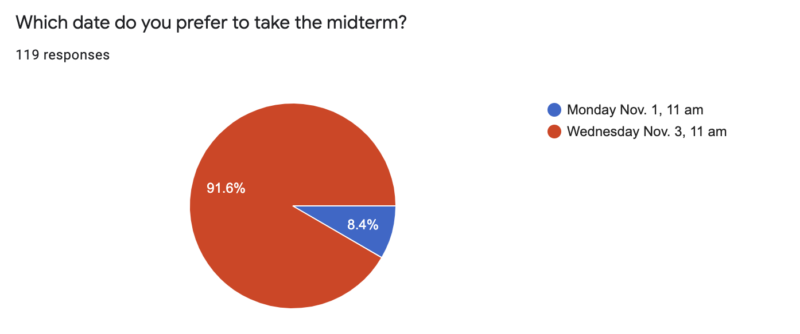
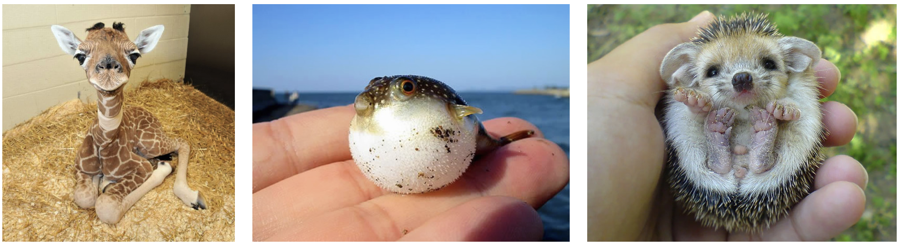

```{r setup, include=FALSE, warning=FALSE}
knitr::opts_chunk$set(message = FALSE,
                      warning = FALSE,
                      echo = TRUE,
                      fig.align = "center",
                      fig.retina = 3)

library(tidyverse)
library(infer)
library(knitr)
library(xaringanthemer)
library(kableExtra)
library(palmerpenguins)
source("https://raw.githubusercontent.com/stat-20/stat-20-website/main/stat20-theme.R")
xaringanExtra::use_panelset()
set.seed(401)
```

## Announcements

- Lab 10 due next Tuesday 8 am

--

- Problem Set 10 due next Tuesday 8 am

--

- Midterm II


---
## Midterm II

```{r echo = FALSE, fig.align="center"}

```

--

100B midterm is Tuesday evening and open till 5am. Monday is better

--

I feel like this is the right choice to do the midterm on Wednesday.

--

PLEAAASE WEDNESDAY


---
## Announcements

- Lab 10 due next Tuesday 8 am

- Problem Set 10 due next Tuesday 8 am

- Midterm II
  - Email ella.hiesmayr@berkeley.edu to arrange to take it Nov. 1st 11 am
  - Otherwise, plan to take it Nov. 3rd 11 am
      - Amanda's sections: Physics 3
      - Jake and Ella's sections: Evans 10
      - Alternative environment: look for email from me

---
## Midterm II

.pull-left[
**Tools of classical inference**
- Hypothesis Test
- Confidence Intervals

**Methods for approximating null/sampling dists.**
- _Computational_: Permutation, taking draws, bootstrap
- _Mathematical_: Normal approximation (CLT), t-distribution
]

.pull-right[
**Statistics/Settings**
- One proportion
- Difference in proportions
- One mean/median
- Difference in medians
- Chi-squared
- F

**Data Privacy**
- Myth of de-identification
- k-anonymity
- Differential privacy
]


---
class: center, middle, inverse
# Testing equality of many means

---
# Wolf River
--

```{r out.width=700, echo = FALSE, fig.align='center'}
knitr::include_graphics("figs/wolf-river.jpg")
```

--

- The Wolf River in Tennessee flows past an abandoned site once used by the 
pesticide industry for dumping wastes, including hexachlorobenzene (HCB).
- HCB known to cause various cancers and birth defects.


---
# Wolf River study
--

- Standard method to test whether HCB is present in a river is to take samples at middepth.

--
- **Question: is it found at different concentrations at different depths?**

--

.pull-left[
```{r wolf-data, echo=2}
wolf <- read_table("figs/wolfriver.txt")
wolf
```
]

--

.pull-right[
.task[
What type of plot can I use to visualize the relationship between Depth and HCB?
]
]

---
# Wolf River data, 3 ways
--

```{r wolf-boxes, echo = FALSE, fig.align="center", fig.height = 6, fig.width=8}
p1 <- ggplot(wolf, aes(x = Depth, y = HCB)) +
  geom_boxplot() +
  theme_bw(base_size = 18) +
  labs(title = "Side-by-side Boxplots")
p1
```


---
# Wolf River data, 3 ways

```{r wolf-densities, echo = FALSE, fig.align="center", fig.height = 6, fig.width=9}
p2 <- ggplot(wolf, aes(x = HCB, 
                 fill = Depth, 
                 color = Depth)) +
  geom_density(alpha = .3) +
  theme_bw(base_size = 18) +
  labs(title = "Density Plots")
p2
```

---
# Wolf River data, 3 ways

```{r wolf-hists, echo = FALSE, fig.align="center", fig.height = 6, fig.width=9}
p3 <- ggplot(wolf, aes(x = HCB)) +
  geom_histogram(bins = 10) +
    facet_wrap(vars(Depth)) +
  theme_bw(base_size = 18) +
  labs(title = "Faceted Histograms")
p3
```

---
# Wolf River data, 3 ways

```{r fig.height = 3, fig.width = 14, echo = FALSE, fig.align='center'}
library(patchwork)
p1 + p2 + p3
```

--

**Question: is it found at different concentrations at different depths?**

--

> There appears to be a difference in this data, but was this just due to chance?

---
class: center, middle

## Poll test

Let's be sure the poll is working.

--

.task[
Prepare to vote at `pollev.com/andrewbray088`.
]

---

Which of the following baby creatures is cutest?

```{r echo = FALSE, fig.align='center'}

```

A. Giraffe

B. Pufferfish

C. Hedgehog

```{r echo = FALSE}
countdown::countdown(minutes = 0, seconds = 30, warn_when = 10)
```

---
## Poll Results

--

<center>
<iframe src="https://embed.polleverywhere.com/multiple_choice_polls/oPrWxchjofjVYpPRTWryF?controls=none&short_poll=true" width="600px" height="450px"></iframe>
</center>

---
## Question Protocol

1. You will have 30 seconds to answer a question solo.

--

2. You will have 2 minutes to discuss with someone nearby _with a different answer_.

--

3. You will have 30 seconds to revote.

---

Which of the following plots shows groups with means that are *most* and *least* likely to be significantly different from each other?

```{r out.width=900, echo = FALSE, fig.align='center'}
knitr::include_graphics("figs/3-anovas.png")
```

A. most: III, least: II

B. most: II, least: III

C. most: I, least: III

D. most: I, least: II 

```{r echo = FALSE}
countdown::countdown(minutes = 0, seconds = 30, warn_when = 10)
```

---
## Question Protocol

1. You will have 30 seconds to answer a question solo.

2. **You will have 2 minutes to discuss with someone nearby _with a different answer_.**

3. You will have 30 seconds to revote.

---

Which of the following plots shows groups with means that are *most* and *least* likely to be significantly different from each other?

```{r out.width=900, echo = FALSE, fig.align='center'}
knitr::include_graphics("figs/3-anovas.png")
```

A. most: III, least: II

B. most: II, least: III

C. most: I, least: III

D. most: I, least: II 

```{r echo = FALSE}
countdown::countdown(minutes = 3, seconds = 0, warn_when = 10)
```

---
## Re-poll results

--

<center>
<iframe src="https://embed.polleverywhere.com/multiple_choice_polls/wqjWfbxnZJsuiozLtK4u1?controls=none&short_poll=true" width="600px" height="450px"></iframe>
</center>

---
## Original Poll

--

<center>
<iframe src="https://embed.polleverywhere.com/multiple_choice_polls/mBMshdsbwbQbecicgnA2Y?controls=none&short_poll=true" width="600px" height="450px"></iframe>
</center>

---

Which of the following plots shows groups with means that are *most* and *least* likely to be significantly different from each other?

```{r out.width=900, echo = FALSE, fig.align='center'}
knitr::include_graphics("figs/3-anovas.png")
```

.pull-left[
A. most: III, least: II

B. most: II, least: III

C. most: I, least: III

D. most: I, least: II 
]

--

.pull-right[
> What do you see in the plots that makes you draw your conclusion?

> Can we encode that in a summary statistic?

]

---

Which of the following plots shows groups with means that are *most* and *least* likely to be significantly different from each other?

```{r out.width=900, echo = FALSE, fig.align='center'}
knitr::include_graphics("figs/3-anovas.png")
```

--

- I has a high F.
- II has a low F.
- III has a middling F.


---
# Wolf River data
--

.pull-left[
```{r wolf-boxes2, echo = FALSE, fig.align="center", fig.height = 4}
ggplot(wolf, aes(x = Depth, y = HCB)) +
  geom_boxplot() +
  theme_bw(base_size = 18)
```
]

--

.pull-right[
```{r fecho = FALSE}
obs_stat <- wolf %>%
  specify(HCB ~ Depth) %>%
  calculate(stat = "F")
obs_stat
```
]

--

How big is `r obs_stat`?


---
# ANOVA F-test
--

$$ H_0: \mu_1 = \mu_2 = \ldots = \mu_k $$
$$ H_A: \textrm{At least one } \mu_j \textrm{ is different} $$

--

We can find the distribution of the F-statistic under the null hypothesis by

- Permutation
- Mathematical approximation

--

Permutation null:

$H_0$: HCB level is independent of depth.

---
## Null dist for F stat
--

```{r randoF2, eval = FALSE}
null <- wolf %>%
  specify(response = HCB, 
          explanatory = Depth) %>%
  hypothesize(null = "independence") %>%
  generate(reps = 1000, 
           type = "permute") %>%
  calculate(stat = "F")
null
```
--
```{r ref.label = "randoF2", echo = FALSE}
```


---
## Null dist for F stat, cont.
--

```{r nullplot, echo = FALSE}
null %>%
  visualize() +
  shade_p_value(obs_stat = obs_stat,
                direction = "right")
```

--

```{r ref.label="nullplot", echo = FALSE, fig.height = 4, fig.align="center"}

```


---
## Null dist for F stat, cont.
--

```{r fig.align="center", fig.height = 5}
null %>%
  get_p_value(obs_stat = obs_stat, 
              direction = "right")
```


---
## Null dist for F via Approximation

If:

1. Independent observations.
2. Approximate normal distributions within groups.
3. Constant variance between groups.

--

Then the sampling distribution for the $F$ statistic under the $H_0$ is well approximated by an F distribution with $df_1 = k - 1$ and $df_2 = N - k$. The p-value is represented by the upper tail.

```{r echo = FALSE}
obsstat <- pull(obs_stat)
```


```{r f-output}
1 - pf(obsstat, df1 = 2, df2 = 30 - 3)
```

---

```{r fig.align="center", fig.height = 5, warning = FALSE}
null %>%
  visualize(method = "both") +
  shade_p_value(obs_stat = obs_stat,
                direction = "right")
```


---
## Wolf River Conclusions
--

```{r conc, , fig.align="center", fig.height = 4, echo = FALSE}
ggplot(wolf, aes(x = Depth, y = HCB)) +
  geom_boxplot() +
  theme_bw()
```

- With a p-value of $\approx 0.07$, it is questionable whether HCB concentration
functions the same at all three depths.
- *Replicating the study* could add some certainty.
- In a subsequent study, we may wish to only test middepth versus bottom.
