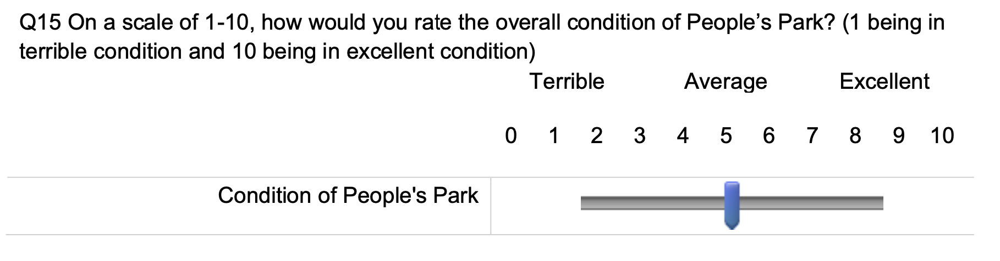

```{r setup, include=FALSE, warning=FALSE}
knitr::opts_chunk$set(message = FALSE,
                      warning = FALSE,
                      echo = TRUE,
                      fig.align = "center",
                      fig.retina = 3)

library(tidyverse)
library(infer)
library(knitr)
library(xaringanthemer)
library(kableExtra)
library(palmerpenguins)
source("https://raw.githubusercontent.com/stat-20/stat-20-website/main/stat20-theme.R")
xaringanExtra::use_panelset()
set.seed(401)
```

class: center, middle, inverse
# Inference for one and two means

---
## Assessing the condition of People's Park
--

12) What is the mean and median rating of the condition of People's Park (question 15 on the survey)?

--

```{r out.width=700, echo = FALSE, fig.align='center'}

```

---
## Assessing the condition of People's Park, cont.
--

```{r qna, eval = FALSE}
ppk <- read_csv("https://www.dropbox.com/s/zamyjzlclortmtu/ppk.csv?dl=1")
ppk %>%
  ggplot(aes(x = factor(Q15_1))) +
  geom_bar()
```

--

```{r ref.label = "qna", echo = FALSE, fig.height=4}
```

--

.task[
Why are there so many NAs?
]

---

```{r out.width=700, echo = FALSE, fig.align='center'}

```

---
12) What is our best est. of the mean rating of the condition of People's Park?
--

.panelset[
.panel[.panel-name[Data]
```{r}
ppk %>%
  select(Q15_1)
```

]
.panel[.panel-name[Plot]
.pull-left[
```{r q15plot, eval = FALSE}
ppk %>%
  drop_na(Q15_1) %>%
  ggplot(aes(x = factor(Q15_1))) +
  geom_bar()
```
]
.pull-right[
```{r ref.label = "q15plot", echo = FALSE, fig.height=4}
```
]
]
.panel[.panel-name[Point Est.]
.pull-left[
```{r q15pe, eval = FALSE}
ppk %>%
  drop_na(Q15_1) %>%
  specify(response = Q15_1) %>%
  calculate(stat = "mean")
```
]
.pull-right[
```{r ref.label = "q15pe", echo = FALSE}
```
]
]
.panel[.panel-name[CI via Bootstrap]
.pull-left[
```{r q15ci, eval = FALSE}
boot <- ppk %>%
  drop_na(Q15_1) %>%
  specify(response = Q15_1) %>%
  generate(reps = 500, #<<
           type = "bootstrap") %>% #<<
  calculate(stat = "mean")
ci <- boot %>%
  get_ci(level = .95)
boot %>%
  visualize() +
  shade_ci(ci)
ci
```
]
.pull-right[
```{r ref.label = "q15ci", echo = FALSE, fig.height=3.5}
```
]
]
.panel[.panel-name[CI via CLT]
.pull-left[
If the observations are independent and the sample size is large enough, $\bar{x}$ becomes normally distributed.

\begin{align}
\textrm{point estimate} &\pm 2 SE \\
\bar{x} &\pm 2 s/\sqrt{n}
\end{align}
]
.pull-right[
```{r}
stats <- ppk %>%
  drop_na(Q15_1) %>%
  summarize(xbar = mean(Q15_1),
            s = sd(Q15_1),
            n = n())
stats %>%
  mutate(lb = xbar - 2*s/sqrt(n),
         ub = xbar + 2*s/sqrt(n)) %>%
  select(lb, ub)
```
]
]
]

---
## A New Question

What is our best estimate of the difference in mean rating between undergrads and grads?

--

Data source:

```{r out.width=700, echo = FALSE, fig.align='center'}

```

---
## Distribution of Q1
--

```{r ugplot, eval = FALSE}
ppk %>%
  ggplot(aes(x = factor(Q1))) +
  geom_bar()
```

--

```{r ref.label = "ugplot", fig.height=4, echo = FALSE}
```

--

.task[
How can we create a new variable indicating grad or undergrad?
]

---
## Creating a new variable
--

```{r ugvar, eval = FALSE}
ppk <- ppk %>%
  mutate(grad_student = Q1 == 5)
ppk %>%
  select(Q1, grad_student)
```

--

```{r ref.label = "ugvar", fig.height=5, echo = FALSE}
```


---
## Distribution of grad/undergrad
--

```{r ugdist, eval = FALSE}
ppk %>%
  ggplot(aes(x = grad_student)) +
  geom_bar()
```

--

```{r ref.label = "ugdist", fig.height=5, echo = FALSE}
```

---
What is our best estimate of the diff in mean rating between ugrads and grads?
--

.panelset[
.panel[.panel-name[Data]
```{r}
ppk %>%
  select(grad_student, Q15_1)
```
]
.panel[.panel-name[Plot]
.pull-left[
```{r q15ugplot, eval = FALSE}
ppk %>%
  drop_na(Q15_1) %>%
  ggplot(aes(x = factor(Q15_1))) +
  geom_bar() +
  facet_wrap(vars(grad_student), #<<
             scales = "free_y") #<<
```
]
.pull-right[
```{r ref.label = "q15ugplot", echo = FALSE, fig.height=4}
```
]
]
.panel[.panel-name[Stats]
.pull-left[
```{r q15ugstats, eval = FALSE}
ppk %>%
  drop_na(Q15_1) %>%
  group_by(grad_student) %>%
  summarize(mean(Q15_1))
```
]
.pull-right[
```{r ref.label = "q15ugstats", echo = FALSE}
```
]
]
.panel[.panel-name[Point Est.]
.pull-left[
```{r q15ugpe, eval = FALSE}
obs_stat <- ppk %>%
  drop_na(Q15_1) %>%
  specify(response = Q15_1,
          explanatory = grad_student) %>% #<<
  calculate(stat = "diff in means") #<<
```
]
.pull-right[
```{r ref.label = "q15ugpe", echo = FALSE}
```
]
]
.panel[.panel-name[CI via Bootstrap]
.pull-left[
```{r q15ugci, eval = FALSE}
boot <- ppk %>%
  drop_na(Q15_1) %>%
  specify(response = Q15_1,
          explanatory = grad_student) %>%
  generate(reps = 500, #<<
           type = "bootstrap") %>% #<<
  calculate(stat = "diff in means") 
ci <- boot %>%
  get_ci(level = .95)
boot %>%
  visualize() +
  shade_ci(ci)
ci
```
]
.pull-right[
```{r ref.label = "q15ugci", echo = FALSE, fig.height=3.5}
```
]
]
]

---
## Phrasing it as a Hypothesis Test
--

$H_0$: Perception of the condition of People's Park is _independent_ of whether someone is an undergrad or grad student.

$H_A$: Perception of the condition of People's Park is _dependent_ on whether someone is an undergrad or grad student.

--

> We can generate data under this null using _permutation_.

---
## Data sets under the null
--

.pull-left[
```{r nulldata, eval = FALSE}
null_9 <- ppk %>%
  drop_na(Q15_1) %>%
  specify(response = Q15_1,
          explanatory = grad_student) %>%
  hypothesize(null = "independence") %>% #<<
  generate(reps = 9, 
           type = "permute")
null_9
```
]
--
.pull-right[
```{r ref.label = "nulldata", echo = FALSE}
```
]

---
## Data sets under the null, cont.

.pull-left[
```{r nulldataplot, eval = FALSE}
null_9 %>%
  ggplot(aes(x = Q15_1,
             y = grad_student)) +
  geom_boxplot() +
  facet_wrap(vars(replicate))
```
]
--
.pull-right[
```{r ref.label = "nulldataplot", echo = FALSE, fig.height=6}
```
]

---
What is our best estimate of the diff in mean ratings between ugrads and grads?
--

.panelset[
.panel[.panel-name[Obs. Stat]
.pull-left[
```{r q15ugh1, eval = FALSE}
obs_stat <- ppk %>%
  drop_na(Q15_1) %>%
  specify(response = Q15_1,
          explanatory = grad_student) %>%
  calculate(stat = "diff in means")
obs_stat
```
]
.pull-right[
```{r ref.label = "q15ugh1", echo = FALSE, fig.height=4}
```
]
]
.panel[.panel-name[Null Stats]
.pull-left[
```{r q15ugh2, eval = FALSE}
null <- ppk %>%
  drop_na(Q15_1) %>%
  specify(response = Q15_1,
          explanatory = grad_student) %>%
  hypothesize(null = "independence") %>%
  generate(reps = 500, 
           type = "permute") %>%
  calculate(stat = "diff in means")
null
```
]
.pull-right[
```{r ref.label = "q15ugh2", echo = FALSE}
```
]
]
.panel[.panel-name[Null Dist.]
.pull-left[
```{r q15ugh3, eval = FALSE}
null %>%
  visualize() +
  shade_p_value(obs_stat = obs_stat, 
                direction = "both")
```
]
.pull-right[
```{r ref.label = "q15ugh3", echo = FALSE, fig.height=4.5}
```
]
]
.panel[.panel-name[p-value]
.pull-left[
```{r q15ugh4, eval = FALSE}
null %>%
  get_p_value(obs_stat = obs_stat,
              direction = "both")
```
]
.pull-right[
```{r ref.label = "q15ugh4", echo = FALSE, fig.height=3.5}
```
]
.task[
What does this p-value tell us about data relative to the null hypothesis?
]
]
.panel[.panel-name[Conclusion]
.pull-left[
Our data is consistent with the notion that there is no difference in the way that undergrads and grad students assess the conditions of People's Park.
]
]
]

---
## Inferential Tools Compared

--
**Hypothesis Test**

Asserts a value of a _parameter_ and considers the probability of the _statistic_.

--

**Confidence Intverval**

Considers the uncertainty of the _statistic_ to find a plausible range for the _parameter_.

