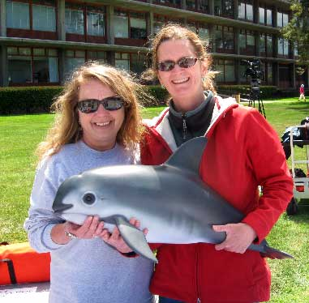
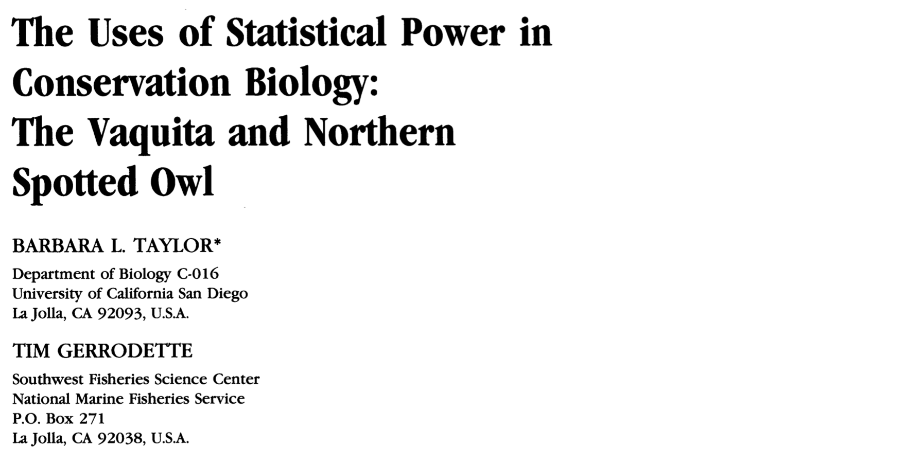
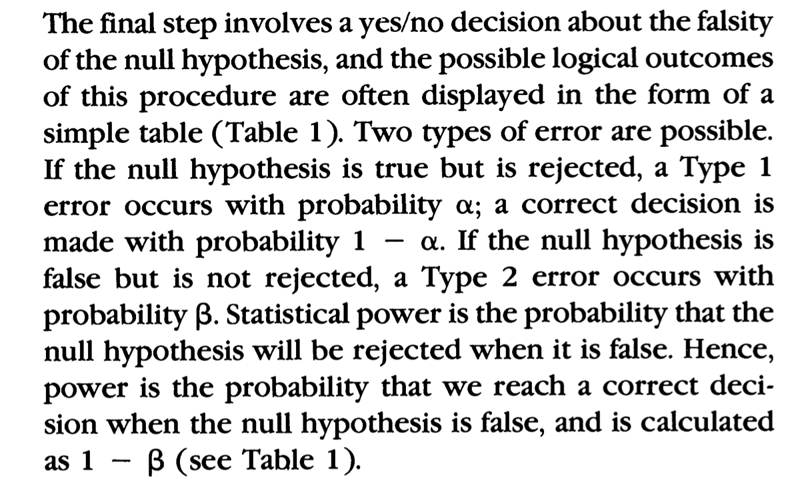

```{r setup, include=FALSE, warning=FALSE}
knitr::opts_chunk$set(message = FALSE,
                      warning = FALSE,
                      echo = TRUE,
                      fig.align = "center",
                      fig.retina = 3)

library(tidyverse)
library(infer)
library(knitr)
library(xaringanthemer)
library(kableExtra)
library(palmerpenguins)
source("https://raw.githubusercontent.com/stat-20/stat-20-website/main/stat20-theme.R")
xaringanExtra::use_panelset()
set.seed(401)
```

## While You're Waiting

.task[
Why don't we accept the null hypothesis when we get a high p-value?
]

Please answer (or upvote) at `pollev.com/andrewbray088`.

---
class: center, middle
## Pitfalls in Hypothesis testing
--

.adage[Low power studies.]

--

.adage[Multiple Comparisons]

---
class: center

# What creature is this?

```{r echo = FALSE, out.width="45%"}

```

---

```{r echo = FALSE, out.width="100%"}

```

---

boardwork

---
## Null Distribution

```{r echo = FALSE, eval = TRUE, fig.width=6, fig.height=4.5}
library(ggplot2)
x1  <- 0:20
df <- data.frame(x = x1, y = dbinom(x1, 200, 0.05))
plot1 <- ggplot(df, aes(x = x, y = y)) + 
  geom_bar(stat = "identity", col = "white") + 
  scale_y_continuous(expand = c(0.01, 0)) + 
  xlab("x") + 
  ylab("Density") + 
  labs(title = "Null Distribution (Binom(200, .05)") + 
  theme(plot.title = element_text(size = rel(1.2), vjust = 1.5))
plot1
```

---
## Null and Alternative

```{r echo = FALSE, eval = TRUE, fig.width=6, fig.height=4.5}
library(ggplot2)
x1  <- 0:20
df <- data.frame(x = c(x1, x1), 
                 y = c(dbinom(x1, 200, 0.05),
                        dbinom(x1, 150, 0.05)),
                 dist = rep(c("null", "alt"), 
                            each = length(x1)))
plot2 <- ggplot(df, aes(x = x, 
                        y = y)) + 
  geom_bar(stat = "identity", col = "white") + 
  facet_wrap(vars(dist),ncol = 1) +
  scale_y_continuous(expand = c(0.01, 0)) + 
  xlab("x") + 
  ylab("Density") + 
  theme(plot.title = element_text(size = rel(1.2), vjust = 1.5))
plot2
```

---


```{r echo = FALSE, out.width="80%"}

```

---
## While You're Waiting

Why don't we accept the null hypothesis when we get a high p-value?

.task[
Please answer (or upvote) at `pollev.com/andrewbray088`.
]

---

<center>
<iframe src="https://embed.polleverywhere.com/discourses/JjragTI00m0nZhboRT3GQ?controls=none&short_poll=true" width="800px" height="600px"></iframe>
</center>

---

```{r echo = FALSE, out.width="50%"}
knitr::include_graphics("figs/vacquita-nears-extinction.png")
```

.cite[National Geographic October 2019]