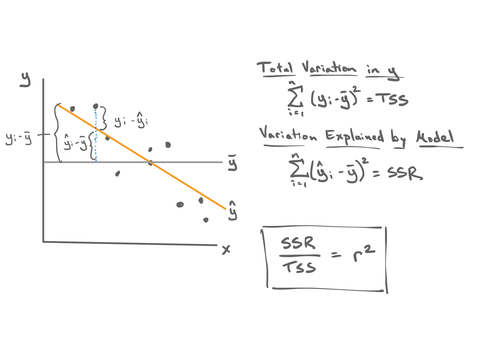

```{r setup, include=FALSE, warning=FALSE}
knitr::opts_chunk$set(message = FALSE,
                      warning = FALSE,
                      echo = TRUE,
                      fig.align = "center",
                      fig.retina = 3)

library(tidyverse)
library(infer)
library(knitr)
library(xaringanthemer)
library(kableExtra)
library(ggrepel)
source("https://raw.githubusercontent.com/stat-20/stat-20-website/main/stat20-theme.R")
xaringanExtra::use_panelset()
set.seed(401)
```

## Announcements
--

- Midterm II
  - Mean unadjusted score: 17.6/24
- PS like normal this week
- Read Ch. 7
- No lab meeting Thursday

---
class: center, middle

.adage[Last time...]

---

```{r echo=FALSE, fig.width=14, fig.height=8, fig.align="center"}
poverty <- read_delim("figs/poverty.txt")
poverty <- poverty %>%
  mutate(hi_grad = case_when(
    State %in% c("New Hampshire", "Minnesota") ~ State, 
    TRUE ~ ""),
    hi_pov = case_when(
      State %in% c("New Mexico", "Arkansas", "Mississippi") ~ State,
      TRUE ~ ""),
    hi_res = case_when(
      State %in% c("Montana", "District of Columbia") ~ State,
      TRUE ~ ""))
p1 <- poverty %>%
  ggplot(aes(x = Poverty, 
             y = Graduates)) +
  geom_point(size = 3) +
  geom_text_repel(aes(label = State),
                  seed = 29) +
  theme_bw(base_size = 18)
p1
```

???
We were interested in the relationship between poverty rates and graduates rates, so we started by visualizing it with a scatter plot. We described the strength of the linear relationship with the correlation coefficient. A linear model is more interesting, involving two statistics, so we considered the full range of lines we _could_ fit.

To decide which to use, we need to decide which line is "best" in some sense.

---

```{r echo=FALSE, fig.width=14, fig.height=8, fig.align="center"}
r <- round(cor(poverty$Graduates,
               poverty$Poverty),
           digits = 2)
p1 +
  annotate("text", x = 17, y = 90, size = 8,
           label = paste0("r = ", r))
```

---

```{r echo=FALSE, fig.width=14, fig.height=8, fig.align="center"}
m1 <- lm(Graduates ~ Poverty, data = poverty)
p2 <- p1 +
  annotate("text", x = 17, y = 90, size = 8,
           label = paste0("r = ", r)) +
  geom_abline(intercept = m1$coef[1], slope = m1$coef[2], 
              col = "gray", lwd = 2, alpha = .5) +
  geom_abline(intercept = 100, slope = -1.2, 
              col = "gray", lwd = 2, alpha = .5) +
  geom_abline(intercept = 77, slope = .65, 
              col = "gray", lwd = 2, alpha = .5) +
  geom_abline(intercept = 88, slope = -.6, 
              col = "gray", lwd = 2, alpha = .5) +
  geom_abline(intercept = 84, slope = .01, 
              col = "gray", lwd = 2, alpha = .5)

p2
```

---
## Ordinary Least Squares

Find the line that minimizes the sum of the squared residuals.

--

$$\sum_{i=1}^n (y_i - \hat{y}_i)^2$$

--

Two methods of finding that line:

--
.pull-left[
Numerical Optimization
]
.pull-right[
Calculus
]

---

$$\sum_{i=1}^n (y_i - \hat{y}_i)^2 = \sum_{i=1}^n (y_i - \mathbf{b_0} - \mathbf{b_1}x)^2 = f_{RSS}(b_0, b_1)$$

--

.pull-left[
<center>
<iframe width="784" height="444" src="https://www.youtube.com/embed/j2gcuRVbwR0" title="YouTube video player" frameborder="0" allow="accelerometer; autoplay; clipboard-write; encrypted-media; gyroscope; picture-in-picture" allowfullscreen></iframe>
<center>
]
--
.pull-right[
Take derivatives of $f_{RSS}$, set to 0, solve.

$$ b_1 = r \frac{s_y}{s_x} $$

$$ b_0 = \bar{y} - b_1 \bar{x} $$
]

---

```{r echo=FALSE, fig.width=14, fig.height=8, fig.align="center"}
p2
```

---

```{r echo=FALSE, fig.width=14, fig.height=8, fig.align="center"}
p2 +
  geom_abline(intercept = m1$coef[1], slope = m1$coef[2], 
              col = "goldenrod", lwd = 2, alpha = .5)
```

---
class: middle, center, inverse

# Estimation in R

---
## Estimation in R
--

```{r fitlm}
m1 <- lm(Graduates ~ Poverty, data = poverty)
summary(m1)
```


---
## The `lm` object
--

```{r showlm}
attributes(m1)
coefficients(m1)
coef(m1)
```

---
## The `lm` object, cont.
--

```{r}
fitted(m1)
```

---
## The `lm` object, cont.
--

```{r}
residuals(m1)
```

---
class: center, middle, inverse

# The linear model: what is it good for?

---
## The linear model: what is it good for?
--

1. _Prediction_: predicting the unknown value of $y_i$ for a new $x_i$ not in the data set.

--

2. _Residual Analysis_: understanding the deviation of each observation, $y_i$, relative to the model's prediction, $\hat{y}_i$.

--

3. _Description_: describing the linear relationship between the variables in the data set.

---
## Linear Models for Prediction

.pull-left-narrow[
.task[
What graduation rate would you expect for a state with a poverty rate of 15%?
]
$$\hat{y} = 96.2 - .9 x$$
]

.pull-right-wide[
```{r, echo = FALSE, fig.height = 6, fig.width = 9, fig.align="center"}
p1 + 
  geom_abline(intercept = m1$coef[1], slope = m1$coef[2], 
              col = "goldenrod", lwd = 1.5)
```
]

---
## Linear Models for Prediction

.pull-left-narrow[
.task[
What graduation rate would you expect for a state with a poverty rate of 15%?
]
$$\hat{y} = 96.2 - .9 x$$
]

.pull-right-wide[
```{r, echo = FALSE, fig.height = 6, fig.width = 9, fig.align="center"}
p1 + 
  geom_abline(intercept = m1$coef[1], slope = m1$coef[2], 
              col = "goldenrod", lwd = 1.5) +
  geom_vline(xintercept = 15, color = "steelblue", lty = 2, lwd = 1.5)
```
]

---
## Linear Models for Prediction

.pull-left-narrow[
.task[
What graduation rate would you expect for a state with a poverty rate of 15%?
]
$$\hat{y} = 96.2 - .9 x$$
]

.pull-right-wide[
```{r, echo = FALSE, fig.height = 6, fig.width = 9, fig.align="center"}
povnew <- data.frame(Poverty = 15)
yhat <- predict(m1, povnew)
p1 + 
  geom_abline(intercept = m1$coef[1], slope = m1$coef[2], 
              col = "goldenrod", lwd = 1.5) +
  geom_vline(xintercept = 15, color = "steelblue", lty = 2, lwd = 1.5) +
  geom_hline(yintercept = yhat, color = "steelblue", lty = 2, lwd = 1.5)
```
]

---
## Linear Models for Prediction

.pull-left-narrow[
.task[
What graduation rate would you expect for a state with a poverty rate of 15%?
]
$$\hat{y} = 96.2 - .9 x$$

$$ 96.2 - .9 \times 15 = 82.7$$
]

.pull-right-wide[
```{r, echo = FALSE, fig.height = 6, fig.width = 9, fig.align="center"}
povnew <- data.frame(Poverty = 15)
yhat <- predict(m1, povnew)
p1 + 
  geom_abline(intercept = m1$coef[1], slope = m1$coef[2], 
              col = "goldenrod", lwd = 1.5) +
  geom_vline(xintercept = 15, color = "steelblue", lty = 2, lwd = 1.5) +
  geom_hline(yintercept = yhat, color = "steelblue", lty = 2, lwd = 1.5)
```
]

---
## Linear Models for Prediction in R
--

.pull-left[
By hand:
```{r}
coef(m1)[1] + coef(m1)[2] * 15
```
]
--
.pull-right[
Using `predict()`:
```{r}
newx <- data.frame(Poverty = 15)
predict(m1, newx)
```
]

---
## How good were the predictions?
--

.task[
Which data set(s) will yield a linear model with the best predictions?
]

--

```{r out.width="55%", echo = FALSE, fig.align='center'}
knitr::include_graphics("figs/id-the-slr.png")
```

---

boardwork

---

```{r out.width="80%", echo = FALSE, fig.align='center'}

```

---
## How good were the predictions?
--

$r^2$, the square of the correlation coefficient measures the proportion of total variability in the $y$ that is explained by the linear model.

--

- $r^2 \in [0, 1]$

- $r^2$ near 1 means predictions were more accurate.

- $r^2$ near 0 means predictions were less accurate.

---
## Two classes of predictions
--

1. _Interpolation_: Prediction using a value of $x$ that is _within_ the range of $x$ values found in the data set used to fit the model.

--

2. _Extrapolation_: Prediction using a value of $x$ that is _outside_ the range of $x$ values found in the data set used to fit the model.

---
## Linear Models for Prediction

.pull-left-narrow[
.task[
What graduation rate would you expect for a state with a poverty rate of 1%?
]
$$\hat{y} = 96.2 - .9 x$$

]

.pull-right-wide[
```{r, echo = FALSE, fig.height = 6, fig.width = 9, fig.align="center"}
povnew <- data.frame(Poverty = 1)
yhat <- predict(m1, povnew)
p1 + 
  xlim(0, 20) +
  ylim(77, 97) +
  geom_abline(intercept = m1$coef[1], slope = m1$coef[2], 
              col = "goldenrod", lwd = 1.5)
```
]

---
class: center
```{r echo = FALSE, out.width = "60%"}
knitr::include_graphics("https://imgs.xkcd.com/comics/extrapolating.png")
```
.cite[source: https://xkcd.com/605/]
--
  
_Extrapolation is treacherous._

---
## The linear model: what is it good for?
--

1. _Prediction_: predicting the unknown value of $y_i$ for a new $x_i$ not in the data set.

--

2. _Residual Analysis_: understanding the deviation of each observation, $y_i$, relative to the model's prediction, $\hat{y}_i$.

--

3. _Description_: describing the linear relationship between the variables in the data set.

---
## Residual Analysis
--

.task[
What is the definition of _residual_?
]

--

A) $\hat{y}_i - \bar{y}_i$

B) $y_i - \bar{y}_i$

C) $\hat{y}_i - \bar{y}_i$

D) $y_i - \hat{y}_i$

E) $\hat{y}_i - y_i$

---
## Residual Analysis
--

A _residual_ is the difference between the observed value and the "predicted" value of a given $y_i$.

$$ e_i = y_i - \hat{y}_i $$

--

Can be used to:

- Describe where a given observation lay relative to the model.
- Uncover more general trends in the interaction of the data and the model.

---
## Residual Analysis, cont.

Consider the case of Montana.

--

```{r}
p1
```

---
## Residuals vs $x$
--

.pull-left[
```{r res1, eval = FALSE}
poverty %>%
  mutate(yhat = fitted(m1),
         res  = residuals(m1)) %>%
  ggplot(aes(x = Poverty,
             y = res)) +
  geom_point(size = 3) +
  geom_text_repel(aes(label = State)) +
  theme_bw(base_size = 18)
```
]
--
.pull-right[
```{r ref.label="res1", echo = FALSE}
```
]

---
## Residuals vs $\hat{y}$

.pull-left[
```{r res2, eval = FALSE}
poverty %>%
  mutate(yhat = fitted(m1),
         res  = residuals(m1)) %>%
  ggplot(aes(x = yhat,
             y = res)) +
  geom_point(size = 3) +
  geom_text_repel(aes(label = State)) +
  theme_bw(base_size = 18)
```
]
--
.pull-right[
```{r ref.label="res2", echo = FALSE}
```
]

---
## Residual plots

What to look for:

- Increasing or descreasing variance in the residuals (_heteroskedasticity_)

- Non-linear trends

---
## The linear model: what is it good for?
--

1. _Prediction_: predicting the unknown value of $y_i$ for a new $x_i$ not in the data set.

--

2. _Residual Analysis_: understanding the deviation of each observation, $y_i$, relative to the model's prediction, $\hat{y}_i$.

--

3. _Description_: describing the linear relationship between the variables in the data set.

---
## Interpretation of $b_1$
--

The **slope** describes the estimated difference in the $y$ variable if the explanatory
variable $x$ for a case happened to be one unit larger.

--

```{r}
coef(m1)[2]
```

*For each additional percentage point of people living below the poverty level,
we expect a state to have a proportion of high school graduates that is 0.898
lower*.

**Be Cautious**: if it is observational data, you do not have evidence of a 
*causal link*, but of an association, which still can be used for prediction.


---
## Interpretation of $b_0$
--

The **intercept** is the predicted value that $y$ will take for a case with an $x$ value of zero.

--

```{r}
coef(m1)[2]
```

While necessary for prediction, the intercept often has no meaningful interpretation.
