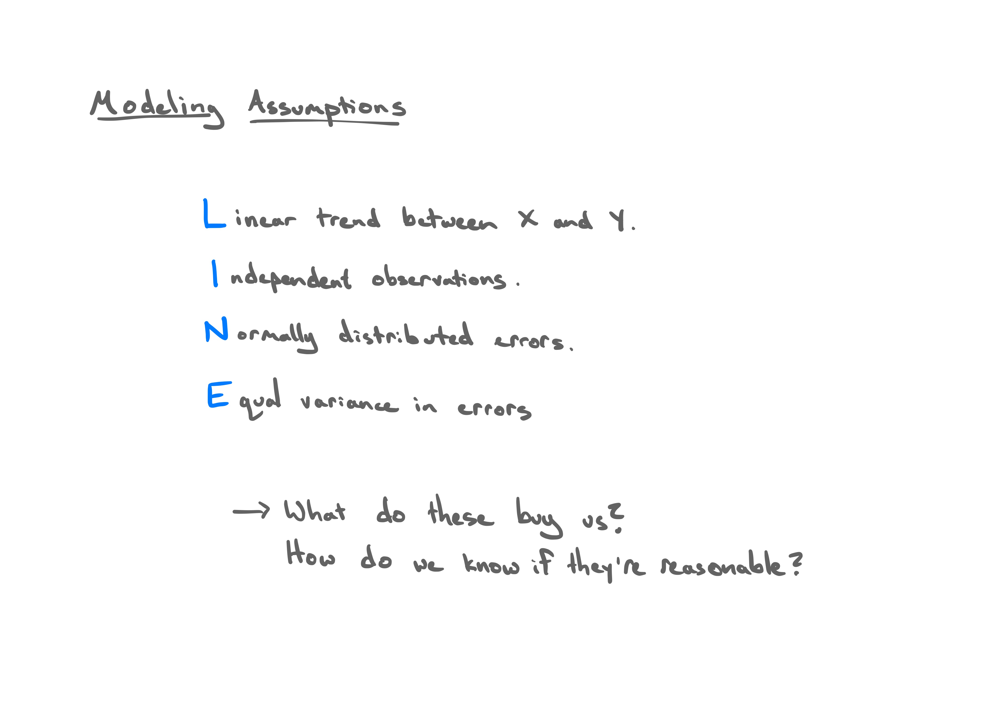
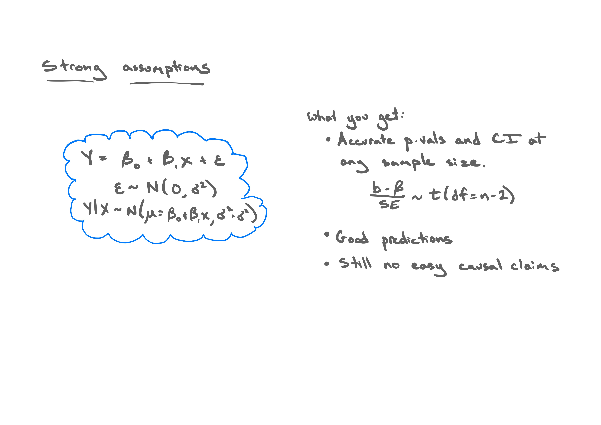
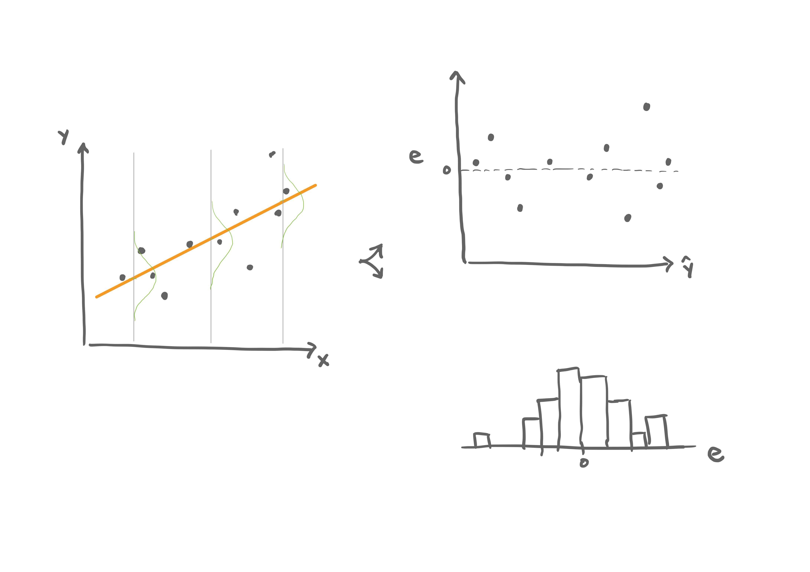
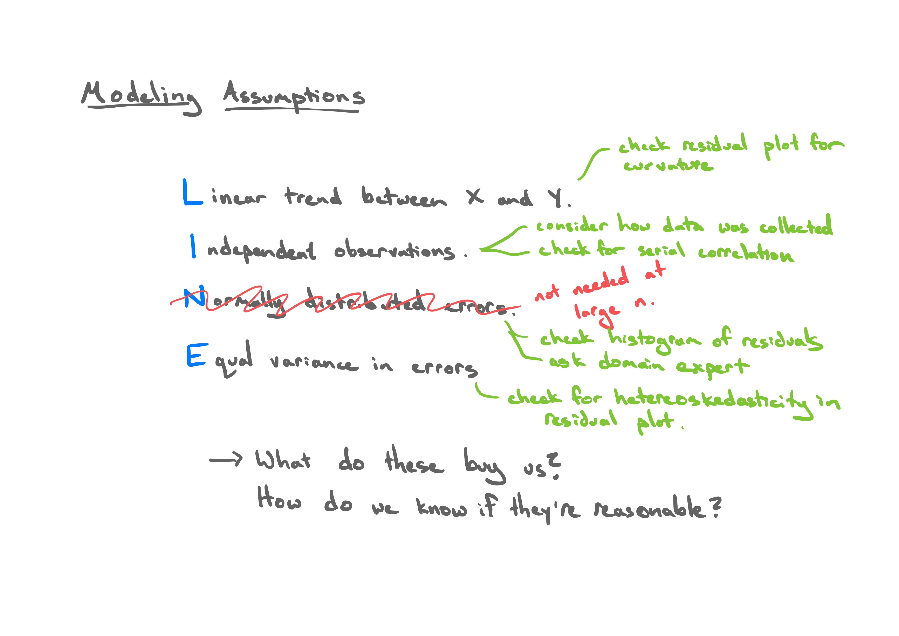
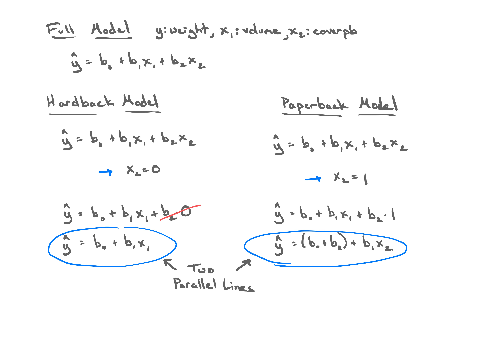
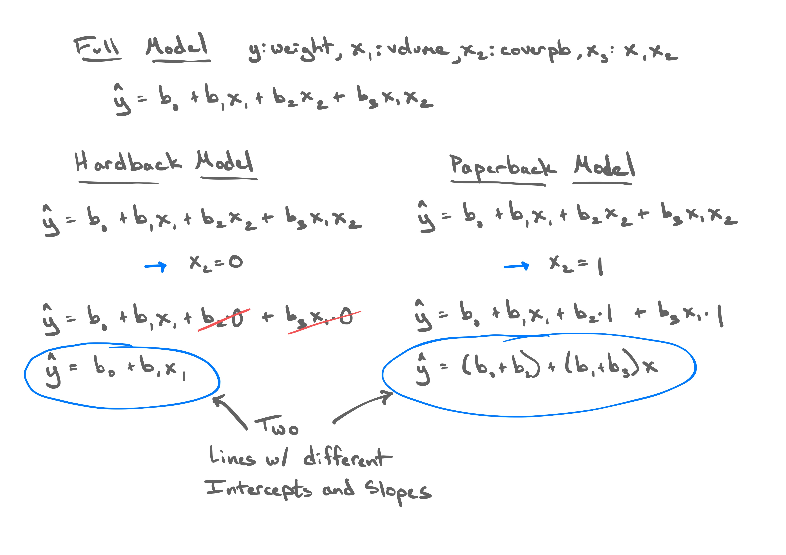

```{r setup, include=FALSE, warning=FALSE}
knitr::opts_chunk$set(message = FALSE,
                      warning = FALSE,
                      echo = TRUE,
                      fig.align = "center",
                      fig.retina = 3,
                      fig.width=9,
                      fig.height = 5)

library(tidyverse)
library(infer)
library(knitr)
library(xaringanthemer)
library(kableExtra)
library(ggrepel)
source("https://raw.githubusercontent.com/stat-20/stat-20-website/main/stat20-theme.R")
xaringanExtra::use_panelset()
set.seed(401)
```

```{r out.width=870, echo = FALSE}

```

---

```{r out.width=870, echo = FALSE}

```

---

```{r out.width=870, echo = FALSE}

```

---

```{r out.width=870, echo = FALSE}

```

---
class: center, middle

.adage[
That is simple linear regression. Let's begin to add some complexity.
]

---

## Example: shipping books
--

```{r out.width=480, echo = FALSE}
knitr::include_graphics("figs/pile-of-books.jpg")
```

When you buy a book off of Amazon, you get a quote for how much it
costs to ship. This is based on the weight of the book. If you
didn't know the weight a book, what other characteristics of it
could you measure to help predict weight?

```{r getdata, echo = FALSE, message=FALSE}
library(DAAG)
data(allbacks)
books <- allbacks[, c(3, 1, 4)] %>%
  tibble()
```


---
## The data
--

Consider the following data set, a simple random sample of books from Amazon's catalog where the weight of the books is known.

```{r booksdata, eval = FALSE}
books %>%
  select(weight, volume)
```
--
```{r ref.label = "booksdata", echo = FALSE}
```


---
## Shipping books visualized
--

```{r plotallbacks, echo = FALSE, fig.width=9, fig.height = 6.7}
p1 <- ggplot(books, aes(x = volume, y = weight)) +
  geom_point(size = 3) +
  theme_bw(base_size = 18)
p1
```


---
## Shipping books visualized, cont.

```{r fitm1, echo = FALSE}
m1 <- lm(weight ~ volume, data = books)
```

```{r plotallbackswline, fig.width=9, fig.height = 6.7, echo = FALSE}
p1 + 
  geom_abline(intercept = m1$coef[1], slope = m1$coef[2],
              col = "blue", lwd = 2)
```


---
class: small
## Fitting the linear model
--

```{r lm, eval = FALSE}
m1 <- lm(weight ~ volume, data = books)
summary(m1)
```

--

```{r ref.label = "lm", echo = FALSE}
m1 <- lm(weight ~ volume, data = books)
summary(m1)
```


---

**Question 1**: What is the equation for the line?
--

$$ \hat{y} = 107.7 + 0.708 x $$

$$ \widehat{weight} = 107.7 + 0.708 volume $$


---
**Question 2**: Does this appear to be a reasonable setting in which to apply linear regression for inference?

--

We need to consider:

1. Linear trend
2. Independent observations
3. Normal residuals
4. Equal variance

---
## Residual Plot
--

```{r resplot, fig.width=9, fig.height = 6.7, echo = FALSE}
ggplot(m1, aes(x = .fitted, y = .resid)) +
  geom_point(size = 3) +
  geom_hline(yintercept = 0, linetype = "dashed") +
  xlab("Fitted values") +
  ylab("Residuals") +
  theme_bw(base_size = 18)
```


---
## Histogram of Residuals
--

```{r resplot2, warning=FALSE, fig.width=9, fig.height = 6.7, echo = FALSE}
ggplot(m1, aes(x = .resid)) +
  geom_histogram() +
  theme_bw(base_size = 18) +
  labs(x = "Residuals")
```

---
**Question 2**: Does this appear to be a reasonable setting in which to apply linear regression for inference?

--

We need to consider:

1. Linear trend: _Looks reasonable_
2. Independent observations _Seems reasonable_
3. Normal residuals _Questionable_
4. Equal variance _Looks reasonable_

--

> We should be skeptical of the accuracy of our p-values.

---
**Question 3**: Is volume a significant predictor?
--

```{r sumtable}
summary(m1)
```

**Question 4**: How much of the variation in weight is explained by the model?


---
## Multiple Regression
--

Allows us create a model to explain one $numerical$ variable, the response, as a linear function of many explanatory variables that can be both $numerical$ and
$categorical$.

--

We posit a true model (here with a normal errors assumption):

$$ y = \beta_0 + \beta_1 x_1 + \beta_2 x_2 + \ldots + \beta_p x_p + \epsilon; \quad \epsilon \sim N(0, \sigma^2) $$

We use the data to estimate our fitted model:

$$ \hat{y} = b_0 + b_1 x_1 + b_2 x_2 + \ldots + b_p x_p $$

---
## Estimating $\beta_0, \beta_1$ etc.
--

In least-squares regression, we're still finding the estimates that minimize
the sum of squared residuals.

$$ e_i = y_i - \hat{y}_i $$

$$ \sum_{i = 1}^n e_i^2 $$

And yes, they have a closed-form solution.

$$ \mathbf{b} = (X'X)^{-1}X'Y $$

--

In R:
```{r eval = FALSE}
lm(Y ~ X1 + X2 + ... + Xp, data = mydata)
```


---
## Example: shipping books
--

```{r df, eval = FALSE}
books
```
--
```{r ref.label = "df", echo = FALSE}
```


---
## Example: shipping books
--

```{r plotcolors, echo = FALSE}
p2 <- ggplot(books, aes(x = volume,
                        y = weight, 
                        color = cover)) +
  geom_point(size = 3) +
  theme_bw(base_size = 18)
p2
```


---
## Example: shipping books
--

```{r}
m2 <- lm(weight ~ volume + cover, data = books)
summary(m2)
```

---
## How do we interpret these estimates?

Think about the geometry of the model.

---

```{r out.width=870, echo = FALSE}

```


---
## Example: shipping books
--

```{r echo = FALSE}
p3 <- p2 +
  geom_abline(intercept = m2$coef[1], slope = m2$coef[2], col = 2) +
  geom_abline(intercept = m2$coef[1] + m2$coef[3], slope = m2$coef[2], col = 4)
p3
```


---
## MLR slope interpretation
--

The slope corresponding to the dummy variable tells us:

- How much vertical separation there is between our lines
- How much `weight` is expected to increase if `cover` goes
from 0 to 1 and `volume` is left unchanged.

Each $b_i$ tells you how much you expect the $Y$ to change when you change the
$X_i$, while **holding all other variables constant**.


---
## Your turn 1
--

.pull-left-wide[
```{r}
summary(m2)
```
]
--
.pull-right-narrow[
- Is the difference between cover types significant?
- How much of the variation in weight is explained by a model containing both
volume and cover?
]

---
## Your turn 2
--

```{r}
coef(summary(m2))
qt(.025, df = nrow(books) - 3)
```

.task[Which of the follow represents the appropriate 95% CI for `coverpb`?]

1. $197 \pm 1.96 \times 59.19$
2. $-184 \pm 2.18 \times 40.5$
3. $-184 \pm -4.55 \times 40.5$

```{r}
countdown::countdown(2)
```

---

<center>
<iframe src="https://embed.polleverywhere.com/multiple_choice_polls/G5f4aGxEBfiyURlsZxxe4?controls=none&short_poll=true" width="800px" height="600px"></iframe>
</center>

---
## Mathematical CIs in R

.pull-left[
By hand.

```{r}
LB <- coef(m2)[3] + 
  qt(.025, nrow(books)-3) * 40.5
UB <- coef(m2)[3] - 
  qt(.025, nrow(books)-3) * 40.5
c(LB, UB)
```

]
--
.pull-right[
With `confint()`.

```{r cis}
confint(m2)
```
]


---
## Extending the model
--

```{r echo = FALSE}
p3
```

The two cover types have different intercepts. Do they share the same slope?


---
## Extending the model

Think about the geometry.

---

```{r out.width=870, echo = FALSE}

```


---
## Extending the model

```{r echo = FALSE}
p2 +
  stat_smooth(method = "lm", se = FALSE)
```


---
class:small
## Interaction terms
--

```{r}
m3 <- lm(weight ~ volume + cover + volume:cover, 
         data = books)
summary(m3)
```

Do we have evidence that two types of books have different relationships
between volume and weight?


---
## Take home messages
--

- There is a statistically significant relationship between volume and weight.
- There is a statistically significant difference in weight between paperback
and hardcover books, when controlling for volume.
- There is no strong evidence that the relationship between volume and weight
differs between paperbacks and hardbacks.

This is **inference**, which requires **valid models**.

---

Recall the original residual plots for the simple model.

```{r, fig.width=12, fig.height = 5, echo = FALSE}
p1 <- ggplot(m1, aes(x = .fitted, y = .resid)) +
  geom_point(size = 3) +
  geom_hline(yintercept = 0, linetype = "dashed") +
  xlab("Fitted values") +
  ylab("Residuals") +
  theme_bw(base_size = 18)
p2 <- ggplot(m1, aes(x = .resid)) +
  geom_histogram() +
  theme_bw(base_size = 18) +
  labs(x = "Residuals")
library(patchwork)
p1 + p2
```

---

Residual plots for the two-intercept model.

```{r, fig.width=12, fig.height = 5, echo = FALSE}
p1 <- ggplot(m2, aes(x = .fitted, y = .resid)) +
  geom_point(size = 3) +
  geom_hline(yintercept = 0, linetype = "dashed") +
  xlab("Fitted values") +
  ylab("Residuals") +
  theme_bw(base_size = 18)
p2 <- ggplot(m2, aes(x = .resid)) +
  geom_histogram() +
  theme_bw(base_size = 18) +
  labs(x = "Residuals")
library(patchwork)
p1 + p2
```

---

```{r echo = FALSE}
p3
```


