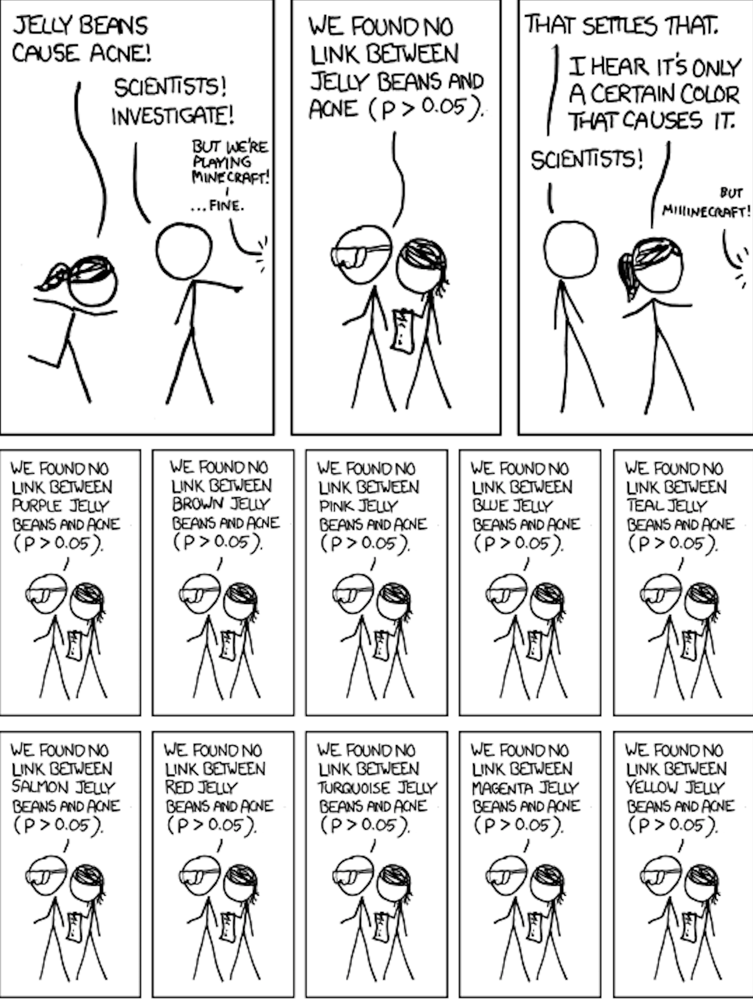

```{r setup, include=FALSE, warning=FALSE}
knitr::opts_chunk$set(message = FALSE,
                      warning = FALSE,
                      echo = TRUE,
                      fig.align = "center",
                      fig.retina = 3,
                      fig.width=9,
                      fig.height = 5)

library(tidyverse)
library(infer)
library(knitr)
library(xaringanthemer)
library(kableExtra)
library(ggrepel)
source("https://raw.githubusercontent.com/stat-20/stat-20-website/main/stat20-theme.R")
xaringanExtra::use_panelset()
set.seed(401)
```


## Steps in model building:

1. Statistical question
--

2. Data wrangling
--

3. Exploratory data analysis (EDA)
--

4. Modeling
--

5. Interpretation

--
### Three topics
--

1. Data wrangling / processing
2. Transformations
3. Dummy variables
4. $R^2$ and $R^2$ adjusted


---

```{r echo = FALSE, out.width="90%"}
knitr::include_graphics("figs/david-mansion-LA.jpg")
```


---
## Ex: LA Homes
--

We'd like to build a model to explain prices of homes in LA as a function of the characteristics of those homes.

$$ \widehat{price} = location + size + pool + acreage \ldots $$

--

Steps in model building:

1. Statistical question
2. Data wrangling
3. Exploratory data analysis (EDA)
4. Modeling
5. Interpretation

---
## Asking a question
--

**A vague question**: what explains the price of a house in West LA?

--

**A specific question**: how do location, size, acreage, and the presence of a pool correspond to the price of a home in West LA?

$$ \widehat{price} = location + size + pool + acreage $$

--

> Be clear on if you're doing an _exploratory_ or a _confirmatory_ analysis.

--

.pull-left[
**Exploratory**: seeks to uncover trends in data to help refine the research question for a subsequent analysis.
]
.pull-right[
**Confirmatory**: starts with a very specific question to confirm an effect found in a previous analysis.
]


---

.pull-left[
```{r echo = FALSE, out.width="90%"}

```
]
--
.pull-right[
```{r echo = FALSE, out.width="90%"}

```
]

.cite[source: https://xkcd.com/882/]
---

> Be clear on if you're doing an _exploratory_ or a _confirmatory_ analysis.

.pull-left[
**Exploratory**: seeks to uncover trends in data to help refine the research question for a subsequent analysis.
]
.pull-right[
**Confirmatory**: starts with a very specific question to confirm an effect found in a previous analysis.
]

--

_The Green Jelly Bean Effect_: While you're exploring, you can often find significant effects just due to chance (type I errors).


---
## Data wrangling  
--

Home price data is available on many websites now, including zillow.com.

```{r load-data, echo = FALSE}
LA <- read.csv("figs/LA.csv") %>%
  tibble()
```

```{r}
head(LA, 5)
```

--

**Unit of observation**: a home for sale in west LA.  
**Population**: all homes in west LA?


---
## Data wrangling, cont.
--

```{r data-2}
glimpse(LA)
```

---
## Data wrangling: `city`
--

```{r cntcity, eval = FALSE}
LA %>%
  count(city)
```
--
```{r ref.label = "cntcity", echo = FALSE}
```


---
## Data wrangling: `type`
--

```{r cnttype, eval = FALSE}
LA %>%
  count(type)
```
--
```{r ref.label = "cnttype", echo = FALSE}
```

--

If you wish to change the _levels_ of a categorical variable, you need to _recode_ it.

---
## Recoding `type`
--

```{r}
LA <- LA %>%
  mutate(type = fct_recode(type,
                           "unknown" = "",
                           "condo"   = "Condo/Twh",
                           "sfr"     = "SFR"))
```

--

```{r cnt2, eval=FALSE}
LA %>%
  count(type)
```
--
```{r cnt2, echo = FALSE}
```


---
## Data wrangling, cont.
--

```{r}
glimpse(LA)
```


---
## Data wrangling: `garage`
--

```{r data-4, eval = FALSE}
LA %>%
  count(garage)
```
--
```{r ref.label = "data-4", echo = FALSE}
```


---
## Recoding `garage`
--

We can _combine_ levels of a categorical variable using a similar approach.

--

```{r}
LA <- LA %>%
  mutate(garage = fct_collapse(garage,
                           "small" = c("", "1"),
                           "large" = c("2", "3", "4+")))
```

--

```{r}
count(LA, garage)
```


---
## Data wrangling, cont.
--

```{r}
glimpse(LA)
```

What's going on with `pool` and `spa`?


---
## Dropping columns
--

.pull-left[
```{r}
LA %>%
  count(pool)
```

```{r}
LA %>%
  summarize(nas = sum(is.na(spa)))
```
]

--

.pull-right[
Two variables seem mis-coded/uninformative, so they could be dropped.

```{r}
LA <- LA %>%
  select(-pool, -spa)
```
]

---
## Fully wrangled data set
--

```{r}
head(LA)
```

Once the data set is ready to go, save it to a new .csv file.

```{r eval = FALSE}
write_csv(LA, file = "LA.csv")
```


---
## Exploratory Data Analysis
--

Our goals are to:

--

1. Develop a sense of the *univariate* distributions in terms of center, shape, spread, unusual observations.

--

2. Develop a sense of the *bivariate* and *multivariate* distributions and what
they indicate about the relationship between variables.


---
## Your turn
--

.task[
Which of the following are *not* good methods to visualize the distribution of a single variable?
]

1. density plot
2. scatterplot
3. histogram
4. side-by-side boxplots

---

<center>
<iframe src="https://embed.polleverywhere.com/multiple_choice_polls/rzDd0B2ZnIXSzmxAgT8Ae?controls=none&short_poll=true" width="800px" height="600px"></iframe>
</center>

---
**Question**: Which of the following are *not* good methods to visualize the distribution of a single variable?

1. density plot
2. **scatterplot**
3. histogram
4. **side-by-side boxplots**


---
## EDA for `price`  
--

```{r warning = FALSE, echo = FALSE, fig.height = 6.5, fig.width = 9}
ggplot(LA, aes(x = price)) +
  geom_histogram() +
  theme_bw(base_size = 18)
```


---
**Question**: How would you visualize the relationship between `price` and `city`?

```{r}
head(LA)
```


---

**Question**: How would you visualize the relationship between `price` and `city`?

```{r, echo = FALSE, fig.height = 5.5, fig.width = 9}
ggplot(LA, aes(x = city, y = price)) +
  geom_boxplot() +
  theme_bw(base_size = 18)
```


---
**Question**: How would you visualize the relationship between `price` and `sqft`?

```{r}
head(LA)
```


---
**Question**: How would you visualize the relationship between `price` and `sqft`?

```{r echo = FALSE, fig.height = 6.5, fig.width = 9}
ggplot(LA, aes(x = sqft, y = price)) +
  geom_point(size = 3) +
  theme_bw(base_size = 18)
```


---
## Transformations  
--

Highly skewed data (particularly the response) can be very difficult to model using least squares regression. A common solution is to consider a transformation of the variable.

--

$$ \widehat{price} \sim sqft $$

versus

$$\widehat{log(price)} \sim log(sqft) $$

--

In R: `log()` or `log10()`


---
## EDA for `price`  
--

```{r}
LA <- LA %>%
  mutate(logprice = log(price))
```

--

```{r warning = FALSE, echo = FALSE, fig.height = 5, fig.width = 9}
ggplot(LA, aes(x = logprice)) +
  geom_histogram() +
  theme_bw(base_size = 18)
```


---
## EDA for `logprice` and `logsqft`
--

```{r echo = FALSE}
LA <- LA %>%
  mutate(logsqft = log(sqft))
```

```{r echo = FALSE, fig.height = 6.5, fig.width = 9}
ggplot(LA, aes(x = logsqft, y = logprice)) +
  geom_point(size = 3) +
  theme_bw(base_size = 18)
```


---
## Comparing residuals
--

```{r}
m1 <- lm(price ~ sqft, data = LA)
m2 <- lm(logprice ~ logsqft, data = LA)
```

--

```{r echo = FALSE, fig.height = 5, fig.width = 9}
library(patchwork)
p1 <- qplot(x = .fitted, y = .stdresid, data = m1, main = "model 1") +
  theme_bw()
p2 <- qplot(x = .fitted, y = .stdresid, data = m2, main = "model 2") +
  theme_bw()
p1 + p2
```


---
## Transformation, cont.
--

Highly skewed data often leads to invalid models. This can be often be fixed 
with a transformation, but the interpretations change slightly.

--

```{r, echo = FALSE}
summary(m2)$coef
```

*A one unit increase in the log sqft of a home is associated with a 1.44 unit
increase in the log price of a home.*

---
## Dummy Variables
--

```{r dum, eval = FALSE}
m3 <- lm(logprice ~ logsqft + city, data = LA)
LA %>%
  count(city)
```
--
```{r ref.label = "dum", echo = FALSE}
```

> How can we encode a categorical variable like `city` into a numerical variable so that we can include it in our model?

---
boardwork

---

```{r sum3, eval = FALSE}
summary(m3)
```
--
```{r ref.label = "sum3", echo = FALSE}
```


---
## Dummy Variables, cont.
--

- Categorical variables with $k$ levels can be recoded as $k - 1$ dummy variables (also called indicator variables or one-hot encoding).

--

- The level that is left out of the dummy variables is called the **reference level** and by default is the first alphabetically. The `intercept` estimate refers to this level.

--

- The levels encoded by dummies have a coefficient that captures the deviation of their intercept to the reference level.

---
## Assessing model fit
--

Our existing statistic to measure how well the model captures the variability in the data is $R^2$.

$$R^2 = \frac{SSR}{TSS}$$

--

.pull-left[
**Model 2**

$$ \widehat{log(price)} \sim log(sqft) $$

```{r}
summary(m2)$r.squared
```
]
--
.pull-right[
**Model 3**

$$ \widehat{log(price)} \sim log(sqft) + city $$

```{r}
summary(m3)$r.squared
```
]

---

boardwork

---
## Assessing model fit, cont.

Our existing statistic to measure how well the model captures the variability in the data is $R^2$.

$$R^2 = \frac{SSR}{TSS}$$

--

**Note**: $R^2$ can never decrease when additional variables are added to the model.

A more useful statistic when comparing MLR models of difference complexities is adjusted $R^2$, which balances the ability of the model to explain the data with its simplicity.

$$R^2_{adj} = 1 - \frac{SSE}{TSS} \cdot \frac{n - 1}{n - p - 1} $$

---
.pull-left[
**Model 2**

$$ \widehat{log(price)} \sim log(sqft) $$

```{r}
summary(m2)$r.squared
```
]
.pull-right[
**Model 3**

$$ \widehat{log(price)} \sim log(sqft) + city $$

```{r}
summary(m3)$r.squared
```
]
--
.pull-left[
```{r}
summary(m2)$adj.r.squared
```
]
--
.pull-right[
```{r}
summary(m3)$adj.r.squared
```
]


---
## Where we've been

1. Statistical question
2. Data wrangling
3. Exploratory Data Analysis
4. Modeling
5. **Interpretation**
