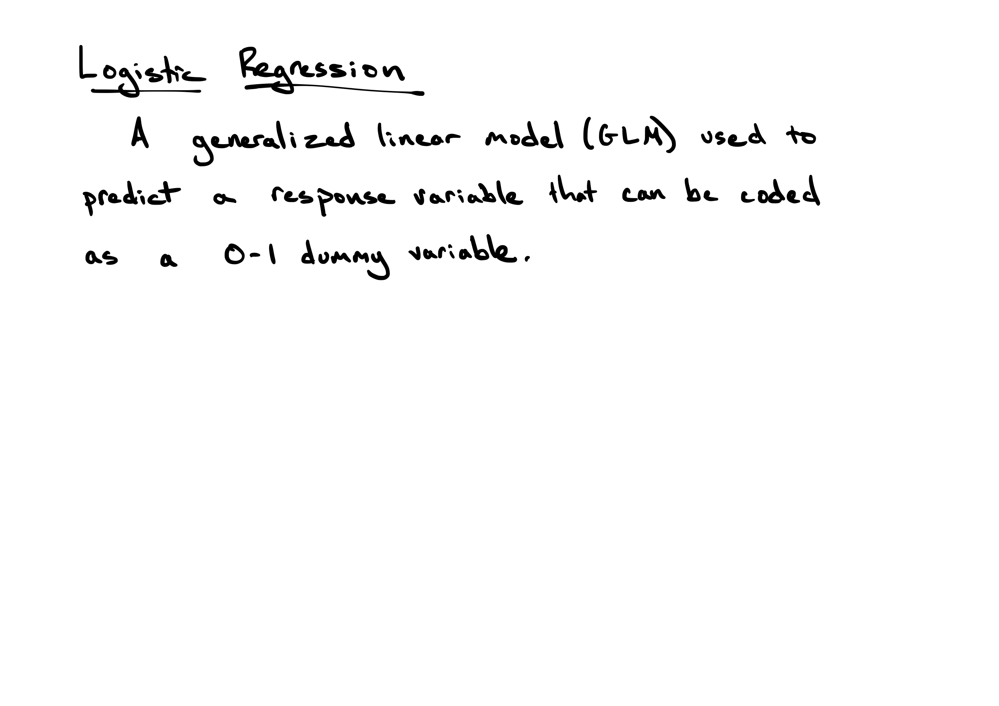
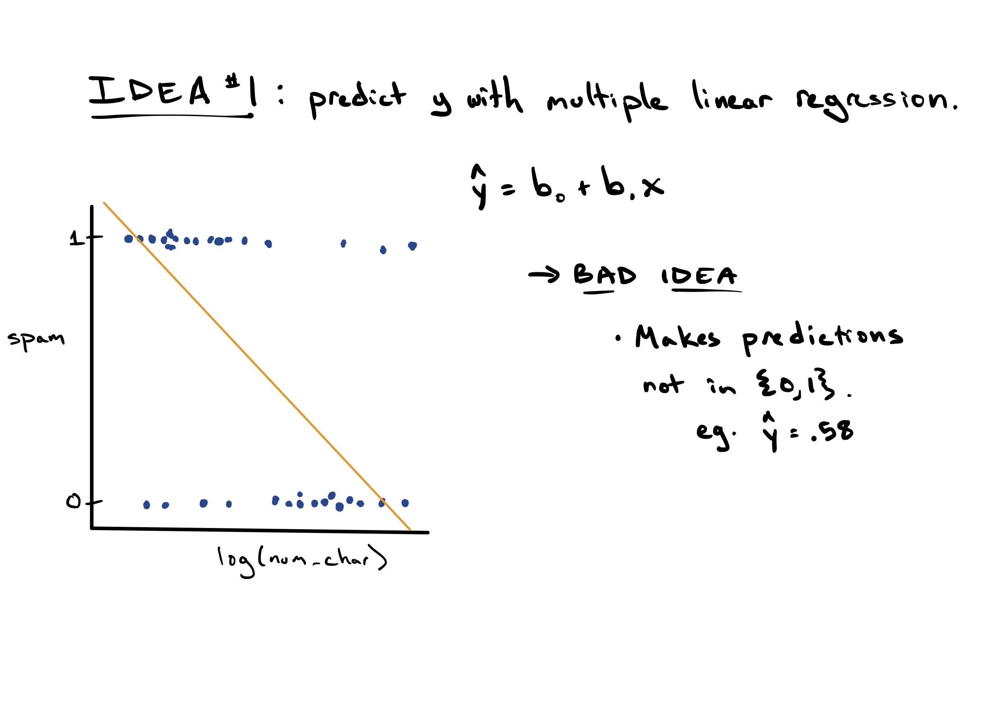
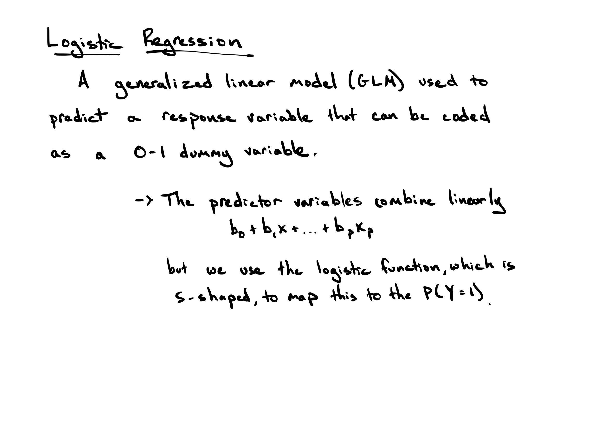

```{r setup, include=FALSE, warning=FALSE}
knitr::opts_chunk$set(message = FALSE,
                      warning = FALSE,
                      echo = TRUE,
                      fig.align = "center",
                      fig.retina = 3,
                      fig.width=9,
                      fig.height = 5)

library(tidyverse)
library(infer)
library(knitr)
library(xaringanthemer)
library(openintro)
library(kableExtra)
library(ggrepel)
source("https://raw.githubusercontent.com/stat-20/stat-20-website/main/stat20-theme.R")
xaringanExtra::use_panelset()
set.seed(401)
```

---
## Taking the big picture
--

A regression model _can_ be used to...

- **describe** the data at hand,
--

- **predict** the $y$ for new data,
--

- to make **inferences** on population parameters, and to
--

- draw **causal conclusions**

--

... but each use requires careful thought. It is regretfully common to see these models misapplied.


---
## Using a model for **description**: LA Homes
--

_A fitted model is a specific answer to a specific question_

--

**Question 1**
What is the relationship between the number of bedrooms in a house and its price?
--

$$ \widehat{\textrm{log(price)}} = 11.8 + .53 \textrm{bed}$$

--

**Question 2**
After controlling for the size of a house, what is the relationship between the number of bedrooms in a house and its price?

$$ \widehat{\textrm{log(price)}} = 11.8 + -0.12 \textrm{bed} + 1.66 \textrm{log(sqft)}$$

---
## Using a model for **inference**: LA Homes
--

.pull-left[
In order for inference to be coherent:

1. There must be a **well-defined population** of interest

2. The **sample must be representative** of that population
]
--
.pull-right[
For LA Homes:

1. All homes in West LA in March 2011? All homes in the US in 2011? All homes in West LA in future years?

2. Requires domain expertise to determine
]

---
## Using a model for **causation**: baseball
--

.pull-left[
Causal inference using observational data is challenging.

1. Without an RCT, there may be **omitted confounding variables** (omitted variable bias).

2. **Strong domain expertise** is needed to understand possible causal structures.

3. Social systems are very **complex**
]
--
.pull-right[
For baseball

1. Nearly all baseball data lacks random assignment.

2. Baseball analysts and managers have some confidence they have all relevant variables.
]


---
## Using a model for **prediction**: spam
--

```{r out.width=530, echo = FALSE}
knitr::include_graphics("figs/spam.png")
```

> Email spam, also referred to as junk email or simply spam, is unsolicited messages sent in bulk by email (spamming). The name comes from a Monty Python sketch in which the name of the canned pork product Spam is ubiquitous, unavoidable, and repetitive.

.cite[source: freezelight/flickr, Wikipedia]
---
## The data
--

```{r}
email
```

???
How was the data collected?

---
## How was the data collected?
--

```{r out.width=800, echo = FALSE}
knitr::include_graphics("figs/gmail-emails.png")
```

--

1. Choose a single email account
2. Save each email that comes in during a given time frame
3. Create dummy variables for each text component of interest
4. Visually classify each as spam or not


---
## Simple Filter A 
--

Predicting spam or not using the presence of "winner".

--

```{r echo = FALSE, fig.width=7, fig.height = 5}
email <- mutate(email, spam = factor(spam))
ggplot(email, aes(x = winner, fill = spam)) +
  geom_bar(position ="fill") +
  theme_bw(base_size = 18)
```

If "winner" then "spam"?

---
## Simple Filter B 
--

Predicting spam or not using number of characters (in K)

```{r echo = FALSE, fig.width = 8, fig.height = 5}
ggplot(email, aes(x = num_char, fill = spam)) +
  geom_density(alpha = .4) +
  theme_bw(base_size = 18)
```


---
## Simple Filter B, cont.

Predicting spam or not using log number of characters (in K)

--

```{r echo = FALSE, fig.width = 8, fig.height = 5}
ggplot(email, aes(x = log(num_char), fill = spam)) +
  geom_density(alpha = .4) +
  theme_bw(base_size = 18)
```

If `log(num_char)` < 1, then "spam"?

---
## Challenges 
--

Each simple filter can be thought of as a regression model.

#### Filter A

$spam \sim winner; \quad X_1 \sim X_2$

#### Filter B
$spam \sim log(num\_char); \quad X_1 \sim W_1$

--

Each one by itself has poor predictive power, so how can we combine them into a single stronger model?


---

```{r out.width=800, echo = FALSE}

```

---

```{r out.width=800, echo = FALSE}

```

---

```{r out.width=800, echo = FALSE}
knitr::include_graphics("figs/log-3.png")
```

---

```{r out.width=800, echo = FALSE}
knitr::include_graphics("figs/log-4.png")
```

---

```{r out.width=800, echo = FALSE}

```
