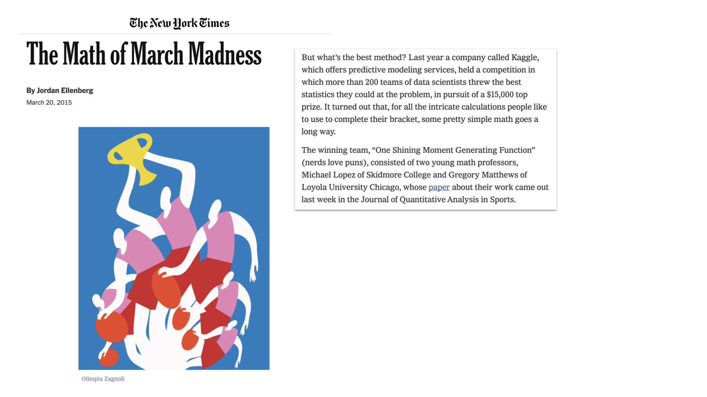
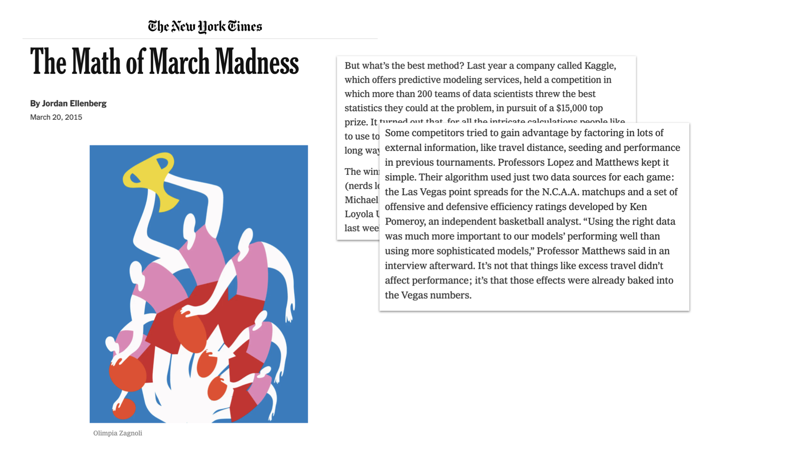
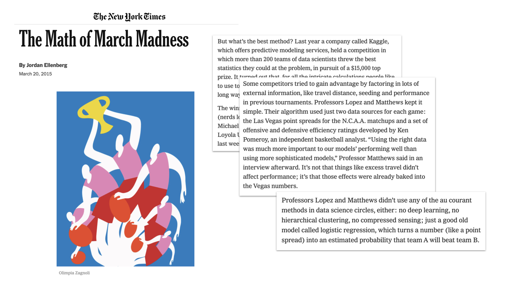

```{r setup, include=FALSE, warning=FALSE}
knitr::opts_chunk$set(message = FALSE,
                      warning = FALSE,
                      echo = TRUE,
                      fig.align = "center",
                      fig.retina = 3,
                      fig.width=9,
                      fig.height = 5)

library(tidyverse)
library(infer)
library(knitr)
library(xaringanthemer)
library(openintro)
library(kableExtra)
library(ggrepel)
source("https://raw.githubusercontent.com/stat-20/stat-20-website/main/stat20-theme.R")
xaringanExtra::use_panelset()
set.seed(401)
```

## Announcements

1. Last PS is available and due next Tuesday 8 am.
--

2. Last Lab assignment will be available tomorrow morning and due Tuesday 8 am.
--
3. Please fill out course evaluations!
--
4. OH and Evening Study Session like normal this week (2-2:30 today will be one-on-one meetings)
--
5. Stat 20 Spring 2022 will need tutors!

---

```{r out.width=800, echo = FALSE}
knitr::include_graphics("figs/log-2.png")
```

---

```{r out.width=800, echo = FALSE}
knitr::include_graphics("figs/log-3.png")
```

---

```{r out.width=800, echo = FALSE}
knitr::include_graphics("figs/log-4.png")
```

---

```{r out.width=800, echo = FALSE}
knitr::include_graphics("figs/log-5.png")
```

---
## Logistic Regression for Filter B
--

$$spam \sim log(num\_char)$$

```{r echo = FALSE, eval = TRUE, message = FALSE, fig.width=9, fig.height = 6}
data(email)
email <- email %>%
  mutate(spam = as.numeric(spam) - 1,
         log_num_char = log(num_char))
ggplot(email, aes(x = log_num_char, y = spam)) +
  geom_point(alpha = .05, size = 3) + 
  stat_smooth(method = "glm", 
              method.args = list(family = "binomial"), 
              se = FALSE,
              col = "steelblue") +
  theme_bw(base_size = 18)
```

---
## Model fitting
--

```{r}
m1 <- glm(spam ~ log_num_char, data = email, family = "binomial")
summary(m1)
```

---

```{r out.width=800, echo = FALSE}
knitr::include_graphics("figs/log-geo.jpg")
```

---
## Interpreting Logistic Regression
--

1. A positive slope estimate indicates that there is a positive association.

--

2. Each row of the summary output is still a H-test on that parameter being 0.

--

3. Each estimate is still conditional on the other variables held constant.

--

Other details:

1. The coefficients aren't estimated using Least Squares but with a method called _maximum likelihood_.

2. The p-values rely upon the Central Limit Theorem -> large $n$.


---
## A more sophisticated model
--

```{r}
m2 <- glm(spam ~ log_num_char + to_multiple + attach + dollar + inherit + viagra, 
          data = email, family = "binomial")
coef(summary(m2))
```

---
## From fitted values to predictions
--

The fitted values, $\hat{p}_i$, are _probabilities_. They can be converted to predictions by setting a threshold probability for a case being a 1.

$$
\texttt{if P(y = 1) > threshold, then y-hat = 1}
$$

--

```{r make-pred, eval = FALSE}
tibble(y = email$spam,
       p_y_is_1 = fitted(m2)) %>%
  mutate(y_pred = p_y_is_1 > .5)
```
--
```{r ref.label = "make-pred", echo = FALSE}
```

---
## From fitted values to predictions, cont.
--

```{r make-pred2, eval = FALSE}
tibble(y = email$spam,
       p_y_is_1 = fitted(m2)) %>%
  mutate(y_pred = p_y_is_1 > .5) %>%
  count(y, y_pred)
```
--
```{r ref.label = "make-pred2", echo = FALSE}
```

> The predictive performance can be measured with a _confusion matrix_ of false positives, false negatives, true positives, and true negatives.


---
## Comparing models: confusion matrix 
--

.pull-left[
Complex Model
```{r}
tibble(y = email$spam,
       p_y_is_1 = fitted(m2)) %>%
  mutate(y_pred = p_y_is_1 > .5) %>%
  count(y, y_pred)
```
]
--
.pull-right[
Simple Model
```{r}
tibble(y = email$spam,
       p_y_is_1 = fitted(m1)) %>%
  mutate(y_pred = p_y_is_1 > .5) %>%
  count(y, y_pred)
```
]

---
## Predictive accuracy
--

If false positives and false negatives are both equally bad, then one metric of performance is the **misclassification rate**.

$$
\textrm{misclassification rate:} \frac{FP + FN}{FP + FN + TP + TN}
$$

.pull-left[
Complex Model
```{r echo = FALSE}
misclass_2 <- tibble(y = email$spam,
       p_y_is_1 = fitted(m2)) %>%
  mutate(y_pred = p_y_is_1 > .5) %>%
  count(y, y_pred) %>%
  mutate(res = c("TN", "FP", "FN", "TP")) %>%
  select(n, res) %>%
  pivot_wider(names_from = res, values_from = n) %>%
  mutate(misclass = (FP + FN)/(TN + FP + FN + TP)) %>%
  pull(misclass)
misclass_2
```
]
--
.pull-right[
Simple Model
```{r echo = FALSE}
misclass_1 <- tibble(y = email$spam,
       p_y_is_1 = fitted(m1)) %>%
  mutate(y_pred = p_y_is_1 > .5) %>%
  count(y, y_pred) %>%
  mutate(res = c("TN", "FP", "FN", "TP")) %>%
  select(n, res) %>%
  pivot_wider(names_from = res, values_from = n) %>%
  mutate(misclass = (FP + FN)/(TN + FP + FN + TP)) %>%
  pull(misclass)
misclass_1
```
]

---
## Predictive accuracy in context
--

Always check that your model outforms that naive model that always predicts the dominant response.

--

```{r echo = FALSE}
naive_df <- tibble(y = email$spam,
                   p_y_is_1_1 = fitted(m1),
                   p_y_is_1_2 = fitted(m2)) %>%
  mutate(y_pred_1 = p_y_is_1_1 > .5,
         y_pred_2 = p_y_is_1_2 > .5,
         y_pred_naive = FALSE)
naive_df %>%
  select(contains("pred")) %>%
  head(5)
```

--

```{r echo = FALSE}
misclass_naive <- naive_df %>%
  count(y, y_pred_naive) %>%
  mutate(res = c("TN", "FN")) %>%
  select(n, res) %>%
  pivot_wider(names_from = res, values_from = n) %>%
  mutate(misclass = (FN)/(TN + FN)) %>%
  pull(misclass)
```

```{r misclass, eval = FALSE}
c(misclass_1, misclass_2, misclass_naive)
```
--
```{r ref.label = "misclass", echo = FALSE}
```


---
## Model Selection for Prediction
--

You can generally improve the "predictions" on your observed data by making your model more **complex** (more variables/feature, squigglier lines).-- True prediction on unseen data, however, often rewards a more **parsimonious** model (fewer variables/features, straighter lines).
--

### Two approaches to selecting the model
--

.pull-left[
_Classical Method_

Compute single score / statistic on observed data for each model and compare.
]
--
.pull-right[
_Computational Method_

Split your data into **training** data (used to fit model) and **testing** data (not used to fit model). Compare testing scores for each model.
]

---
## Model Selection for Prediction, Classical
--

$R^2_{adj}$ was helpful in MLR, but there are no "sums of squares" in the logistic regression setting. It is common to use $AIC$ (Akaike Information Criterion) as an alternative.

--

.pull-left[
$$R^2_{adj} = 1 - \frac{SSE}{TSS} \cdot \frac{n - 1}{n - p - 1} $$
]
--
.pull-right[
$$AIC = 2p - 2 \log(L)$$
]

where $L$ is the _total likelihood_ of the data, a measure of goodness of fit, and $p$ is the number of parameters, a measure of complexity. A model with a lower $AIC$ is considered better.

---

```{r}
summary(m1)
```


---

```{r}
summary(m2)
```


---
## Taking the big picture
--

A regression model _can_ be used to...

- **describe** the data at hand,
--

- **predict** the $y$ for new data,
--

- to make **inferences** on population parameters, and to
--

- draw **causal conclusions**

--

... but each use requires careful thought. It is regretfully common to see these models misapplied.

---

class: middle, center

## Parting thoughts on Logistic Regression

--

.adage[Choice of data is more important than choice of model.]

--

.adage[Logistic regression can be the kernel of more complicated models.]

---

```{r out.width=1200, echo = FALSE}

```

---

```{r out.width=1200, echo = FALSE}

```

---

```{r out.width=1200, echo = FALSE}

```

---

```{r out.width=1200, echo = FALSE}

```

---
## A more complex prediction task..
--

Build a model that can take an image of a handwritten digit and predict whether it is a 0 or a 1.

```{r out.width=600, echo = FALSE}
knitr::include_graphics("figs/mnist.png")
```

--

Can we use logistic regression?

--
> Yes
